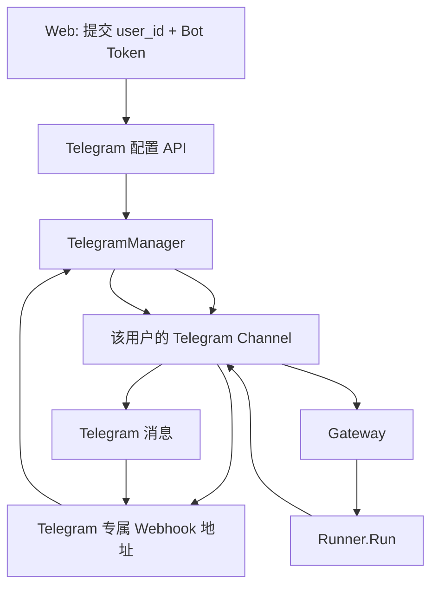

# Telegram 用户自定义 Bot 计划

## 目标

让用户在 Web 页面提交自己的 Telegram Bot Token 后，系统动态接入该 Bot。

规则：

```text
一个 user_id 只能配置一个 Telegram Bot
```

用户发给自己 Bot 的消息，进入该 `user_id` 的 Runner：

```text
Runner.Run(demo-app, user_id, session_id, message)
```

## 本次只做什么

```text
Web 配置 Telegram Bot
  ↓
后端验证 Token
  ↓
自动注册 Webhook
  ↓
动态创建该 Bot 的 Channel
  ↓
消息进入对应 user_id 的 Runner
  ↓
使用原 Bot 回复
```

不做飞书用户自定义 App，不改 Gateway 和 Runner。

## 运行结构



## 核心处理逻辑

### 创建或替换 Bot

用户在 Web 提交 Bot Token 后：

1. 后端用 Token 创建 Telegram 客户端，验证 Bot 是否有效。
2. 后端生成一个内部 Webhook 路由 key。
3. 用该 key 拼出 Webhook 地址，并调用 Telegram API 注册。
4. `TelegramManager` 保存“路由 key → Channel → user_id”的运行关系。
5. 如果该用户已有 Bot：新 Bot 注册成功后，替换旧 Channel；再取消旧 Bot 的 Webhook。

Webhook 地址类似：

```text
/webhook/telegram/<内部路由key>
```

路由 key 仅后端使用，前端不需要知道或管理。

### 收到消息

```text
Telegram 请求
  ↓
从 URL 取路由 key
  ↓
TelegramManager 找到对应 Channel
  ↓
该 Channel 已知道所属 user_id
  ↓
组装 session_id
  ↓
Gateway → Runner.Run
  ↓
同一个 Channel 使用自己的 Bot 回复原 chat
```

## 代码职责

### TelegramManager（新增）

负责 Bot 的生命周期：

- 创建和验证用户 Bot。
- 替换用户原有 Bot。
- 按 Webhook 路由 key 找到 Channel。
- 保证一个 `user_id` 只有一个 Bot。

### Telegram Channel（小改）

继续负责：

- 解析 Telegram Update。
- 调用 Gateway。
- 用本 Bot 回复原聊天。

新增能力：Channel 知道自己属于哪个内部 `user_id`，因此不再把 `from.id` 直接作为 Runner 的 `user_id`。

### HTTP Server（小改）

新增一个动态路由：

```text
POST /webhook/telegram/{routeKey}
```

由 Manager 找到正确的 Channel 后处理。

### Web（新增一个小配置区）

用户填写：

```text
当前 user_id 的 Telegram Bot Token
```

提交后展示：

```text
已连接 / 连接失败 / 当前 Bot 用户名
```

不展示 Token。

## 首版边界

首版是“跑通功能版”：

- 使用内存保存运行中的 Bot 配置。
- 服务重启后，用户需要重新提交 Token。
- 暂不做 Token 加密和数据库持久化。
- 暂不限制哪个 Telegram `from.id` 可以操作该 Bot。

最后一条意味着：知道 Bot 用户名的人也可能触发该 Bot，并消耗 Bot 所属用户的 Agent 资源。该限制会在后续“Telegram 账号绑定”阶段解决。

## 不改的部分

```text
Gateway
Runner
Session / Memory / Sandbox
飞书接入
Web 登录注册
```

## 验证标准

1. 用户 A 配置 Bot A 后，Bot A 可以回复。
2. 用户 B 配置 Bot B 后，Bot B 可以回复。
3. Bot A 的消息只进入用户 A 的 Session / Sandbox。
4. Bot B 的消息只进入用户 B 的 Session / Sandbox。
5. 用户 A 再配置新 Token 后，旧 Bot 不再接收消息，新 Bot 生效。
6. 无效 Token 不创建 Channel，也不影响已有 Bot。
