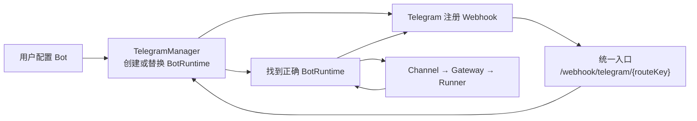

# 用户自定义 Telegram Bot：心智模型

> 目标：先跑通“每个 Web 用户可以配置自己的一个 Telegram Bot”。
>
> 本文不讨论登录、数据库、加密、Telegram 账号绑定；它们是后续能力。

## 没有它的时代：发生了什么困境？

现在的程序启动时读取一个环境变量：

```text
TELEGRAM_TOKEN
```

因此它只能启动一个固定 Bot：

```text
一个 Go 进程
    └── 一个 Telegram Bot
```

这适合 Demo，但不适合下面的产品目标：

```text
用户 A 想接入自己的 Bot A
用户 B 想接入自己的 Bot B
```

不能为每个用户启动一套新的 Go 服务。我们要的是：

```text
一个 Go 服务
    ├── 运行 Bot A
    ├── 运行 Bot B
    └── 共用同一个 Gateway 和 Runner
```

注意：

```text
一个用户一个 Bot
```

不等于：

```text
整个系统只有一个 Bot
```

用户很多时，系统里仍会同时存在多个 Bot；只是每个用户最多一个。

## 它为何出现：具体解决什么？

我们新增的不是第二个 Runner，而是一个外层的“Bot 管理员”。

它的工作只有两件：

```text
1. 用户配置 Bot 时：创建或替换这个用户的 Bot。
2. Telegram 发来消息时：找到这条消息属于哪个 Bot。
```

这个管理员叫：

```text
TelegramManager
```

它解决的核心问题是：

```text
多个 Bot 的 Webhook 都到了同一台 Go 服务，
这台服务如何找到正确的 Bot？
```

## 跨领域类比：它处在什么生态位？

把系统想成一栋写字楼：

```text
Go 服务          = 一栋大楼
Webhook 入口     = 大楼唯一前台
TelegramManager  = 前台的住户名册
BotRuntime       = 一间具体办公室
Channel          = 办公室的接线员
Gateway + Runner = 大楼共享的专家团队
```

ASCII 图：

```text
Telegram
   │
   ▼
[大楼前台：Webhook Handler]
   │  看地址里的 routeKey
   ▼
[住户名册：TelegramManager]
   │  找到 Bot A 的办公室
   ▼
[BotRuntime A]
   │
   ▼
[Channel 接线员] ──> [Gateway + Runner 专家团队]
   │                                  │
   └──────── 使用 Bot A 回电话 ────────┘
```

这个类比的边界：BotRuntime 不是一个新进程或新 Agent；它只是同一个 Go 服务里的一份 Bot 运行配置。

## 底层原理与本质

### 先理解两个不同的流程

#### 流程 A：用户配置 Bot

```text
Web 用户 u_001 提交自己的 Bot Token
        ↓
后端验证 Token，确认 Bot 存在
        ↓
生成 routeKey（后端内部的门牌号）
        ↓
给这个 Bot 注册 Webhook URL
        ↓
TelegramManager 记住：
routeKey 对应哪个 Bot，哪个用户
```

例如：

```text
用户 u_001
  └── Bot A
        └── Webhook: /webhook/telegram/rk_A
```

`routeKey` 不是用户填写的，也不是 Runner 参数。它只是后端用来在 Webhook 到达时找到 Bot 的“门牌号”。

#### 流程 B：Telegram 消息进来

```text
Telegram 用户发消息给 Bot A
        ↓
Telegram 请求 /webhook/telegram/rk_A
        ↓
统一 Webhook Handler 读到 rk_A
        ↓
TelegramManager 找到 BotRuntime A
        ↓
BotRuntime A 知道自己属于 u_001
        ↓
Channel → Gateway → Runner.Run(..., u_001, ...)
        ↓
Bot A 回复原 chat
```

### 为什么是“一个通配 Handler”，不是动态注册路由？

我们只在程序启动时注册一次：

```text
POST /webhook/telegram/{routeKey}
```

这相当于大楼只有一个前台。所有 Bot 的消息都先到前台，再由前台根据门牌号查名册。

错误做法是每增加一个 Bot，就修改 HTTP 路由表：

```text
Bot A 来了 → 新增一个 HTTP 路由
Bot B 来了 → 再新增一个 HTTP 路由
```

我们不这么做。运行时变化的只有 `TelegramManager` 中的名册。

### 为什么 Manager 要有两种查找方式？

它不是“字段多”，而是两种业务动作问的问题不同：

```text
用户在 Web 配置 Bot：
“这个 user_id 现在的 Bot 是什么？”

Telegram Webhook 到达：
“这个 routeKey 对应哪个 Bot？”
```

因此 Manager 需要两本名册：

```text
按 user_id 查：用于创建、替换、查看自己的 Bot。
按 routeKey 查：用于 Webhook 到达时快速路由。
```

ASCII 图：

```text
                ┌── user_id ────> BotRuntime A
TelegramManager ┤
                └── routeKey ───> BotRuntime A
```

它们最终指向同一个 BotRuntime，不是两套 Bot。

### BotRuntime 到底是什么？

它是“一个正在工作的用户 Bot”，里面只保留运行 Bot 必需的东西：

```text
它属于谁
它的 Webhook 门牌号
它用哪个 Telegram Channel 收发消息
```

它不拥有 Gateway、Runner、Session 或 Sandbox；这些仍是全系统共享的内层能力。

### 为什么 Webhook 要快速返回 200？

Telegram 只关心一件事：

```text
“我的这条 Update 你收到了吗？”
```

如果我们等待 Agent 完整执行后才回答，Agent 慢时 Telegram 可能重试同一条消息。

正确节奏：

```text
Webhook 收到 Update
    ↓
启动后台任务
    ↓
立刻返回 HTTP 200
    ↓
后台：Channel → Gateway → Runner → Bot 回复
```

后台任务不能继续使用 HTTP 请求的 `r.Context()`：请求一结束，它会被取消。应使用独立且有超时的 Context。

## Mermaid 心智模型



## 最小伪代码

配置时：

```text
Configure(userID, token):
    newRuntime = 用 token 创建并验证 Bot
    newRuntime.routeKey = 后端生成随机 key
    为这个 Bot 注册 /webhook/telegram/{routeKey}
    成功后：Manager 用 newRuntime 替换该 userID 的旧 Runtime
```

收到消息时：

```text
Webhook(routeKey, update):
    runtime = Manager 按 routeKey 查找
    找不到 → 404
    找到 → 后台 runtime.Channel 处理 update
    立刻返回 200
```

## 这次先不解决什么

为了先跑通功能，以下内容明确后置：

```text
服务重启后恢复 Bot 配置
Bot Token 加密保存
绑定 Telegram from.id，限制只有主人能使用
Webhook 去重
多实例部署
飞书用户自定义 App
```

其中最重要的安全提醒：首版不限制 `from.id` 时，任何能私聊该 Bot 的 Telegram 用户都可能触发 Bot 所属用户的 Agent。它只适合功能验证。

## 一句话带走

> TelegramManager 是“多个用户 Bot 的前台名册”：用户配置时创建/替换 BotRuntime；Webhook 到达时按 routeKey 找回 BotRuntime；随后仍由原来的 Channel → Gateway → Runner 处理。
