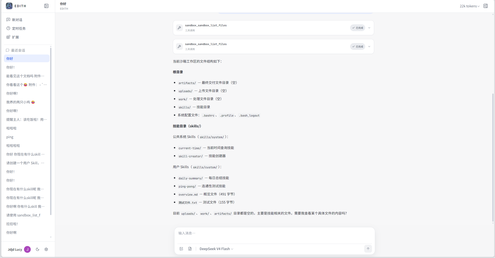
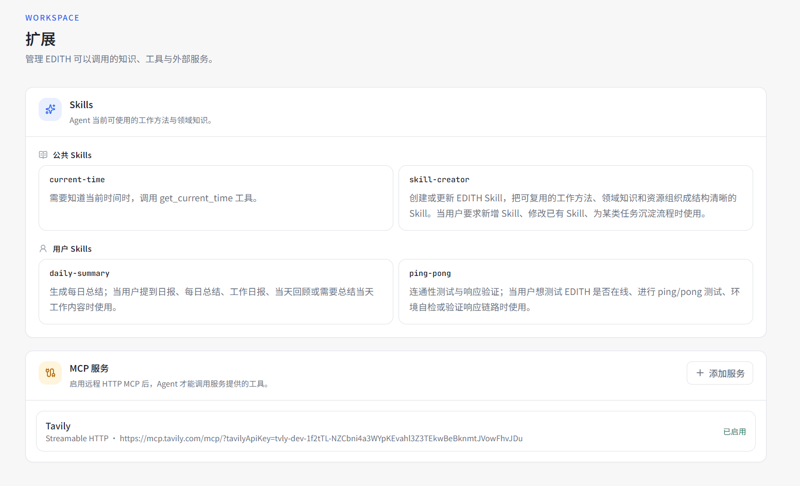
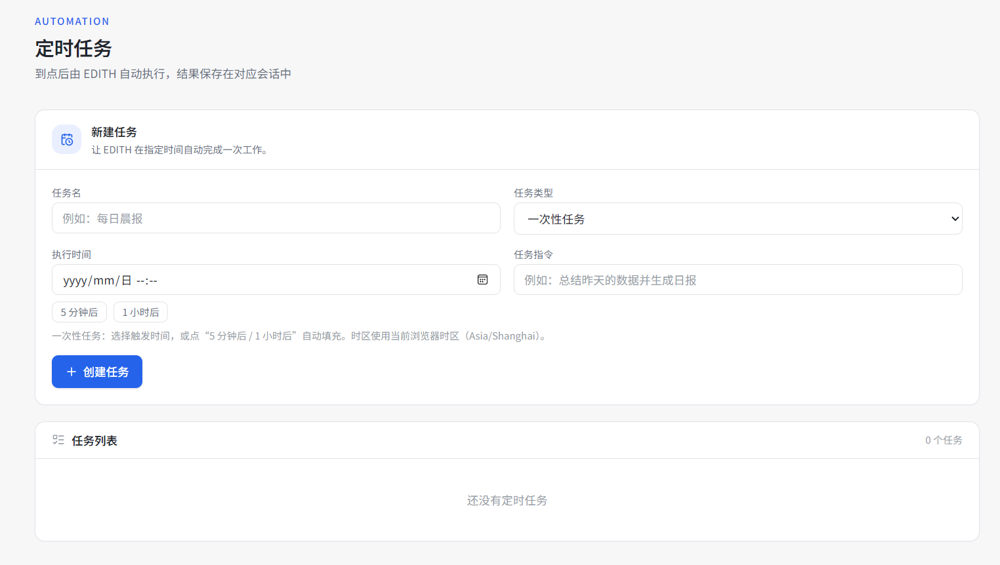
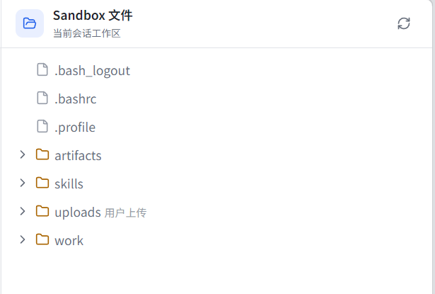
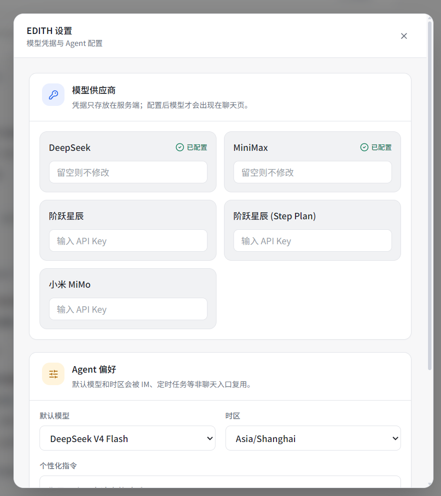

# EDITH

[English](README.md) · 一个面向多用户的可扩展服务端 AI Agent 平台。

EDITH 不只是一个聊天页面，而是一个可长期演进的**多用户服务端 Agent 平台**：每位用户拥有独立身份、配置、会话、Sandbox 与 Skill Volume；用户可与模型对话、让 Agent 使用工具与持久化沙箱、把可复用的方法沉淀为 Skill、定时自动执行任务，并在每个会话中保留工作文件。

如果你想快速体验，请访问：[在线体验](https://edith.lucyspace.top/)。

> 当前以 Web 为第一个用户渠道；飞书、Telegram、GitHub App 等 IM 渠道留待后续接入。

## 项目特点

- **真正的 Agent 运行时**：所有请求先进入唯一 Gateway，再由 AgentRun 聚合配置，最终交给 `ManagedRunner` 执行。
- **多用户隔离**：Clerk 用户身份贯穿请求、会话、配置、Sandbox、Volume 与定时任务，用户之间不共享运行空间或凭据。
- **有状态的工作区**：每个会话拥有独立 E2B Sandbox，可执行命令、管理文件、上传原始资料并产出交付文件。
- **跨会话复用 Skills**：公共 Skill 随 EDITH 发布；用户 Skill 保存在自己的 E2B Volume 中，可跨新会话继续使用。
- **不止聊天，还能自动化**：定时任务和 Web 对话走同一个 Agent 入口，执行结果自然沉淀为会话历史。
- **长对话可持续**：当会话接近当前模型上下文窗口的 40% 时，框架自动生成滚动摘要；完整历史仍永久保留。
- **面向产品的界面**：深浅主题、紧凑的思考/工具卡片、会话导航、MCP 管理、Skills 展示与会话文件工作区。

## 实拍图











## 已实现功能

### Agent 对话

- 流式回复、思考过程与工具调用卡片
- 基于 Request ID 的运行状态查询与中断
- 会话级并发保护
- 多模型供应商配置，以及聊天内临时切换模型
- 图片输入与历史图片水合
- 按模型上下文窗口比例触发的滚动会话摘要

### Sandbox 文件工作区

- 每个 `user_id + session_id` 拥有独立 E2B Sandbox
- 在聊天页查看当前会话的文件树
- 上传原始资料到 `/uploads`
- Agent 可读取、处理、生成与整理文件
- 从 `/artifacts` 下载 Agent 产出的交付物

### Skills 与扩展

- 随服务内置、并挂载进每个 Sandbox 的公共 Skills
- 保存在用户持久化 E2B Volume 中的自定义 Skills
- `overview.md` 同时为 Agent 上下文和扩展页提供稳定、低成本的 Skill 摘要
- 可在界面中配置、启停和管理远程 HTTP MCP 服务

### 定时任务

- 一次性任务与周期性 Cron 任务
- 用户时区与默认模型
- 原子抢占，避免同一任务重复执行
- 每次任务执行通过同一个 Gateway，并在独立会话中保存结果

## 架构一眼看懂

EDITH 将渠道、执行与基础设施分开；核心运行主链路很短：

```text
WebAdapter / CronAdapter / 未来 IM Adapter
                    │
                    ▼
                Gateway
          身份确认与请求边界
                    │
                    ▼
                AgentRun
  模型 + MCP + Skills + 图片 + 工具 + 参数聚合
                    │
                    ▼
             ManagedRunner
                    │
                    ▼
          中性 Agent 流式事件
```

后端按显式模块组织。每个模块管理自己的存储、自己的 HTTP 边界（若需要），并暴露自己的公开能力；`main.go` 只负责创建模块和连接模块能力。

```text
backend-v2/
├─ cmd/server/          组合根与进程启动
├─ internal/agentrun/   聚合 RunOptions，执行 ManagedRunner
├─ internal/gateway/    统一 Agent 请求入口
├─ internal/webadapter/ Web 请求与 SSE 适配器
├─ internal/cronjob/    Cron 存储与调度器
├─ internal/cronadapter/ 定时执行适配器
├─ internal/sandbox/    E2B Sandbox 生命周期、文件、上传下载 HTTP
├─ internal/volume/     用户级持久化 E2B Volume
├─ internal/skills/     公共与用户 Skill 目录
├─ internal/tools/      Agent ToolSet 注册表
├─ internal/userconfig/ 用户设置、供应商、MCP 与绑定
├─ internal/conversation/ 历史会话投影
└─ internal/agentstream/ 框架事件 → 中性流式事件
```

完整的架构心智模型见：[Go架构心智模型.md](backend-v2/Go架构心智模型.md)。

## 技术栈

- 后端：Go、`trpc-agent-go`、SQLite
- 前端：Next.js、React、TypeScript、Tailwind CSS
- 身份认证：Clerk
- Agent 工作区与持久化 Skills：E2B Sandbox + Volume

## 本地启动

1. 配置 Clerk、模型供应商与 E2B 所需环境变量。
2. 启动后端：

   ```powershell
   cd backend-v2
   go run ./cmd/server
   ```

3. 在另一个终端启动 Web：

   ```powershell
   cd web-v1
   npm install
   npm run dev
   ```

4. 打开 `http://localhost:3000`。

## 目录说明

| 路径 | 作用 |
| --- | --- |
| `backend-v2/` | 当前模块化后端 |
| `web-v1/` | Next.js Web 工作台 |
| `e2b-template/` | E2B Sandbox 模板定义 |
| `docs/` | 产品、架构、协议与设计文档 |
| `reference/` | 只读的上游源码与文档参考 |
| `backend-v1/` | 保留用于学习和对比的早期实现 |

## 当前状态

多用户服务端 Agent 平台的核心闭环已完成：对话、工具、文件、Skills、自动化、MCP、用户配置和上下文压缩可以协同工作。未来可新增飞书、Telegram、GitHub App 等渠道适配器，而无需改动 Agent 执行核心。
