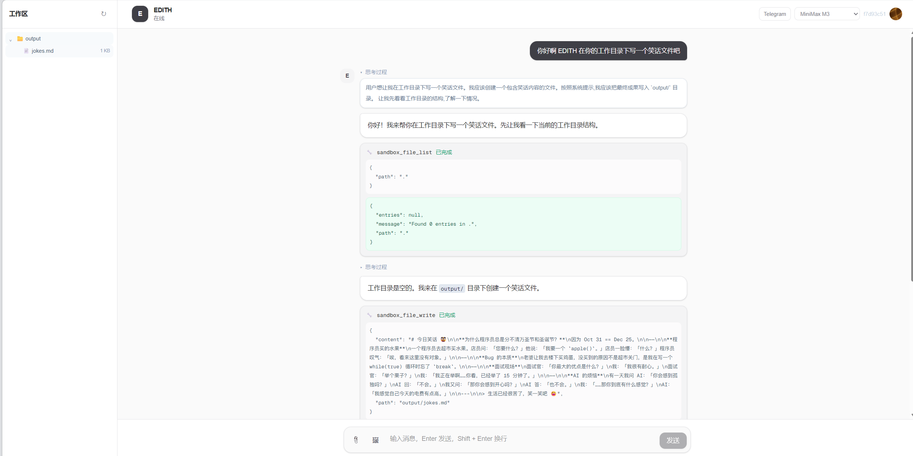
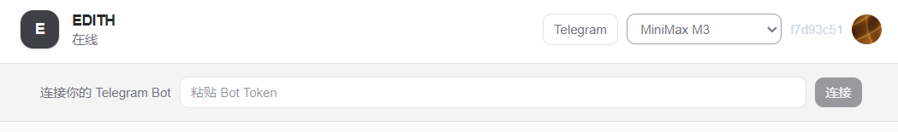

# EDITH

> **中文** | [English](README.md)

一个面向多用户的服务端 Agent MVP：Web 登录、流式对话、会话隔离、Sandbox 工作区，以及用户自带 Telegram Bot 接入。

## 名字来源

EDITH 致敬《蜘蛛侠：英雄远征》中的 AI 系统 **E.D.I.T.H.**：

> **Even Dead, I’m The Hero.**

这个项目借鉴的不是电影设定，而是它的核心意象：AI 不只负责聊天，也能理解任务、调用工具，并在受控工作区中真正完成事情。

## 当前能力

- Clerk 登录后使用 EDITH；浏览器提交的 `user_id` 不被信任，由 Next.js BFF 从登录态注入。
- Web 流式对话：模型选择、思考过程、工具调用、历史会话加载。
- 图片直接作为视觉输入发送给支持视觉的模型。
- 普通文件上传到当前会话的 Sandbox；Agent 可处理它们。
- 工作区文件树：查看 Agent 生成的文件并下载。
- Local / E2B 两种 Sandbox 后端。
- 系统 Skills：公共、只读的 Skills 随 E2B Template 预装；Agent 按需读取完整说明后执行。
- 用户在页面填写自己的 Telegram Bot Token；后端注册 Webhook，消息进入该用户的 Agent 空间。
- GitHub MCP 工具集。



## 架构

```text
Web Browser
    │ Clerk 登录
    ▼
Next.js BFF
    │ 从登录态注入可信 user_id
    ▼
Go Backend
    │ Gateway → Runner.Run(APPName, user_id, session_id)
    ▼
Agent + Tools + Local / E2B Sandbox
```

```text
用户自己的 Telegram Bot
    │ Webhook: /webhook/telegram/{routeKey}
    ▼
TelegramService
    │ routeKey → ownerUserID + Telegram Client
    ▼
Gateway → Runner → Agent
    │
    └── 使用同一个 Bot Client 回复消息
```

核心隔离边界：

```text
APPName + user_id + session_id
```

## 目录

```text
.
├── backend/      Go 后端：Agent、Gateway、Sandbox、Telegram、HTTP API
├── web/          Next.js：Clerk、聊天页、BFF、SSE
├── docs/         EDITH 架构设计与学习笔记
├── .claude/      项目级 Agent / Skill 配置
└── .codex/       项目级 Agent / Skill 配置
```

## 本地启动

### 1. 准备配置

在两个目录中分别复制环境变量模板：

```powershell
Copy-Item backend/.env.example backend/.env
Copy-Item web/.env.example web/.env
```

然后填写：

- `backend/.env`：DeepSeek、MiniMax、GitHub Token；按需配置 E2B 与 Telegram Webhook。
- `web/.env`：Clerk Publishable Key 与 Secret Key。

本地 Sandbox 默认可用：

```dotenv
SANDBOX_MODE=local
```

### 2. 启动后端

```powershell
cd backend
go run .
```

默认地址：`http://127.0.0.1:8080`

### 3. 启动前端

新开一个终端：

```powershell
cd web
npm install
npm run dev
```

打开：`http://localhost:3000`

## Telegram 接入

1. 在 Telegram 中通过 BotFather 创建 Bot，取得 Bot Token。
2. 让后端可被公网 HTTPS 访问，例如使用 ngrok。
3. 在 `backend/.env` 配置：

```dotenv
TELEGRAM_WEBHOOK_BASE_URL=https://your-public-domain
```

4. 登录 EDITH，点击右上角 **Telegram**，填入自己的 Bot Token。

后端会验证 Token、生成内部 `routeKey` 并向 Telegram 注册 Webhook。前端不需要知道 `routeKey`。

若本地无法直接访问 Telegram API，可配置代理，记得代理端口要和clash之类的软件上的端口号一致：

```dotenv
TELEGRAM_PROXY=http://127.0.0.1:7897
```



## 开发检查

```powershell
# 需要 GNU Make；Windows 可使用 Git Bash、MSYS2 或 Scoop 安装 make。
make check
make build
```

常用命令：

```text
make backend-run    启动 Go 后端
make web-dev        启动 Next.js 开发服务
make check          后端测试 + 前端 TypeScript 检查
make build          构建前后端
```

## 当前 MVP 边界

- Telegram Bot 配置目前仅保存在后端内存中，重启后需要重新填写 Token。
- 当前不校验 Telegram 消息发送者；收到私聊消息后，会进入该 Bot 所属用户的 Agent 空间。
- E2B 需要自行填写 API Key；本地开发默认使用 Local Sandbox。
- `.env`、私钥、运行时工作区和构建产物不应提交到 Git。

## 文档

- [IM 接入设计](docs/IM接入设计.md)
- [多用户改造计划](docs/多用户改造计划.md)
- [tRPC-Agent-Go 学习笔记](docs/learn/trpc-agent-go/01-核心心智模型.md)

## License

[MIT](LICENSE)