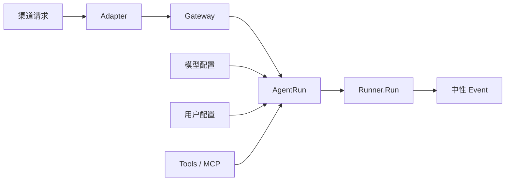

# Go 架构心智模型

这份文档记录我偏好的 Go 架构。目标不是追求某种“标准写法”，而是让代码满足：

> **显式、线性、模块自治、少抽象。打开源码就能沿调用链一直读下去。**

## 为什么需要这套心智模型

没有统一骨架时，代码很容易演变成：

```text
请求进来
  ├─ 去公共 webapi 找路由
  ├─ 去 service 找业务
  ├─ 去 repository 找数据库
  ├─ 去 utils 找转换
  └─ 再经过多层 New / interface / resolve
```

每个文件看起来都分类整齐，但一个功能被横向切碎，无法回答：它是谁、由谁创建、依赖谁、结果交给谁。

这套架构采用**纵向功能模块**：一个功能拥有完成职责所需的全部器官；只有真正跨模块的调用才连接出去。

## 总体骨架

```text
外部请求
   │
   ▼
Adapter             渠道协议翻译
   │
   ▼
Gateway             统一身份与会话
   │
   ▼
AgentRun            聚合一次运行需要的配置
   │
   ▼
Runner.Run          真正执行
   │
   ▼
中性 Event          唯一输出
```



主流程只有一条。配置可以从四面八方汇入 AgentRun，但不能让这些配置模块接管主流程。

## 模块是一个完整个体

每个功能模块管理自己的：

```text
模块
├─ 数据表与 Store
├─ 业务能力
├─ HTTP types（有 HTTP 时）
├─ 路由注册（有 HTTP 时）
├─ Tool（属于该功能时）
└─ README 心智模型
```

例如 `cronjob` 自己拥有任务表、CRUD、HTTP、Tool 和 Scheduler；不把数据库操作集中丢进公共 `repository`，也不把路由集中丢进 `webapi`。

它类似一个进程内的小型服务：边界和职责独立，但仍共享同一个进程与数据库，不承担微服务的网络和部署成本。这个类比只用于理解自治边界，不代表模块之间必须通过 HTTP 通信。

## main.go 负责什么

`main.go` 是**显式组装图**，负责：

```text
打开长期资源
   ↓
创建顶层功能模块
   ↓
连接平级模块
   ↓
注册各模块路由
   ↓
启动 Scheduler / HTTP
   ↓
进程退出时关闭资源
```

适合放在 `main`：

- 数据库、Session Service、Runner 等进程级资源。
- `userconfig`、`models`、`cronjob`、`AgentRun`、`Gateway` 等顶层个体。
- 顶层个体之间的依赖连接。
- 路由是否注册、主动组件是否启动。
- 进程退出时的关闭顺序。

不适合放在 `main`：

- 模块内部的 Store、HTTP、ToolSet 等小结构体。
- 业务判断和数据库语句。
- 为了隐藏组装而出现的总管 `Server.NewEverything()`。

```go
// 喜欢：源码直接展示真实连接。
users := userconfig.New(db)
models := models.New(users.Providers)
runs := agentrun.New(agentrun.Dependencies{
    Models:   models.Catalog,
    Settings: users.Settings,
})

users.HTTP.Register(mux)
models.HTTP.Register(mux)
```

## 顶层模块与内部器官

判断由谁创建：

```text
它是否是能独立描述职责的顶层个体？
  ├─ 是 → main 创建并连接
  └─ 否 → 所属模块内部创建
```

例如：

```text
main
├─ 创建 AgentRun
├─ 创建 Gateway
└─ 把 AgentRun 交给 Gateway

AgentRun.New
├─ 创建 sessionLanes
├─ 创建 runConfigurations
└─ 创建 runLifecycle 所需能力
```

`Gateway` 和 `AgentRun` 是平级个体，因此由 main 连接；`sessionLanes` 只是 AgentRun 的内部器官，不应泄露给 main。

## 结构体字段与函数参数

设计一个模块前，先不急着拆文件或写 `NewXxx`。先问：**这个长期存在的对象，应该拥有什么能力、状态与身份？**

```text
结构体字段
├── 长期能力：Runner、Sandbox、数据库、HTTP Client
├── 长期状态：缓存、Map、Mutex、配置
└── 稳定身份：App ID、基础 Prompt、目录路径

函数参数
└── 本次调用才有的输入：ctx、userID、sessionID、消息、请求选项
```

判断方式：

```text
每次调用都会变化？
  ├─ 是 → 函数参数
  └─ 否 → 它是否属于对象长期能力、状态或身份？
           ├─ 是 → 结构体字段
           └─ 否 → 不应出现在这个对象中
```

不要把本次请求的 `userID` 塞进长期 Service；也不要让每次调用都重复传递长期数据库依赖。

## 依赖要显式，但不能变成参数墙

构造顶层模块时使用具名依赖结构体：

```go
agentRuns, err := agentrun.New(agentrun.Dependencies{
    Runner:    managedRunner,
    Models:    modelCatalog,
    Settings:  settings,
    Providers: providers,
    MCP:       mcp,
})
```

这样能直接看出依赖身份，也避免一长串位置参数。不要使用全局 Service Locator，也不要让构造函数在内部偷偷创建顶层依赖。

模块内部的小结构体可以直接字面量组装，不必每个结构体都写 `NewXxx`：

```go
store := &store{db: deps.DB}
return &Module{
    Jobs: &Jobs{store: store},
    HTTP: &HTTP{jobs: store},
}
```

## 接口只放在真正的替换边界

不要因为 Go 流行接口就到处定义接口。

优先使用具体类型；只有调用方确实只关心一项可替换能力时，才在**调用方所在包**定义小接口：

```go
// Scheduler 不关心 Gateway，只需要“执行任务”的能力。
type JobRunner interface {
    RunJob(job Job)
}
```

合理使用场景：渠道 Adapter、外部服务替换点、Scheduler 的执行入口。不要为每个 Store、Service 和函数机械制造接口。

## HTTP 归属功能模块

有 HTTP 的模块自己拥有 `types.go`、路由和输入输出转换：

```text
cronjob/
├─ types.go      HTTP 契约和领域类型
├─ routes.go     Register(mux)
├─ http.go       HTTP 输入 → 业务调用 → HTTP 输出
├─ store.go
└─ scheduler.go
```

`main` 只决定是否注册：

```go
cronJobs.HTTP.Register(mux)
images.HTTP.Register(mux)
```

不建立集中管理所有 CRUD 的 `webapi` 包。HTTP 只是模块公开能力之一，不是系统的中心。

## 聚合模块只能做聚合

有些模块天然需要汇集其他能力：

```text
AgentRun  ← 模型、用户设置、供应商凭据、MCP、图片
tools     ← Sandbox Tools、Cron Tools、系统 Tools
main      ← 顶层模块与生命周期
```

聚合器不能顺便吞掉被聚合模块的职责：

- AgentRun 加载配置，但不管理配置 CRUD。
- `tools` 汇总 Tool，但不实现 Sandbox 或 Cron 业务。
- main 连接模块，但不替模块组装内部器官。
- Gateway 翻译身份与会话，但不加载模型和 MCP。

## 运行时主流程必须线性

喜欢这种源码：

```go
func (s *Service) Run(request Request) (*Stream, *Error) {
    validate(request)
    acquireSessionLane(request)
    configured := s.configurations.Load(request)
    return s.startManagedRunner(configured)
}
```

不喜欢主流程隐藏在：

- 回调函数。
- 闭包保存的重要状态。
- `handle → process → resolve → execute` 的含糊跳转。
- Event channel 在很多无关层之间传递。
- 一个万能 `Server` 或 `Runtime` 吞下所有能力。

异步不是问题，**隐式异步**才是问题。启动 goroutine 的地方必须能看出：谁读取、谁关闭、谁负责异常收尾。

## 命名规则

名字直接说明领域动作与对象：

```text
喜欢                         不喜欢
LoadDefaultModelID           resolveModel
ClaimDue                     processJob
RunJob                       handleTask
OpenWorkspace                getResource
timelineProjection           helper / utils
```

文件名按职责命名，而不是按模糊技术词分类：

```text
configuration.go
execution.go
timeline_projection.go
schedule_store.go
```

如果一个名字无法回答“它具体做什么”，就继续改名。

## 文件拆分规则

拆文件是为了降低一次阅读需要记住的东西，不是为了追求文件数量。

```text
同一模块、同一职责、线性阅读舒服 → 放在一起
同一模块、不同职责、文件开始难读 → 分文件
拥有独立身份和生命周期          → 才考虑分模块
```

不要把每个小结构体拆成一个模块，也不要为了所谓复用创建公共 `utils` 大杂烩。

## 生命周期必须能追踪

对长期资源和 goroutine，必须回答：

```text
谁创建？
谁启动？
谁停止？
谁关闭 channel / DB / Client？
中途失败由谁收尾？
```

资源归属原则：**谁拥有，谁关闭；main 只关闭进程级资源，模块关闭自己拥有的资源。**

重要收尾不要散落成很多 `defer` 或隐藏在回调里。可以用一个职责明确的生命周期对象集中表达，但不能让它接管主业务流程。

## Context 的使用边界

`context.Context` 表示一次调用的取消、截止时间和框架透传信息，不是通用依赖容器。

- HTTP Context 只约束 HTTP 请求本身。
- 后台 Agent 若应脱离 HTTP 断线，必须显式创建自己的任务 Context。
- Tool 可以按框架约定从 Invocation Context 读取可信 `UserID / SessionID`。
- 数据库、Service 等长期依赖不能偷偷塞进 Context。

使用框架 Context 魔法时，代码注释必须说明信息由谁注入、在哪里读取。

## 代码注释与模块 README

注释统一使用中文，言简意赅地说明：

- 输入是什么。
- 输出是什么。
- 方法在什么调用场景使用。
- 不明显的框架语义和生命周期边界。

每个模块保留一个短 README：

```text
这个模块是谁
      │
      ├─ 拥有什么文件与能力
      ├─ 依赖谁
      └─ 被谁调用、输出给谁
```

README 必须描述真实代码，不能成为脱离实现的愿景文档。

## 明确拒绝的模式

- 公共 `webapi` 管理所有模块路由和 DTO。
- 公共 `repository` 集中所有表操作。
- 公共 `utils` 收留无法归类的代码。
- 无替换需求却到处定义接口。
- 多层构造函数隐藏真正依赖。
- 一个 `Server` 创建所有模块，再整体丢给 main。
- 为未来可能复用而提前抽象。
- 用回调或闭包保存核心运行状态。
- 把 `userID` 等可信身份交给 AI 作为 Tool 参数填写。
- 只看编译结果，不核对框架事件和生命周期语义。

## 开发前检查

写代码前先回答：

1. 这个功能属于哪个完整个体？
2. 它的数据、HTTP 和 Tool 应该归谁？
3. 它是顶层模块还是模块内部器官？
4. 谁在 main 中创建并连接它？
5. 本次调用参数与长期依赖是否分开？
6. 主流程能否用一条线画出来？
7. goroutine、Context、channel 和外部连接由谁收尾？
8. 是否真的需要接口或新的抽象层？

## 代码评审检查

打开任意模块，应能快速回答：

```text
它是谁？
它负责什么？
谁创建它？
谁调用它？
它依赖谁？
结果交给谁？
资源由谁关闭？
```

如果需要在很多目录间跳转才能回答，说明职责边界或命名仍不清晰。

## 一句话带走

> **功能模块各自自治，main 显式连接顶层个体，主流程保持线性，抽象只出现在真实边界。**
