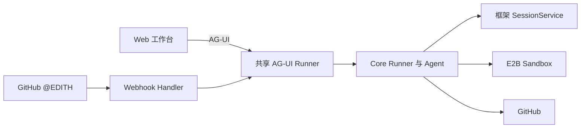
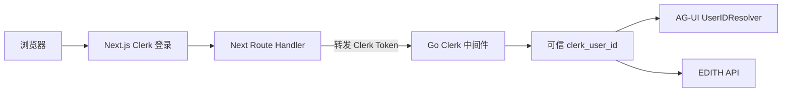
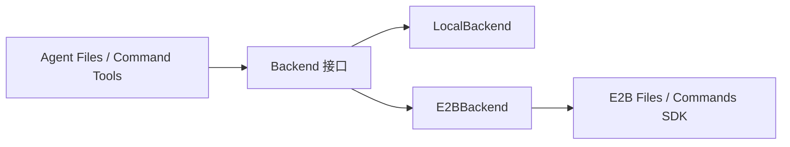
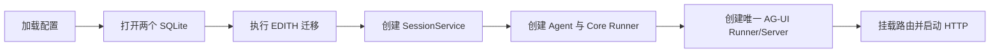
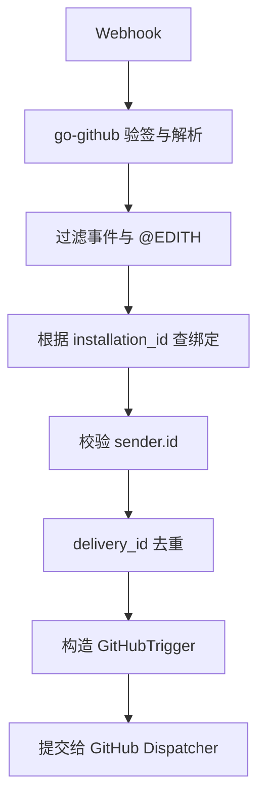
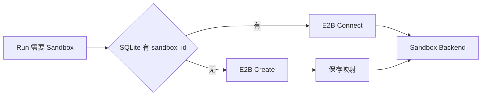

？# EDITH MVP 实施计划

> 本文交给实现 Agent 使用。开始编码前，必须先读完：
>
> 1. [产品分析](./产品分析.md)
> 2. [架构设计](./架构设计.md)
> 3. [细节设计](./细节设计.md)

### 实现 Agent 强制规则

遇到不会写、不确定 API、或不理解框架行为的地方，必须先阅读当前公网依赖版本的官方文档和源码；源码已建立 CodeGraph 索引时优先使用 CodeGraph 定位调用链。只有确认职责边界、输入输出和生命周期后才能编码。

```text
禁止猜测不存在的 API
禁止照搬其他版本示例
禁止用全局变量或重复造轮子绕开尚未理解的框架能力
禁止因为源码难读就擅自修改既定架构
```

如果 CodeGraph 尚未 Init，先建立索引；无法确认时明确记录问题和证据，不得用“应该可以”代替查证。

## 一、目标与完成标准

实现一个模块化单体 Go 后端，并配套一个 Next.js Web 前端，让同一个 Agent 同时服务 Web 工作台和 GitHub：

当前进度：阶段 1、2 已完成；下一步是阶段 3。

### 30 秒总览

```text
阶段 1-2  已完成登录、数据库和 Web 对话
阶段 3    管理员命令绑定 Clerk 用户与个人 GitHub Installation
阶段 4    一个 Session 复用一个 E2B Sandbox
阶段 5-7  接收 GitHub 评论、运行 Agent、回写结果
阶段 8    端到端验收
```



MVP 完成时必须跑通：

```text
1. Web 能创建对话、实时查看 Agent 输出、刷新后恢复历史。
2. GitHub Issue/PR 评论中 @EDITH 能触发同一个 Agent。
3. 同一 Issue/PR 使用稳定 Session，能够延续历史。
4. 同一 GitHub Session 运行中再次 @EDITH，会追加到当前 Run。
5. 一个 Session 始终复用同一个 E2B Sandbox。
6. 服务重启后，可根据 SQLite 中的 sandbox_id 连接原 Sandbox。
```

## 二、不可推翻的架构前提

实现 Agent 不要重新讨论或替换以下决策：

```text
Go 后端使用一个进程部署，不拆微服务；Next.js 作为独立前端运行时。
一个 Issue / PR / Web 新对话 = 一个 Session。
一个 Session = 一个 E2B Sandbox。
不引入 Task、Workspace、MQ、Redis、事务队列。
Web 与 GitHub 共用同一个 AG-UI Runner、Core Runner、Agent 和 SessionService。
Web Run 期间禁止再次发送消息，不实现 Web enqueue。
GitHub Run 期间的新消息使用 EnqueueUserMessage。
Agent 自己决定 clone、checkout、commit、push 和创建 PR 的时机。
```

身份与租户模型固定为：

```text
EDITH 是多用户系统，一个 Clerk 用户就是一个租户。
Clerk Token 的 sub 是唯一可信 Web 身份，业务代码称其为 clerk_user_id。
所有租户共用同一个由环境变量配置的 EDITH GitHub App。
MVP 每个 Clerk 用户只能绑定一个个人 GitHub Installation。
users 与 github_installations 是绑定关系的唯一事实源，不用配置文件保存租户映射。
阶段 3 使用管理员命令完成绑定，不开发安装回调和前端绑定页面。
```

数据所有权：

```text
框架 SessionService  保存 Session、消息和执行历史
E2B                  保存文件与运行现场
GitHub               保存代码、分支、Commit、PR 和评论
EDITH SQLite          只保存用户绑定、Sandbox 映射和 Webhook 去重
```

## 三、指定技术与本地参考

新项目根目录固定为仓库根部的：

```text
edith/
```

`docs/EDITH/` 只保存设计文档，正式项目的全部实现都位于 `edith/`。

在 `edith/` 内建立独立 `go.mod`。所有 Go 依赖从公网模块仓库下载，不允许添加指向本地 `docs/` 的 `replace`：

```text
禁止：replace trpc.group/... => ../docs/trpc-agent-go
```

实现开始时使用公网最新可用版本解析依赖，完成编译和测试后把实际版本锁定在 `edith/go.mod` 与 `edith/go.sum`。若最新的 AG-UI、Core 与 Session SQLite 模块存在版本兼容问题，选择能够共同编译的最新兼容组合，并在交付说明中记录原因，不回退到本地源码替换。

指定技术和本地阅读参考：

| 能力 | 指定实现 | 本地参考 |
| --- | --- | --- |
| Agent 与 Runner | `trpc-agent-go` | `docs/trpc-agent-go` |
| Web 协议 | 框架 AG-UI Server | `docs/trpc-agent-go/docs/mkdocs/zh/agui` |
| Web 应用 | Next.js App Router + CopilotKit | `docs/trpc-agent-go/examples/agui/client/copilotkit` |
| Web 身份 | `@clerk/nextjs` | Clerk 当前官方 Next.js Quickstart |
| Go 身份 | `github.com/clerk/clerk-sdk-go/v2` | Clerk 当前官方 Go SDK 文档与下载版本源码 |
| GitHub Webhook/API | `go-github/v69` | `docs/go-github` |
| GitHub App Token | `go-github` + JWT | GitHub 官方文档与公网依赖源码 |
| EDITH 数据库 | SQLite + `go-sqlite3` | 公网 Go Module 与标准 `database/sql` |
| SessionService | 框架 SQLite SessionService | `docs/trpc-agent-go/session/sqlite` |
| Sandbox | `github.com/eric642/e2b-go-sdk` | `docs/e2b-go-sdk`、`docs/E2B对接文档/e2b-go-sdk-ai-reference.md` |

本地 `docs/` 只帮助理解设计，真正实现时以公网下载到 Go Module Cache 的对应版本源码和 API 为准，因为本地参考可能已经落后。

已经完成的架构实验在 `forward/`。不要重新做相同实验，也不要应用：

```text
forward/verify_agui_enqueue/framework.patch
```

不得修改或 import `docs/trpc-agent-go`、`docs/go-github`、`docs/e2b-go-sdk` 中的源码。这些目录只是阅读参考，不是新项目依赖。

## 四、MVP 范围

### GitHub 只支持

```text
Issue 普通评论中 @EDITH
PR 普通评论中 @EDITH
```

两者都由 `IssueCommentEvent` 表达；通过 `issue.pull_request != nil` 区分 Issue 与 PR。

暂不支持：

```text
Issue opened 自动触发
PR opened / synchronize 自动触发
PR review submitted
PR review 行级评论
Organization Installation
其他用户代替租户触发
```

只有以下条件全部满足才处理：

```text
Webhook 签名有效
action == created
评论正文包含 @EDITH，匹配时忽略大小写
sender 不是 bot
installation_id 已绑定
sender.id == 绑定用户的 github_user_id
delivery_id 尚未处理
```

### Web 只支持

```text
AG-UI 实时对话
MessagesSnapshot 历史恢复
历史 Session 列表
Run 期间禁用发送按钮
```

取消按钮可以继续使用框架内置 Cancel 路由，但不扩展取消语义。

### Next.js、CopilotKit 与 Clerk 最小接入

Web 使用 Next.js App Router + Clerk + CopilotKit。目标是直接复用现成的登录骨架、聊天 UI 和 AG-UI 代理，不维护一套庞大的自定义 AG-UI Hook。

Next.js 只是 Web 工作台和 BFF，不成为第二个业务后端。Session、Agent、Sandbox、GitHub 和数据库业务仍全部属于 Go 服务。

部署时包含 Next.js 前端运行时和一个 Go 业务进程。Agent、AG-UI、GitHub、SQLite 和 E2B 对接全部留在 Go 进程内。



前端：

```text
使用 @clerk/nextjs
App Router 根布局挂 ClerkProvider
未登录进入 Clerk SignIn 页面
已登录才展示 CopilotChat 工作台
新建工作台生成稳定且不可猜测的 threadId，并进入 `/chat/{threadId}`
Run 进行中禁用发送
```

Next Route Handler：

```text
/api/copilotkit  使用 CopilotKit Runtime + HttpAgent 转发到 Go AG-UI
/api/sessions    薄代理当前用户的 Session 列表
```

每次代理请求先通过 Clerk `auth()` 取得当前登录态，再调用默认 `getToken()` 取得 Session Token，并把它作为 `Authorization: Bearer <token>` 转发给 Go。MVP 不创建自定义 JWT Template，也不要在模块初始化时写死某个用户 Token。

`threadId` 是工作台路由的一部分，不使用 Cookie，也不只保存一个全局 `localStorage` 值：点击“新建工作台”时生成 UUID 并跳转到 `/chat/{threadId}`；从历史 Session 列表进入时跳转到对应 URL。这样刷新、前进后退和多个工作台都具有稳定身份。

后端：

```text
使用 github.com/clerk/clerk-sdk-go/v2
使用当前下载版本提供的官方 net/http 鉴权能力
从验证后的请求 Context 取得 clerk_user_id
公开路由只有健康检查和 /webhook/github
```

禁止手写 JWT/JWKS 验证器。具体 Next.js 和 Go API 必须以实现时下载的官方 SDK 源码为准，不照搬旧教程猜包名。

框架的 CopilotKit 示例只作为接入骨架，不整份复制其中巨大的报告面板和自定义事件镜像。MVP 只保留 `CopilotKit Provider`、`CopilotChat`、动态 `threadId` 和必要的 Tool 展示。

CopilotKit 示例没有替 EDITH 实现历史 Session 列表和 MessagesSnapshot 恢复；这两项仍分别调用 Go 的 Session 列表接口与 AG-UI history 路由，但不要另写一套消息存储。

不接 Clerk Webhook。日常请求只验证 Clerk Token 并使用其中的 `sub`；只有阶段 3 的管理员绑定命令会额外查询一次 Clerk Backend API，取得 GitHub `provider_user_id`。不保存 email、avatar、login 等无关资料。

## 五、目标代码边界

保持模块化单体。目录名称可以小幅调整，但职责不得重新混回 `main.go`：

```text
edith/
├── go.mod                     独立 Go Module，不使用本地 replace
├── go.sum
├── cmd/edith/main.go          只负责启动和关闭
├── cmd/edith-bind/main.go     管理员手工绑定用户与 Installation
├── internal/config/           读取并校验配置
├── internal/store/            EDITH SQLite、迁移和四组 Repository
├── internal/identity/         Clerk 身份解析
├── internal/githubapp/        GitHub App Token、绑定校验、Webhook 解析
├── internal/sandbox/          Session 与 E2B Sandbox 的连接/创建
├── internal/runtime/          共享 Runner 组装、GitHub 调度、ActiveRunIndex
├── internal/httpserver/       路由与 HTTP Handler
├── agent/                     Agent、Backend 与 Tools
├── web/                       Next.js App Router + Clerk + CopilotKit
└── data/                      本地运行数据，不提交数据库文件
```

### Backend 统一边界

Agent 的文件操作和命令操作必须只依赖同一个 `Backend` 接口：

```go
type Backend interface {
    ReadFile(ctx context.Context, path string) (string, error)
    WriteFile(ctx context.Context, path, content string) error
    ListDir(ctx context.Context, path string) ([]DirEntry, error)
    ExecCommand(ctx context.Context, command, workDir string) (string, error)
    // 其余文件能力只在实际需要时增加。
}
```



- `LocalBackend` 用于本地开发和测试。
- `E2BBackend` 把同一接口翻译成 E2B Files 与 Commands SDK 调用。
- Tools 中禁止出现 `if local / if e2b` 分支。
- Agent、Prompt 和 Tool 参数不暴露本地路径与 Sandbox 路径的实现差异。
- 每个 `E2BBackend` 绑定本次 Session/Run 取得的 `sbx`，不使用全局 Sandbox。

> **切换运行环境只替换 Backend 实现，不修改 Agent 和 Tools。**

## 六、最小数据模型

业务库建议使用 `edith/data/edith.db`；框架 SessionService 使用 `edith/data/sessions.db`。分开保存，避免 EDITH 表与框架内部表相互耦合。

启动时执行幂等迁移：

```sql
CREATE TABLE IF NOT EXISTS users (
    clerk_user_id  TEXT PRIMARY KEY,
    github_user_id INTEGER NOT NULL UNIQUE,
    created_at     DATETIME NOT NULL DEFAULT CURRENT_TIMESTAMP
);

CREATE TABLE IF NOT EXISTS github_installations (
    installation_id INTEGER PRIMARY KEY,
    clerk_user_id    TEXT NOT NULL UNIQUE,
    created_at       DATETIME NOT NULL DEFAULT CURRENT_TIMESTAMP,
    FOREIGN KEY (clerk_user_id) REFERENCES users(clerk_user_id)
);

CREATE TABLE IF NOT EXISTS session_sandboxes (
    app_name   TEXT NOT NULL,
    user_id    TEXT NOT NULL,
    session_id TEXT NOT NULL,
    sandbox_id TEXT NOT NULL UNIQUE,
    created_at DATETIME NOT NULL DEFAULT CURRENT_TIMESTAMP,
    PRIMARY KEY (app_name, user_id, session_id)
);

CREATE TABLE IF NOT EXISTS webhook_deliveries (
    delivery_id TEXT PRIMARY KEY,
    created_at  DATETIME NOT NULL DEFAULT CURRENT_TIMESTAMP
);
```

Store 只提供真实用到的方法，不为每张表再造接口层：

```go
BindGitHubInstallation(ctx context.Context, clerkUserID string, githubUserID, installationID int64) error
FindUserByClerkID(ctx context.Context, clerkUserID string) (User, error)
FindInstallationByID(ctx context.Context, installationID int64) (Installation, error)
FindInstallationByClerkID(ctx context.Context, clerkUserID string) (Installation, error)
FindSandboxID(ctx context.Context, key session.Key) (sandboxID string, found bool, err error)
SaveSandbox(ctx context.Context, key session.Key, sandboxID string) error
TryInsertDelivery(ctx context.Context, deliveryID string) (inserted bool, err error)
```

`BindGitHubInstallation` 必须在一个事务中写两张身份表，并拒绝覆盖已有的其他绑定。

不要增加通用 BaseRepository、ORM、软删除、审计表和领域事件。

## 七、核心业务结构

GitHub Handler 把经过验证的 Webhook 转换为：

```go
type GitHubTrigger struct {
    ClerkUserID string
    SessionID   string
    Text        string
    GitHub      GitHubContext
}

type GitHubContext struct {
    InstallationID int64
    Owner          string
    Repo           string
    Subject        GitHubSubject // issue 或 pull_request
    Number         int
    DefaultBranch  string
    HeadBranch     string // PR only
    BaseBranch     string // PR only
    HeadSHA        string // PR only
}
```

Session ID：

```text
GitHub = github:{owner}/{repo}#{number}
Web    = AG-UI 客户端生成的 threadId
```

`IssueCommentEvent` 在 PR 场景只负责告诉我们“这是一个 PR 对话”，不保证携带完整的 head/base/SHA。GitHub Adapter 应使用 Installation Client 调用 `PullRequests.Get` 补齐这些可靠事实；不要让 Agent 猜分支。

框架 Session Key：

```text
AppName   = edith
UserID    = clerk_user_id
SessionID = 上述稳定 ID
```

## 八、关键运行链路

### 1. 服务启动



共享 Runner 和 AG-UI Server 只能在组合根创建一次。禁止 Handler 内临时创建 Runner。

### 2. Web 对话

```text
Web AG-UI RunAgentInput
→ 框架 SSE Service
→ 共享 AG-UI Runner
→ Core Runner / Agent
→ SessionService 保存历史
```

要求：

- `threadId` 直接作为 SessionID。
- `AppName` 固定为 `edith`。
- `UserIDResolver` 从服务端验证过的 Clerk 身份读取 UserID，不读取客户端伪造的 `forwardedProps.userId`。
- 使用框架 `/history` MessagesSnapshot，不实现自定义 `/api/history`。
- `/api/sessions` 只包装 `SessionService.ListSessions`，并使用 `WithListSessionOnlyMeta` 与分页。

### 3. GitHub Webhook



HTTP Handler 不等待 Agent 完整执行。完成验证、去重和提交后返回 `202 Accepted`；后台必须持续消费 AG-UI Event Channel，直到关闭，确保历史完整落盘。

### 4. GitHub 创建或追加 Run

`ActiveRunIndex` 只有一个职责：

```text
session.Key → active runID
```

需要三个并发安全操作：

```go
Reserve(key, newRunID) (runID string, created bool)
Get(key) (runID string, ok bool)
Delete(key, runID) // 只有 ID 匹配时才删除
```

流程：

```text
Reserve 成功
→ 准备本次 RuntimeState
→ 调用共享 AG-UI Runner.Run
→ 消费 Event Channel
→ defer Delete(key, runID)

Reserve 返回已有 runID
→ EnqueueUserMessage(runID, message)
```

如果追加时框架返回 `request id not running`，说明 Run 正处于结束边界：删除匹配的旧记录，并把消息作为新 Run 重试一次。禁止无限重试。

创建 GitHub Run 时，把 `GitHubContext` 放入 `RunAgentInput.State`，再由框架的 `StateResolver` 写入本次 `RuntimeState`。Token、`sbx` SDK 对象和数据库连接不得放入 State。Agent 与 Tools 从本次调用上下文取得 RuntimeState，不使用包级全局 GitHub 上下文或全局 Sandbox。

### 5. Session Sandbox



创建 Sandbox 必须配置：

```text
on_timeout = pause
auto_resume = true
```

每个 Run 只取得一次 `sbx` 并在该 Run 内复用。不要维护全局 Sandbox 对象缓存，不主动 Pause，不调用 Kill，不写心跳。

并发创建同一 Session 时，以数据库联合主键保证最终只有一个正式映射；如果极端竞争创建出多余 Sandbox，记录警告即可，MVP 不设计复杂回收器。

### 6. GitHub Token 与 Agent 工作现场

每次 GitHub Run 开始时：

```text
installation_id
→ GitHub App 生成短期 Installation Token
→ 作为 GH_TOKEN 注入该 Session 的 Sandbox
→ Agent 使用 git / gh
```

禁止：

```text
写入全局 os.Setenv
写入 Prompt、Session、数据库或日志
拼入 Git Remote URL
写入 Git 凭证文件
```

简单 GitHub 操作直接使用 `git` / `gh`。复杂长文本评论与创建 PR 可继续通过 Tool，目的只是避免命令转义，不是隐藏 Token。

Agent 获得 repo、Issue/PR 编号、默认分支、PR head/base/SHA 等事实后，自行决定 clone、fetch 和 checkout。SandboxProvider 不管理 Git。

## 九、实现顺序

严格按下面顺序推进。每一步通过测试后再进入下一步，不要一次重写整个仓库。

### 阶段 1（已完成）：项目、Next/Clerk 骨架与 SQLite

- 独立 Go Module、Next.js/Clerk 骨架、Go Clerk 鉴权与请求 Context 已完成。
- 两个 SQLite、四张业务表、Repository、配置校验和优雅关闭已完成。
- 身份中间件会拒绝缺失或伪造的 Token；业务 Handler 只读取验签后的 `clerk_user_id`。
- 相关 Go 测试、构建和前端类型检查已通过。

### 阶段 2（已完成）：共享 Runtime 与 Web AG-UI

- 实现 Agent 创建与依赖组装逻辑。
- 创建 SQLite SessionService、Core Runner、唯一 AG-UI Server。
- 挂载 `/agui`、`/agui/history`、`/agui/cancel`。
- `UserIDResolver` 读取阶段 1 已验证并写入 Context 的 Clerk UserID。
- 实现 Next `/api/copilotkit` Route Handler：从当前登录态取得默认 Clerk Session Token，动态创建/配置 HttpAgent 并转发给 Go AG-UI；不得写死用户 Token。
- 不实现自定义 `/api/history`，直接使用框架的 `/agui/history`；仅实现薄 `/api/sessions`，用于列出当前用户的历史 Session。
- Web 在 Run 期间禁用发送按钮。
- CopilotKit 使用动态 `threadId`，不得保留示例中的固定 `demo-thread`。
- Next `/api/copilotkit` 将请求流式代理到 Go AG-UI，不在 Next 中保存业务状态。

验收：Web 可对话、流式展示、刷新恢复历史、列出 Session。

### 阶段 3：管理员绑定用户与 Installation

MVP 采用人工开户，不实现 GitHub 安装回调和前端绑定页面：

```text
用户使用 GitHub 登录 EDITH，并自行安装 EDITH GitHub App
→ 管理员从 Clerk Dashboard 取得 clerk_user_id
→ 管理员从 GitHub App 管理页取得 installation_id
→ 运行 edith-bind 命令
→ 命令验证后写入 users 与 github_installations
```

命令示例：

```text
go run ./cmd/edith-bind --clerk-user-id user_xxx --installation-id 123456
```

命令必须完成：

- 用 Clerk Go SDK 查询该用户唯一且已验证的 GitHub External Account，取得 `provider_user_id` 作为 `github_user_id`。
- 找不到符合条件的 GitHub External Account，或 `provider_user_id` 不是数字 ID 时，返回清晰错误且不写库。
- 用全局 GitHub App 身份查询 `installation_id`，不信任管理员输入本身。
- 仅当 Installation 属于个人账号，且 `installation.account.id == github_user_id` 时写库。
- `users` 与 `github_installations` 在同一事务中写入。
- 相同绑定重复执行必须成功；用户或 Installation 已绑定到另一方时必须拒绝。
- 不保存 Installation Token。

阶段 3 只新增 `cmd/edith-bind`、GitHub App 查询/校验代码和必要的 Store 方法；不改聊天链路，不实现 Web API。

验收：本人个人 Installation 可绑定并能从两种 ID 反查；其他账号、Organization Installation、无 GitHub 身份和冲突绑定均被拒绝；失败时不产生半条绑定数据。

### 阶段 4：E2B SandboxProvider

- 实现持有单次 Run `sbx` 的 `E2BBackend`。
- 实现 `GetOrCreate(session.Key)`。
- 有映射时 Connect；无映射时按 lifecycle 创建并保存。
- Backend/Tools 只依赖统一接口，不感知 E2B 生命周期。
- 用临时 SQLite 和 fake client 做单测；真实 E2B 只做一条集成测试。

验收：两个 Run 使用同一 sandbox_id；进程重新创建 Provider 后仍能连接原 Sandbox。

### 阶段 5：GitHub Webhook 与 GitHubTrigger

- 使用 `go-github.ValidatePayload` 和 `ParseWebHook`。
- 只处理符合范围的 `IssueCommentEvent`。
- 完成 mention、bot、Installation、sender 和 delivery 校验。
- 构造 `GitHubTrigger`，不要向后传原始 Webhook。
- Handler 返回 `202`，后台执行。

验收：无 mention、非法签名、其他用户、重复 delivery 均不会启动 Agent。

### 阶段 6：ActiveRunIndex 与 GitHub 执行

- 实现内存 `ActiveRunIndex`。
- Session 空闲时构造 AG-UI `RunAgentInput` 并调用共享 Runner。
- Session 忙碌时使用框架追加能力。
- 始终消费事件流；结束和错误都清理匹配记录。
- 测试两个并发 GitHub 消息只创建一个 Run，另一条被追加。

验收：同一 Issue 快速两次 `@EDITH`，历史中两条用户消息各出现一次，只有一个并发 Run。

### 阶段 7：Git、gh 与结果回写

- 每个 GitHub Run 按需获取 Installation Token。
- 注入 Session 专属 Sandbox。
- 保留统一 Backend，让 Agent 不感知本地与 E2B 差异。
- 简单操作使用 `git` / `gh`，长评论和创建 PR 使用 Tool。
- Prompt 只描述事实、默认行为与安全边界，不硬编码工作流步骤。

验收：Agent 能在 Sandbox 中读取仓库、修改代码，并通过 Tool 回复对应 Issue/PR。

### 阶段 8：最小端到端验收

必须手工跑通：

```text
Web 新建工作台 → 流式响应 → 刷新恢复
GitHub Issue @EDITH → Agent 回复
同一 Issue 再次 @EDITH → 延续历史和 Sandbox
运行中再次 @EDITH → 追加到当前 Run
PR 普通评论 @EDITH → 正确读取 PR 分支事实
服务重启 → 再次触发 → 连接原 Sandbox
重复发送同一 delivery_id → 不重复执行
```

最后运行：

```text
cd edith
go test ./...
go vet ./...
```

## 十、配置

至少支持：

```text
HTTP_ADDR
EDITH_DB_PATH
SESSION_DB_PATH
GITHUB_APP_ID
GITHUB_PRIVATE_KEY_PATH
GITHUB_WEBHOOK_SECRET
CLERK_SECRET_KEY
CLERK_AUTHORIZED_PARTIES
E2B_API_KEY
E2B_TEMPLATE_ID
LLM_MODEL
LLM_BASE_URL
LLM_API_KEY
```

前端另需：

```text
NEXT_PUBLIC_CLERK_PUBLISHABLE_KEY
CLERK_SECRET_KEY
GO_BACKEND_URL
```

启动时校验必填配置并返回清晰错误。生产代码不自行解析 `.env`；本地开发由启动环境或专用配置加载器负责。

`GITHUB_APP_ID`、私钥和 Webhook Secret 描述的是全局 EDITH GitHub App。禁止增加全局 `GITHUB_INSTALLATION_ID`；每个租户的 Installation 绑定只保存在 SQLite。

## 十一、明确禁止

实现 Agent 不得顺手加入：

```text
微服务、消息队列、Redis、分布式锁
Task / Workspace 新业务模型
Web 运行中插话
自动验证 Agent、规划 Agent、多 Agent 编排
Sandbox Kill、迁移、损坏恢复和定时清理
GitHub Organization 与团队权限
PR review 行级评论
完整管理后台
框架源码补丁
为了“以后可能用到”而新增的字段和接口
```

发现计划外问题时，先用最小实现完成当前闭环；只有确实阻塞验收标准时才暂停并报告。

## 十二、交付要求

每个阶段交付时说明：

```text
改了哪些文件
跑了哪些测试
哪些验收项已通过
是否存在真实阻塞
```

不要只提交报告；必须提交可运行代码和测试。不要用大量抽象掩盖尚未跑通的链路。

> **先完成一条真实闭环，再扩展能力；优先寄宿框架、GitHub 和 E2B，EDITH 只写不可替代的胶水。**
