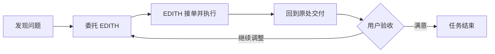
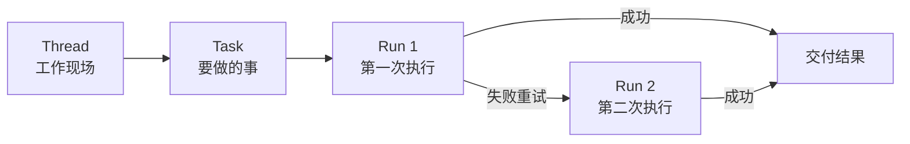
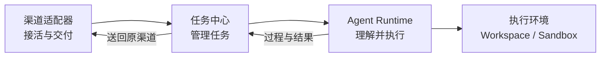
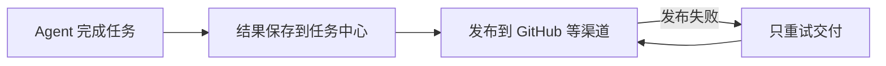
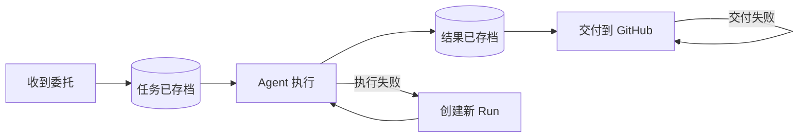
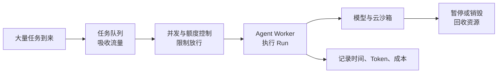

# EDITH 产品分析

## 一、用户怎样使用

用户不是在“启动 Agent”，而是在当前工作现场，把一件事委托给 EDITH。

GitHub 用户的工作现场是 Issue 和 PR；普通用户的工作现场是 Web。EDITH 应该进入这些现场工作，而不是要求用户迁移到另一个平台。

### 心智模型：委托闭环



整个过程可以压缩为：

> **发现 → 委托 → 交付 → 验收**

### 三种使用方式

- 在 Issue 中 `@EDITH`：处理问题、修改代码、创建 PR，再回到 Issue 交付结果。
- 在 PR 中 `@EDITH`：审查代码，再回到 PR 评论区给出意见。
- 在 Web 中：直接委托新任务，也可以查看 GitHub 等渠道产生的任务记录。

GitHub 是工作现场，Web 是统一工作台。用户不应为了使用 EDITH，被迫离开当前工作现场。

无论任务来自哪里，用户只需要关心三件事：

1. EDITH 是否接单？
2. 现在做到哪里？
3. 最后交付了什么？

Task、Run、Sandbox 和 Tool 都是内部实现，不应成为用户的使用负担。

> **在工作发生的地方委托，在原来的地方验收；Web 负责统一观察和管理。**

---

## 二、任务怎样流转

服务端 Agent 收到的不是一条临时聊天消息，而是一张需要持续推进的工单。

```text
Thread = 工作现场，例如一个 Issue、PR 或 Web 对话
Task   = 用户交代的一件事
Run    = 执行这件事的一次尝试
```

### 心智模型



例如，用户在 Issue 中要求修复 Bug：系统创建一个 Task；第一次拉取代码失败是 Run 1，自动重试成功是 Run 2。用户看到的仍然是同一件任务。

一个 Thread 可以包含多个 Task。用户回复正在等待的问题时，继续原 Task；任务完成后提出新要求，则创建新 Task。

> **Thread 保存上下文，Task 表达目标，Run 承担执行。**

---

## 三、谁负责什么

EDITH 可以分成四个逻辑角色：**接活的、管活的、干活的、提供工作环境的。** 这是职责边界，不代表必须拆成四个微服务。

### 心智模型



### 1. 渠道适配器：接活与交付

GitHub、Web、飞书只是不同入口。它们负责接收外部事件、转换成统一请求，并把结果送回原渠道，不直接运行 Agent。

### 2. 任务中心：管活

任务中心管理 Thread、Task 和 Run，控制开始、等待、重试与取消。它是任务状态的唯一真相来源，Web 也从这里查看所有渠道的任务。

### 3. Agent Runtime：干活

Agent Runtime 读取任务、理解上下文、调用模型和工具，并把过程与结果报告给任务中心。

> Agent 负责“怎么做”，任务中心负责“任务现在是什么状态”。

### 4. 执行环境：提供工作条件

```text
Workspace      = 提供文件、命令等操作能力
SandboxManager = 管理环境的创建、恢复、暂停与销毁
```

Agent 通过 Workspace 远程操作沙箱，但不负责沙箱的生命周期。

### 任务完成与结果交付必须分开



GitHub 评论发布失败时，只能重试交付，不能让 Agent 重新修改一次代码。

> **渠道负责来往，任务中心负责状态，Agent 负责决策，执行环境负责操作与资源。**

---

## 四、出问题怎么办

服务端 Agent 依赖模型、GitHub、网络、队列和云沙箱，任何一环都可能失败。可靠性设计不是保证永不出错，而是：

> **失败后不丢任务、不重复搞破坏，也不必全部从头再来。**

### 心智模型：存档点、局部重试、防重复



### 存档点

重要状态必须先保存，再进入下一步：先保存 Task，再启动 Agent；先保存执行结果，再向外部渠道交付。

### 局部重试

哪里失败，只重试哪里：Agent 失败就创建新 Run，GitHub 评论失败只重试评论，沙箱失效则恢复或重新创建环境。

### 防重复

Webhook、消息队列和网络请求都可能重复到达。系统必须通过外部事件 ID、Task ID 等识别重复操作，避免创建两个 Task、两个 PR 或两条相同评论。

### 失败的合理结局

```text
可以恢复       → 自动重试
需要用户信息   → Waiting，不算失败
无法自动处理   → Failed，保留原因，允许人工重试
用户主动停止   → Cancelled
```

重试必须有次数上限，避免坏任务无限消耗模型和沙箱费用。

> **重要节点先存档，失败只重试当前环节，所有外部操作都要防重复。**

---

## 五、变大、变久怎么办

传统 Web 系统常关注 QPS，但 Agent 系统真正昂贵的是：同时运行多少个 Run，以及每个 Run 消耗多少模型、时间和沙箱资源。

> **规模设计不是盲目追求高并发，而是控制任务进入和资源消耗。**

### 心智模型：排队、限额、计量、回收



### 排队

Webhook 收到任务后快速存档，不等待 Agent 完成。Worker 根据自身容量从队列获取 Run。初期可以用数据库实现队列，不必过早引入复杂中间件。

### 限额

系统应限制组织或用户并发数，以及单个 Run 的执行时间、Token、工具调用次数和自动重试次数，防止异常任务无限消耗资源。

### 计量

每个 Run 都要记录使用的模型、Token、执行时间、沙箱时长、成本和最终结果。这些数据是容量规划、成本优化与未来定价的基础。

### 回收

运行结束后暂停沙箱，长期未激活则销毁。历史消息、日志和产物也需要保留期限，避免系统随着时间无限膨胀。

### 核心稳定，边缘可替换

```text
增加飞书       → 新增渠道适配器
增加 Worker    → 提高并发执行能力
更换模型       → 替换模型适配器
更换 E2B       → 替换 Workspace / Sandbox 实现
```

扩展的关键不是提前拆成微服务，而是守住职责边界，让局部变化不会传染整个系统。

> **任务用队列削峰，资源用额度控制，成本按 Run 计量，长期资源必须回收；核心保持稳定，边缘允许替换。**
