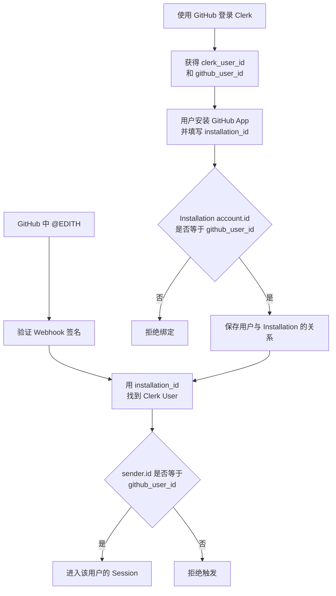
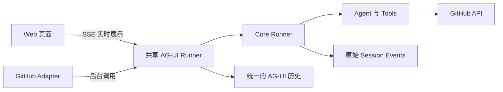
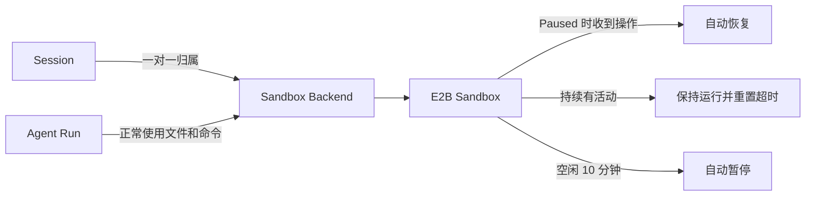
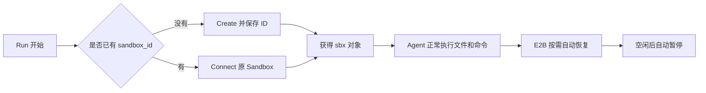
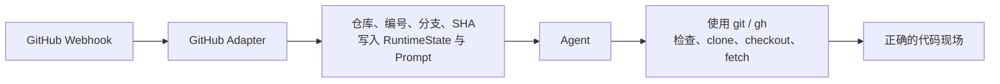
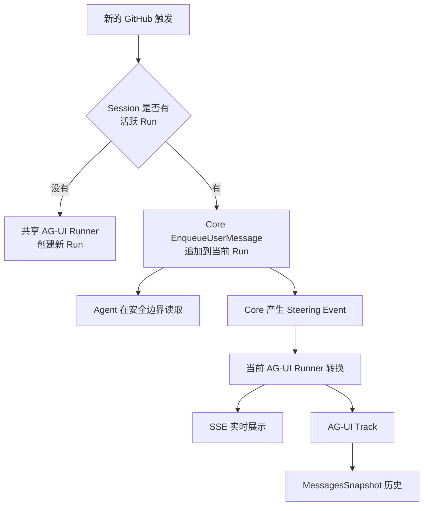

# EDITH 架构设计

## 一、用户与 GitHub 触发隔离

一个 Clerk User 就是一个租户。当前只允许使用 GitHub 登录 Clerk，不实现组织、团队和协作者权限。

### 心智模型



### 绑定 Installation

Clerk 的 GitHub 登录提供经过验证的 `github_user_id`。用户手动安装 GitHub App 并填写 `installation_id`，服务端查询该 Installation：

```text
installation.account.id == github_user_id
```

一致则保存绑定，不一致则拒绝。当前只支持 GitHub 个人账号安装，不支持 Organization Installation。

### 处理 `@EDITH`

Webhook 到达后，服务端先验证签名并防止重复处理，再通过 `installation_id` 找到租户。只有 `sender.id` 与该租户的 `github_user_id` 一致时，才允许消息进入对应 Session。

```text
Clerk user_id ↔ GitHub user_id
Clerk user_id → GitHub Installation
Clerk user_id → Session / Run / Secret / Sandbox
```

操作仓库时，服务端通过 GitHub App 按需生成短期 Installation Token，不保存用户的 GitHub Token。

> **Clerk 证明用户是谁，Installation 决定能操作哪些仓库，sender.id 决定是否为本人触发。**

---

## 二、Web 与 GitHub 如何共用 Agent

Web 和 GitHub 都进入**同一个 AG-UI Runner 实例**。区别只在入口：Web 把事件实时推给页面，GitHub 在后台静默读完事件。

> **✅ 已验证：** Web 经 SSE Service、GitHub 直接调用共享 AG-UI Runner 后，两边消息能够进入同一份 `MessagesSnapshot`，并由 `/history` 统一展示。实验代码、日志与结论见 [AG-UI 统一历史验证](../../forward/verify_agui/验证报告.md)。

### 心智模型



可以把它想成：**两个前台，共用一个翻译员和一台发动机。**

- AG-UI Runner 是共享翻译员：统一并发保护，并把执行事件整理成前端可读历史。
- Core Runner 是发动机：真正运行 Agent。
- SSE 只是 Web 的实时观看方式，不是另一套执行系统。

### Runner 核心映射

```text
appName   = edith
userID    = Clerk user_id
sessionID = github:{owner}/{repo}#{number}
requestID = EDITH run_id
```

同一个 Issue 或 PR 始终使用同一个 Session，因此连续 `@EDITH` 可以读取之前的对话历史。

### 基础伪代码

服务启动时只创建一次共享实例：

```go
coreRunner := runner.NewRunner("edith", agent)

sharedAGUIRunner := aguirunner.New(
    coreRunner,
    WithAppName("edith"),
    WithSessionService(sessionService),
)

// Web SSE 服务也使用这个实例
webService := sse.New(sharedAGUIRunner)
```

GitHub 不绕一圈 HTTP，直接调用同一个实例：

```go
sessionID := "github:" + owner + "/" + repo + "#" + number
runID := newRunID()

events, err := sharedAGUIRunner.Run(ctx, &RunAgentInput{
    ThreadID: sessionID,
    RunID:    runID,
    Messages: []Message{newUserMessage(prompt)},
    State:    githubRuntimeState,
})

// GitHub 不需要实时展示，但必须读完事件，完成历史转换与保存。
for range events {
}
```

Agent 最终通过 `comment_on_issue`、`comment_on_pr`、`create_pr` 等 Tool 回复 GitHub。

### 当前边界

- GitHub Session 在 Web 中先只读，用于查看统一历史。
- 不自建 SSE 协议，不引入 SQLite 任务队列、Redis 或 Kafka。
- 不引入 Task 业务层；Issue/PR 是 Session，活跃执行由 Run 表达。
- 同一 GitHub Session 快速收到新消息时，不创建并发 Run，而是追加到当前 Run。Web 工作台在 Run 期间禁止再次发送消息。
- 伪代码字段名需要在实现时按框架版本编译校正。

> **双入口，共享一个 AG-UI Runner；一次执行，两端共用同一份前端历史。**

---

## 三、Session 与 Sandbox 生命周期

一个 Session 对应一个 E2B Sandbox。后续 Run 回到同一个 Sandbox，继续使用其中的代码和环境。

> **✅ 已验证：** Sandbox 在 Paused 状态下，直接执行 `Files.Read` 或 `Commands.Run` 会自动恢复为 Running，原文件现场完整保留；服务重新取得 Session 后，也能通过持久化的 `sandbox_id` 重新连接原 Sandbox。实验代码与原始结果见 [E2B Session 复用验证](../../forward/verify_e2b_session_reuse/verification_log.txt)。

### 心智模型



职责边界非常简单：

```text
EDITH          管理 Session 使用哪个 Sandbox
E2B Lifecycle  管理 Sandbox 何时恢复、运行和暂停
Agent / Tools  只使用 Backend，不感知生命周期
```

`sbx` 是当前 Go 进程内操作远程 Sandbox 的 SDK 对象，可以把它看作遥控器；`sandbox_id` 是持久化的配对码。进程运行时直接使用 `sbx`，E2B 自动恢复；进程重启后，根据 Session 查出 `sandbox_id`，调用 `Connect` 重新获得 `sbx`。



### 创建配置

创建 Sandbox 时，把生命周期交给 E2B：

```go
sandbox := e2b.CreateSandbox(
    Timeout(10 * time.Minute),
    Lifecycle{
        OnTimeout:  "pause",
        AutoResume: true,
    },
)
```

Sandbox 暂停后，下一次文件、命令或 HTTP 操作会自动恢复；持续活动会重置超时，空闲后再次自动暂停。因此 EDITH 不实现心跳续期，也不要求 Agent 调用创建、恢复或暂停 Tool。

### 当前边界

- 暂不主动 Kill Sandbox，保留每个 Session 的工作现场。
- MVP 不维护全局 Sandbox 对象缓存；每个 Run 开始时根据映射执行一次 Connect 或 Create，Run 内复用同一个 `sbx`。
- 不引入额外的 Workspace 业务模型。
- 不为假想的“Sandbox 损坏”设计迁移和容灾。
- 代码成果仍由 Agent 按任务需要提交到 GitHub。
- 这里只确定关系与职责；数据库字段等最小链路跑通后，再由真实需求决定。

> **Session 保存对话归属，Sandbox 保存工作现场；EDITH 管归属，E2B 管生命周期。**

---

## 四、GitHub 凭证与操作边界

EDITH 按需生成短期 GitHub App Installation Token，并以 `GH_TOKEN` 注入该 Session 的专属 Sandbox。Agent 可以直接使用 `git` 和 `gh` 完成日常操作。

```text
EDITH 生成 Installation Token
              ↓
注入专属 Sandbox 的 GH_TOKEN
              ↓
Agent 使用 git / gh
              ↓
GitHub
```

### Tool 的边界

是否封装 Tool 取决于**操作是否复杂**，而不是为了隐藏 Token：

```text
简单操作 → 直接使用 git / gh
复杂操作 → 封装 Tool，减少命令拼接和长文本转义
```

例如 `git status`、`git commit`、`git push` 可以直接执行；长篇 Issue / PR 评论等容易出现引号、换行和转义问题的操作，封装为 Tool。

### 最低安全规则

- Token 不写入 Prompt、Session 或日志。
- Token 不拼进 Git Remote URL，也不写入 Git 凭证文件。
- GitHub App 只申请产品真正需要的权限。
- MVP 不引入 Token Proxy 或 E2B Header Transform。

> **短期 Token 直接进入专属 Sandbox；Agent 自由使用 git / gh，Tool 只解决复杂操作。**

---

## 五、代码现场由 Agent 自主准备

EDITH 不编排固定的 clone 和 checkout 流程。GitHub Adapter 提供可靠事实，Agent 根据当前任务自己准备代码现场。

### 心智模型



这不是让 Agent 猜分支，而是：

```text
系统提供事实和行为边界
Agent 根据任务决定具体 Git 操作
```

### 两种业务场景

```text
Issue
系统提供：repo、default_branch、issue_number
Agent 通常从默认分支创建 edith/issue-{number}，也可按用户要求选择其他分支

PR
系统提供：repo、head_branch、base_branch、head_sha、pr_number
Agent checkout PR 对应代码，MVP 只做审查、检查和评论
```

同一 Session 后续 Run 会回到原 Sandbox。Agent 先检查已有代码现场，再决定是否需要 clone、fetch 或切换分支，不重复执行固定初始化脚本。

### 职责边界

```text
GitHub Adapter  提供准确上下文
Prompt          说明默认行为和权限边界
Agent           自主准备与操作代码
SandboxManager  只提供 Sandbox，不管理 Git
```

> **系统告诉 Agent 在哪里、要处理什么；Agent 自己决定怎样把代码准备到位。**

---

## 六、数据所有权与最小持久化

EDITH 不复制框架、E2B 和 GitHub 已经保存的数据，只持久化自己独有的业务关系。

```text
框架 Session Service  → 对话与执行历史
E2B                    → Sandbox 文件和运行现场
GitHub                 → 代码、Commit、Branch、PR 和评论
EDITH 数据库           → 用户绑定关系 + Session 与 Sandbox 的关系
```

恢复已有 Sandbox 的核心信息只有 `sandbox_id`。因此目前只确定这条关系：

```text
session_key → sandbox_id
```

服务端持有 E2B API Key。找到 `sandbox_id` 后直接使用 Sandbox；如果它处于 Paused 状态，E2B 会在第一次操作时自动恢复。

创建 Sandbox 时可以附加 `app`、`user_id`、`session_id` 等 E2B Metadata，方便排查和反向查找，但它不代替 EDITH 数据库中的正式映射。

具体表结构和字段在最小链路跑通后，根据真实查询需求决定。

> **谁产生的数据归谁保存；EDITH 只保存跨系统之间的业务关系。**

---

## 七、GitHub 连续消息与 Web 工作台

Web 不是普通 Chatbot，而是服务端 Agent 工作台：

```text
一个 Web 新对话 = 一个 Session = 一个 Sandbox
```

GitHub 与 Web 只是 Session 的两种来源，后续共用同一套 Runner、Agent、Backend 和 Sandbox。

> **✅ 已验证：** 运行中通过 Core Runner 的 `EnqueueUserMessage` 追加消息后，Agent 能够在当前 Run 中读取；同一条消息会进入 Session Events、原 SSE 实时流、AG-UI Track 和 `MessagesSnapshot`，且历史中只出现一次。无需修改 AG-UI 框架。实验代码、日志与结论见 [Core Enqueue 与 AG-UI 同步验证](../../forward/verify_core_enqueue_agui/验证报告.md)。

### GitHub 连续消息的心智模型



GitHub 入口不判断新消息意图，不取消当前 Run，也不建立等待队列。

框架已经负责同一 Session 的并发保护和 Run 生命周期。EDITH 只补一个进程内 `ActiveRunIndex`：

```text
session_key → active_run_id
```

它只是让新的 GitHub 消息能找到当前 `runID`。GitHub Session 空闲时创建 Run 并登记，运行中时追加消息，Run 结束后删除记录。

Web 工作台不接入这条追加链路：Run 期间前端禁止再次发送，等待当前 Run 结束后再发起下一次 AG-UI 请求。MVP 不增加 Web `/enqueue` 路由，也不包装框架 SSE Service。

### 双端同步心智模型

可以把 GitHub 与 Web 想成同一个 Session 的两个微信终端：

```text
GitHub 追加消息    ≈ 电脑端发送消息
Web 工作台在线    ≈ 手机端正在打开聊天界面
SSE               ≈ 在线实时同步
MessagesSnapshot  ≈ 离线后重新打开时恢复聊天记录
```

- Web 保持当前 Run 的 SSE 连接时，追加消息与 Agent 后续响应会实时显示。
- Web 未打开或 SSE 已结束时，消息仍保存在 Track 中，之后通过 `/history` 恢复。
- Run 结束后再次追加会返回 `request id not running`，不会产生幽灵消息；调用方按 Session 空闲路径创建新 Run。

初始消息由 AG-UI Runner 记录为 `CUSTOM user_message`；运行中的追加消息由 Core Steering Event 转换为 `TEXT_MESSAGE`。内部路径虽然不同，但最终都会被 `MessagesSnapshot` 还原为正常用户消息，EDITH 不介入这层实现。

> **GitHub 忙碌时允许追加；Web 忙碌时禁止发送。**

---

## 下一阶段：架构验证

先做最小验证版本，不直接建设完整产品。只验证三个最关键的架构假设：

```text
1. ✅ GitHub 与 Web 共用 AG-UI Runner，历史能够统一展示（已验证）
2. ✅ 连续消息能够追加到当前 Run，并正确进入 SSE 与历史（已验证）
3. ✅ Session 能够找到并复用同一个 E2B Sandbox，SDK 操作能够自动恢复（已验证）
```

三条关键链路已经全部跑通，宏观架构能够闭环。下一阶段进入正式模块与最小数据设计；暂不补齐全部 Tool，也不提前优化 Agent 质量。

> **架构验证完成：双入口统一历史、连续消息同步、Session 工作现场复用均已得到真实实验支持。**
