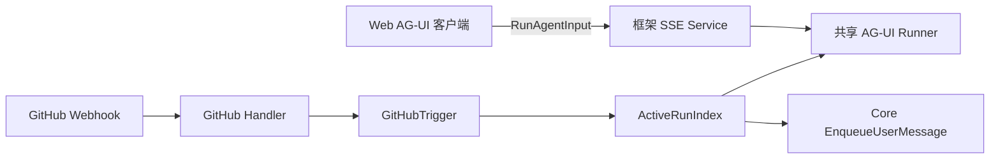
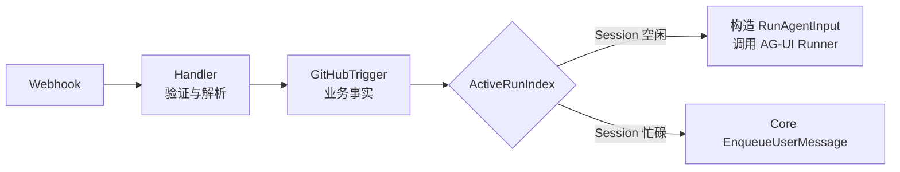
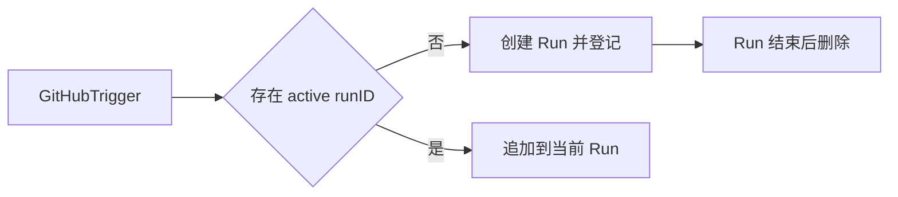

# EDITH 细节设计

本文从真实请求链路反推模块、接口和数据，不预先设计完整数据库。

## 一、Web 与 GitHub 的入口模型

Web 与 GitHub 最终共用 AG-UI Runner，但不需要在 HTTP 入口处强行转换成同一个结构体。



原因是 Web 已经有完整的 AG-UI 协议入口。再次建立 `Web Handler → IncomingMessage → RunAgentInput` 只会重复框架已经完成的工作。

Web 工作台在 Run 期间禁止再次发送消息。MVP 不为 Web 增加 `/enqueue` 路由，也不包装框架 SSE Service；当前 Run 结束后，用户才能发起下一次 AG-UI 请求。

### Web Session 从哪里来

AG-UI 的 `RunAgentInput.threadId` 就是框架使用的 `SessionID`：

```text
AppName   = "edith"
UserID    = Clerk 登录用户
SessionID = RunAgentInput.threadId
```

新建 Web 工作台时，AG-UI 前端生成一个随机且稳定的 `threadId`；该工作台后续的实时对话、历史消息和取消请求继续使用相同的 `threadId`。

EDITH 不需要为此设计一套 `POST /sessions` 和 `POST /sessions/{id}/messages` 协议。服务端仍必须通过 Clerk 登录态解析真实 `UserID`，不能相信前端自行声明的用户身份。

### 历史消息与历史会话列表

这两个能力不同：

```text
历史消息      已知 threadId，恢复该 Session 里的消息
历史会话列表  只知道 UserID，列出该用户拥有的所有 Session
```

AG-UI Server 已内置实时对话、消息快照和取消路由，但没有内置“历史会话列表”HTTP 路由。

框架底层 `SessionService` 已提供 `ListSessions`，并支持只返回元数据和分页。因此未来需要工作台侧边栏时，EDITH 只需增加一个很薄的鉴权接口：

```text
GET /api/sessions
    ↓
从 Clerk 登录态取得 UserID
    ↓
SessionService.ListSessions(AppName="edith", UserID)
```

MVP 若暂时不展示历史工作台列表，可以先不提供该接口，也不需要为此新建 EDITH 会话表。

## 二、GitHub 入口的最小模型

GitHub 没有 AG-UI 客户端。Webhook 还需要完成验签、本人鉴权、仓库解析和 Installation 定位，因此保留一个小型业务模型是合理的。

它不再叫通用的 `IncomingMessage`，而叫一眼就能看懂的 `GitHubTrigger`：

```go
// GitHubTrigger 是一条通过验证、准备交给运行层的 GitHub 触发消息。
// 它不是数据库表，也不保存 Run 或 Sandbox 状态。
type GitHubTrigger struct {
    UserID    string
    SessionID string
    Text      string
    GitHub    GitHubContext
}

type GitHubContext struct {
    InstallationID int64
    Owner          string
    Repo           string
    Subject        GitHubSubject
    Number         int

    DefaultBranch string

    // 只有 PR 场景需要。
    HeadBranch string
    BaseBranch string
    HeadSHA    string
}

type GitHubSubject string

const (
    GitHubSubjectIssue GitHubSubject = "issue"
    GitHubSubjectPR    GitHubSubject = "pull_request"
)
```

GitHub Handler 根据 Webhook 稳定推导：

```text
SessionID = github:{owner}/{repo}#{number}
```

### 为什么不在 Handler 中直接构造 RunAgentInput

直接构造虽然代码更少几行，但会把三种职责混在一起：

```text
解析 GitHub Webhook
表达 GitHub 业务事实
决定启动 Run 还是追加当前 Run
```

`GitHubTrigger` 让边界保持清晰：



因此最终判断是：

- Web 直接使用框架的 `RunAgentInput`，不经过自定义消息模型。
- GitHub 使用最小的 `GitHubTrigger`，不要让原始 Webhook 泄漏进运行层。
- GitHub 入口根据 `ActiveRunIndex` 决定创建新 Run，或向当前 Run 追加消息。

### 明确不放入 GitHubTrigger 的内容

```text
run_id           由 GitHub 入口创建或从 ActiveRunIndex 查找
sandbox_id       由 SandboxProvider 根据 Session 查询
active / status  属于运行时状态
E2B sbx 对象     属于一次 Run 内资源
完整 Webhook     只属于 GitHub Handler
delivery_id      只用于 Webhook 幂等处理
sender_id        Handler 完成本人鉴权后不再向后传递
```

> **Web 寄宿 AG-UI 协议；GitHub 只保留自己的业务翻译层；两者在 Runner 层汇合。**

## 三、ActiveRunIndex

框架已经负责同一 Session 的并发保护、Run 执行和结束清理。EDITH 只需要补充框架没有公开的查询关系：

```text
SessionKey → active runID
```

新的 GitHub 消息通过它找到当前 Run：



实现只需要一个进程内 `map` 和一把锁，不持久化、不排队、不管理 Run 生命周期。

> **`ActiveRunIndex` 只是一本临时通讯录，不是调度系统。**

## 四、MVP 最小数据库

EDITH 只保存跨系统的业务关系，共四张表。

### users

保存 Clerk 用户与 GitHub 身份的绑定：

```text
clerk_user_id   string    主键
github_user_id  int64     唯一，GitHub 用户 ID
created_at      time
```

### github_installations

保存用户安装的 GitHub App：

```text
installation_id  int64     主键
clerk_user_id    string    唯一，关联 users
created_at       time
```

MVP 只支持个人账号，因此一个用户只绑定一个 Installation。Installation Token 按需生成，不进入数据库。

### session_sandboxes

保存完整 Session Key 与 E2B Sandbox 的一对一关系：

```text
app_name     string    联合主键，固定为 edith
user_id      string    联合主键，Clerk user ID
session_id   string    联合主键
sandbox_id   string    唯一
created_at   time
```

查询方向只有：

```text
(app_name, user_id, session_id) → sandbox_id
```

Sandbox 状态、超时和暂停时间不保存，由 E2B Lifecycle 管理。

### webhook_deliveries

保存已经接收的 GitHub Webhook ID，防止同一次投递重复启动 Agent：

```text
delivery_id  string    主键，来自 X-GitHub-Delivery
created_at   time
```

Webhook 验签和鉴权成功后先插入；主键冲突表示已经处理，直接返回成功。MVP 接受“写入后进程立即崩溃可能漏处理”的极小窗口，不为此引入事务队列。

### 明确不建表

```text
sessions       由框架 SessionService 保存
messages       由框架 SessionService 保存
runs           由框架 Runner 管理
active_runs    只存在进程内 ActiveRunIndex
github_data    由 GitHub 保存
tokens         按需生成，不持久化
sandbox_state  由 E2B 管理
```

> **三张关系表加一张去重表；不复制框架、GitHub 和 E2B 已有的数据。**
