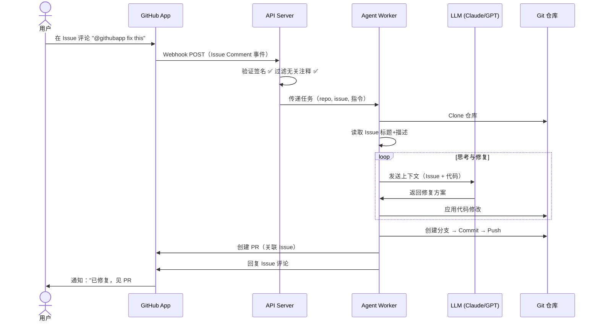
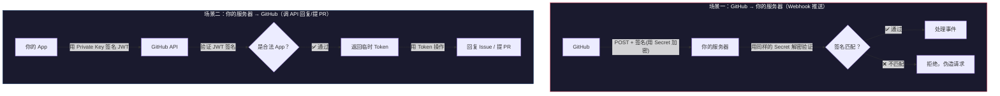
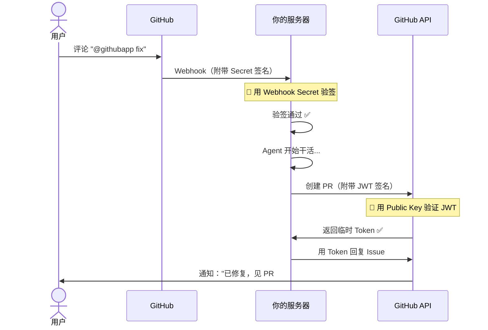

# GitHub Agent - 架构心智模型

## 一句话理解

> 用户在 Issue 里 @githubapp，服务端 Agent 自动拉代码、修 bug、提 PR。

## 心智模型

```
┌──────────────────────────────────────────────────┐
│                   你的大脑                         │
│                                                  │
│  看到 Issue → 理解问题 → 找到代码 → 改代码 → 提 PR │
└──────────────────────────────────────────────────┘
                     ↑ 我们要让机器做的事
                     ↓ 拆成三层

┌────────────┐    ┌────────────┐    ┌────────────┐
│  GitHub    │    │ API Server │    │   Agent    │
│  App       │───→│  耳朵+眼睛  │───→│   大脑     │───→ 回来
│  触发入口   │    │  过滤+认证   │    │  思考+执行  │
└────────────┘    └────────────┘    └────────────┘
   "通知来了"      "是谁？合法吗？"    "我来干活"
```

## 三层心智

| 层 | 角色 | 类比 | 做什么 |
|---|---|---|---|
| **GitHub App** | 门铃 | 收到快递按门铃 | 监听事件，推送通知给服务端 |
| **API Server** | 门卫 | 查身份证、过滤广告 | 接收请求、验签、过滤无效触发 |
| **Agent Worker** | 工匠 | 拿到图纸开始干活 | Clone 代码 → LLM 分析 → 修复 → 提 PR |

## 完整流程



## 认证体系 — 这些凭据都是干嘛的

### 凭据一览

| 凭据 | 是什么 | 为什么需要 |
|---|---|---|
| **App ID** | GitHub 给你 App 发的身份证号 | 告诉 GitHub "我是谁" |
| **Private Key** | App 的私钥，只有你有 | 用 RSA 签名证明"我真的是这个 App" |
| **Webhook Secret** | 你和 GitHub 之间的暗号 | 防止别人伪造请求骗你 |

### 两个完全不同的认证场景



### 一句话总结

- **Webhook Secret**：别人推消息给你时，你验证真假用的（防伪造）
- **Private Key**：你去 GitHub 干活时，证明你是你用的（身份认证）

### 时序：两个认证分别在哪一步



## 项目结构

```
GithubAgent/
├── main.go              # 启动入口
├── config/              # 配置管理
├── server/              # API Server（Gin）
│   └── webhook.go       # 接收 GitHub Webhook
├── github/              # GitHub 操作
│   ├── auth.go          # JWT + Token 认证
│   └── git.go           # Clone/Push/PR
├── agent/               # Agent Worker（trpc-agent-go）
│   ├── agent.go         # 核心编排
│   ├── tools.go         # 工具：读写文件、搜索、执行命令
│   └── prompt.go        # System Prompt
└── model/               # LLM Provider 接口
    └── provider.go      # 可插拔 LLM 支持
```
