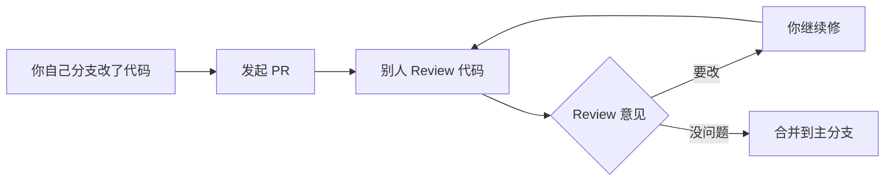
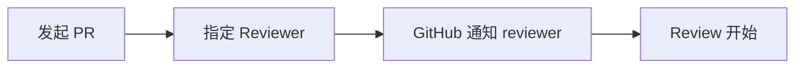
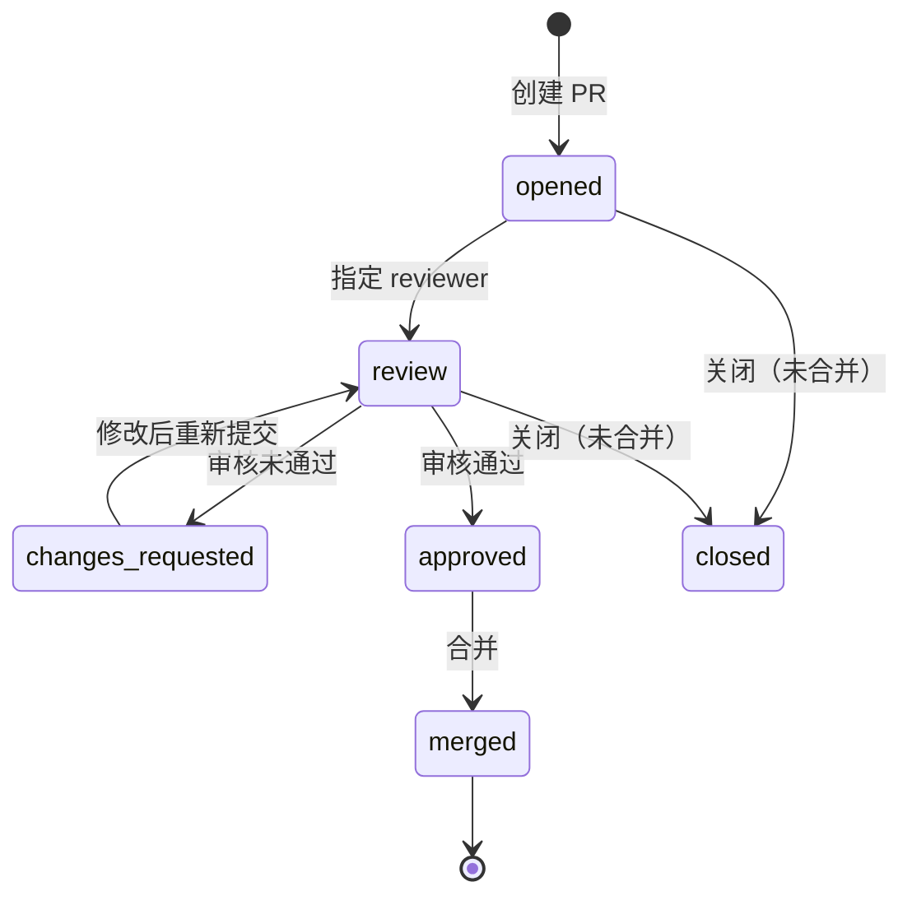

# PR 入门指南

> Pull Request = 提交流代码变更 + 请求别人审核

---

## 一、PR 是什么

PR 就是**一份代码变更申请单**：

```
你改了代码 → 发一个 PR → 别人审核 → 审核通过 → 合并到主分支
```



---

## 二、PR 的核心流程 — 三个环节

### 1. 发起 PR

你改了代码，推送到分支，然后 GitHub 上点"New Pull Request"。

PR 的页面有三个部分：

```
┌─────────────────────────────────────────┐
│  PR 标题: [fix] 修复登录页面样式错乱     │
│  描述: 用户反馈登录按钮偏移...           │
├─────────────────────────────────────────┤
│  Files Changed（文件变更）              │
│  ┌─────────────────────────────────┐   │
│  │ src/login.go                    │   │ ← 改了什么文件
│  │ + 10 // 新增代码               │   │
│  │ - 3  // 删除代码               │   │
│  └─────────────────────────────────┘   │
├─────────────────────────────────────────┤
│  Conversation（讨论区）                │
│  大家可以在这里讨论这个 PR              │
└─────────────────────────────────────────┘
```

### 2. Review 代码（审核）

Review 是 PR 最核心的环节——**别人一行一行地看你的代码**。

GitHub 有三种 Review 结果：

| Review 结果 | 含义 | 后续 |
|---|---|---|
| **Comment** | "这块代码我觉得xxx，你参考一下" | 不阻塞合并 |
| **Approve** | "没问题了，合吧" | ✅ 可以通过 |
| **Request Changes** | "这块有问题，必须改" | ❌ 阻塞合并，改了重新审核 |

### 3. 合并

三种合并方式：

```
Merge Commit     — "创建一次合并提交"
                    保留完整历史，能看到"从哪分出来的，在哪合并的"

Squash and Merge — "压缩成一个提交"
                    把 PR 里所有 commit 压成一个，历史干净

Rebase and Merge — "变基"
                    把 PR 的 commit 一个一个放到主分支上
```

---

## 三、你问的三个问题

### ① "代码行上还能评论？"

**能。这是 Review 的核心能力。** 在 PR 的 Files Changed 页面：

```go
func Login(username, password string) (bool, error) {
    if username == "" {
        return false, nil  // ← 点这行，写评论
    }
    // ...
}
```

点一下某一行，GitHub 弹出输入框：

```
┌──────────────────────────────────────┐
│                                      │
│  ✅ 这里应该返回一个明确的错误      │
│  建议改成 return false,             │
│  errors.New("username required")     │
│                                      │
│  ┌──────────┐  ┌───────────┐         │
│  │ Add single│  │ Start     │         │
│  │ comment   │  │ review    │         │
│  └──────────┘  └───────────┘         │
└──────────────────────────────────────┘
```

两种模式：

| 方式 | 什么时候用 | 效果 |
|---|---|---|
| **Add single comment** | 随口提一句 | 直接发出去，算一次评论 |
| **Start a review** | 打算系统性地 Review | 评论暂存，等全部写完后一次性提交 Review |

**场景举例：**
- "这里少了个空指针判断"
- "变量名改成 camelCase"
- "这段逻辑可以抽成一个函数"

> **对我们 Agent 来说**：监听 `pull_request_review_comment` 事件，就能知道有人在某行代码上提出了意见，EDITH 可以自动按意见改代码。

---

### ② "PR 被 review（提交意见）" 是什么意思

**这是 Review 完成、提交最终结论的时机。** 对应 `pull_request_review` 事件。

```
Reviewer 看完代码后，点击 "Finish your review"
    │
    ├── 选 Comment      → "我觉得xxx，供参考"
    ├── 选 Approve      → "没问题，合吧"
    └── 选 Request Changes → "必须改，改完再看"
    │
    ▼
    触发 pull_request_review 事件
```

**和我们 Agent 的关系：**
- 如果有人 Request Changes → Agent 自动分析意见并修复
- 如果 Approve → Agent 可以自动合并

---

### ③ "PR 被请求 review" 是什么意思

**就是"有人点名让你审代码"。** 对应 `pull_request_review_requested` 事件。



场景：

```
PR 创建者:
    "@EDITH 帮我 review 一下这个 PR？"
    
GitHub:
    触发 pull_request_review_requested 事件
    → EDITH 收到通知 → 自动开始 review
```

或者 PR 页面手动点 "Request review"：

```
Assignees: [选择一个 review 的人]

Request:  ├── @lucy971326
          ├── @EDITH        ← 点这里
          └── @somebody
```

> **对我们 Agent 来说**：如果 EDITH 被指定为 reviewer，收到这个事件就自动开始审代码，然后提交 Approve 或 Request Changes。

---

## 四、PR 相关的事件一览

| 事件 | 触发时机 | EDITH 能干什么 |
|---|---|---|
| **pull_request** (opened) | PR 被创建 | 自动 review 代码 |
| **pull_request** (synchronize) | PR 有新的 commit 推送 | 自动 re-review |
| **pull_request** (closed) | PR 被合并/关闭 | 清理任务 |
| **pull_request_review** (submitted) | Review 完成（Approve/Request Changes） | 根据 Review 意见改代码 |
| **pull_request_review** (dismissed) | Review 被驳回 | 标记处理 |
| **pull_request_review_comment** | 在代码行上写评论 | 按行级意见修复 |
| **pull_request_review_requested** | 有人被指定为 reviewer | 自动开始 review |
| **pull_request_review_request_removed** | 移除了 reviewer | 取消任务 |

---

## 五、总结：PR 生命周期



> **记不住的记住一句**：PR 就是**"你写代码 → 我来看 → 改改改 → 合进去"**的完整流程。
