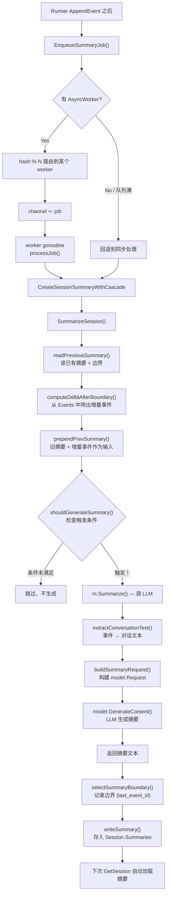

# 通过接口+结构体结构快速理解概念

> 接口 -> 能做什么
> 结构体 -> 需要什么


## Runner

### 接口（能干什么）

```go
// 基础接口
type Runner interface {
    Run(ctx, userID, sessionID, message, opts...) (<-chan *event.Event, error)
}

// 扩展接口
type ManagedRunner interface {
    Runner
    Cancel(requestID)
    RunStatus(requestID) RunStatus
}
```

### 结构体（需要什么）

```go
type runner struct {
    // ── 身份与配置 ──
    appName                         string
    defaultAgentName                string
    agents                          map[string]agent.Agent
    agentFactories                  map[string]AgentFactory

    // ── 外部服务 ──
    sessionService                  session.Service
    memoryService                   memory.Service
    ingestor                        session.Ingestor
    artifactService                 artifact.Service
    evolutionService                evolution.Service
    pluginManager                   agent.PluginManager

    // ── 高级功能 ──
    ralphLoop                       *RalphLoopConfig
    candidateSelector               CandidateSelector
    candidateSelectOptions          candidateSelectOptions
    awaitUserReplyRouting           bool
    persistInterruptedAssistantDefault bool

    // ── 资源管理 ──
    ownedSessionService             bool
    closeOnce                       sync.Once

    // ── 并发控制 ──
    runsMu                          sync.RWMutex
    runs                            map[string]*runHandle
}

type runHandle struct {
    cancel context.CancelFunc
    queue  *steer.Queue
    mu     sync.RWMutex
    status RunStatus
}
```

## Agent

### 接口（能干什么）

```go
type Agent interface {
    Run(ctx, invocation *Invocation) (<-chan *event.Event, error)
    Tools() []tool.Tool
    Info() Info
    SubAgents() []Agent
    FindSubAgent(name string) Agent
}
```

### 抽象结构体（需要什么）

```go
type Invocation struct {
    // ── 执行上下文 ──
    Agent              Agent
    AgentName          string
    InvocationID       string
    Branch             string
    Session            *session.Session
    SessionService     session.Service
    Model              model.Model
    Message            model.Message
    RunOptions         RunOptions

    // ── 外部依赖服务 ──
    MemoryService      memory.Service
    ArtifactService    artifact.Service

    // ── Agent 转移 ──
    TransferInfo       *TransferInfo

    // ── 结构化输出 ──
    StructuredOutput   *model.StructuredOutput
    StructuredOutputType reflect.Type

    // ── 运行控制 ──
    ParentMetadata     *ParentInvocationMetadata
    MaxLLMCalls        int
    MaxToolIterations  int
    Plugins            PluginManager
}
```

### 具体实现：LLMAgent

```go
type LLMAgent struct {
    // ── 身份 ──
    name                string
    description         string

    // ── 模型 ──
    model               model.Model
    models              map[string]model.Model
    modelSelector       agent.ModelSelector

    // ── Prompt ──
    instruction         prompt.Text
    systemPrompt        prompt.Text
    genConfig           model.GenerationConfig

    // ── 工具与执行 ──
    flow                flow.Flow
    tools               []tool.Tool
    userToolNames       map[string]bool
    codeExecutor        codeexecutor.CodeExecutor
    workspaceRegistry   *codeexecutor.WorkspaceRegistry
    planner             planner.Planner
    subAgents           []agent.Agent

    // ── 回调 ──
    agentCallbacks      *agent.Callbacks

    // ── 结构化输出 ──
    outputKey           string
    outputSchema        map[string]any
    inputSchema         map[string]any
    structuredOutput    *model.StructuredOutput
    structuredOutputType reflect.Type

    // ── 原始配置 ──
    option              Options
}
```

### Option

```go
// 配置函数
type Option func(*Options)
```

## Model

### 接口（能干什么）

```go
type Model interface {
    GenerateContent(ctx, request *Request) (<-chan *Response, error)
    Info() Info
}

// 可选扩展：流式场景下降低 channel 开销
type IterModel interface {
    Model
    GenerateContentIter(ctx, request *Request) (Seq[*Response], error)
}

type Seq[T any] func(yield func(T) bool)
```

### 结构体（需要什么）

```go
// ── 请求 ──
type Request struct {
    Messages         []Message
    GenerationConfig                 // 内嵌：Stream/Temperature/MaxTokens...
    StructuredOutput *StructuredOutput
    ExtraFields      map[string]any   // 供应商特有的请求体字段
    Headers          map[string]string
    Tools            map[string]tool.Tool
}

type Message struct {
    Role             Role
    Content          string
    ContentParts     []ContentPart
    ToolID           string
    ToolName         string
    ToolCalls        []ToolCall
    ReasoningContent string
}

// ── 响应 ──
type Response struct {
    ID                string
    Choices           []Choice
    Usage             *Usage
    Error             *ResponseError
    Done              bool
    IsPartial         bool
}
```

### 具体实现：openai.Model

```go
type Model struct {
    client               openai.Client
    name                 string
    baseURL              string
    apiKey               string
    variant              Variant
    enableTokenTailoring bool
    contextWindow        int
    // ...
}
```

### 具体实现：anthropic.Model

```go
type Model struct {
    client               anthropic.Client
    name                 string
    baseURL              string
    apiKey               string
    enableTokenTailoring bool
    contextWindow        int
    // ...
}
```

### 统一工厂

```go
type provider.Option func(*Options)

provider.Model(providerName, modelName, opts...) (model.Model, error)
```

## Event

### 结构体（事件的载体）

```go
type Event struct {
    *model.Response                      // 嵌入 LLM 响应（Choices/Usage/Error/Done/IsPartial）

    RequestID          string             // 请求 ID（由 Runner 自动生成或传入）
    InvocationID       string             // 当前执行上下文 ID
    ParentInvocationID string             // 父级执行上下文 ID（多 Agent 调用链）
    ParentMetadata     *ParentInvocationMetadata  // 描述子调用被谁触发
    Author             string             // 事件发起者（Agent 名）
    ID                 string             // 事件唯一 ID
    Timestamp          time.Time
    Branch             string             // 多 Agent 调用链路径
    Tag                string             // 业务标签（如 transfer;code_execution_code）
    StateDelta         map[string][]byte  // 需要写入会话的状态增量
    Extensions         map[string]json.RawMessage
    FilterKey          string             // 事件层级过滤标识
}

type ParentInvocationMetadata struct {
    TriggerType string   // tool_call / transfer
    TriggerID   string   // 父级 tool call ID
    TriggerName string   // 父级 Agent 名
}
```

### 事件类型（Object 字段）

```go
const (
    ObjectTypeError               = "error"
    ObjectTypeToolResponse        = "tool.response"
    ObjectTypeTransfer            = "agent.transfer"
    ObjectTypeRunnerCompletion    = "runner.completion"
    ObjectTypeChatCompletion      = "chat.completion"
    ObjectTypeChatCompletionChunk = "chat.completion.chunk"
)
```

### 辅助方法

```go
// 判断整次 Runner 是否结束（唯一可靠信号）
func (e *Event) IsRunnerCompletion() bool

// 判断当前这条输出是否已完整
func (rsp *Response) IsFinalResponse() bool
```

### 事件流处理模式

```go
// 消费端典型循环：
for event := range eventChan {
    if event.Error != nil {                     // 错误事件
        fmt.Println("Error:", event.Error.Message)
        continue
    }
    if event.IsRunnerCompletion() {             // 运行结束
        break
    }
    if info := event.Choices[0].Delta.Content; info != "" { // 流式内容
        fmt.Print(info)
    }
}
```

## Tool

### 接口（能干什么）

```go
// 最基础的工具：只有元描述
type Tool interface {
    Declaration() *Declaration
}

// 可调用的工具：Tool + 执行方法
type CallableTool interface {
    Call(ctx context.Context, jsonArgs []byte) (any, error)
    Tool
}

// 流式工具：Tool + 流式执行
type StreamableTool interface {
    StreamableCall(ctx context.Context, jsonArgs []byte) (*StreamReader, error)
    Tool
}

// 工具集：一组工具的容器
type ToolSet interface {
    Tools(context.Context) []Tool
    Close() error
    Name() string
}
```

### 结构体（需要什么）

```go
// 工具元信息
type Declaration struct {
    Name        string   // 工具名，LLM 用这个调用
    Description string   // 描述，LLM 决定用不用
    InputSchema *Schema   // 参数 JSON Schema
    OutputSchema *Schema  // 返回值 JSON Schema
}

// FunctionTool：最常用的工具实现
type FunctionTool[I, O any] struct {
    name        string
    description string
    fn          func(context.Context, I) (O, error)
    longRunning bool
}

// StreamableFunctionTool：流式版本
type StreamableFunctionTool[I, O any] struct {
    fn func(context.Context, I) (*tool.StreamReader, error)
    // ...
}
```

### 工具注册方式

```go
// 1. 注册单个工具
llmagent.WithTools([]tool.Tool{
    myTool,
})

// 2. 注册工具集
llmagent.WithToolSets([]tool.ToolSet{
    mcpToolSet,
})
```

### Option

```go
type Option func(*functionToolOptions)

function.WithName("read_file")
function.WithDescription("读取文件内容")
function.WithLongRunning(true)            // 长时间运行
function.WithSkipSummarization(true)      // 跳过工具后总结
function.WithInputSchema(customSchema)    // 自定义入参 schema
function.WithOutputSchema(customSchema)   // 自定义出参 schema
```

## MCP（Model Context Protocol）

### MCP ToolSet

```go
// 连接配置
type ConnectionConfig struct {
    Transport   string            // "stdio" / "sse" / "streamable_http"
    ServerURL   string            // SSE/Streamable HTTP 的地址
    Headers     map[string]string // HTTP 请求头
    Command     string            // STDIO 模式的命令
    Args        []string          // STDIO 模式的参数
    Timeout     time.Duration     // 超时时间
    Description string            // 服务器能力描述
}

// 结构体
type ToolSet struct {
    config         toolSetConfig
    sessionManager *mcpSessionManager  // 管理 MCP 连接
    tools          []tool.Tool
    name           string
}
```

### Option

```go
type ToolSetOption func(*toolSetConfig)

mcp.WithName("my-mcp")                          // 自定义 ToolSet 名称
mcp.WithToolFilterFunc(tool.NewIncludeToolNamesFilter("echo", "add")) // 工具过滤
mcp.WithSessionReconnect(3)                     // 自动重连（1-10 次）
mcp.WithMCPOptions(mcp.ClientOption...)          // 透传底层 MCP 选项
```

### 三种传输方式

```go
// STDIO：通过子进程通信（本地脚本/CLI）
mcp.NewMCPToolSet(mcp.ConnectionConfig{
    Transport: "stdio",
    Command:   "python",
    Args:      []string{"-m", "my_mcp_server"},
})

// SSE：Server-Sent Events（远程长连接）
mcp.NewMCPToolSet(mcp.ConnectionConfig{
    Transport: "sse",
    ServerURL: "http://localhost:8080/sse",
})

// Streamable HTTP：标准 HTTP 流式（简单）
mcp.NewMCPToolSet(mcp.ConnectionConfig{
    Transport: "streamable_http",
    ServerURL: "http://localhost:3000/mcp",
})
```

### Init 方法

```go
// 可选但推荐：启动时预加载工具列表，快速失败
if err := mcpToolSet.Init(ctx); err != nil {
    log.Fatalf("MCP 初始化失败: %v", err)
}
```

### 一句话

> MCP ToolSet = 一个包装了远端 MCP 服务器的 ToolSet，自动管理连接、工具发现、工具调用和自动重连。`Close()` 释放连接，`Init()` 预加载工具列表。

## AgentTool（Agent 工具）

把另一个 Agent 包装成 Tool，让上层 Agent 可以"派出小弟"干活。

### 结构体

```go
type Tool struct {
    agent             agent.Agent      // 被包装的子 Agent
    skipSummarization bool             // 跳过工具后总结
    streamInner       bool             // 转发子 Agent 的流式事件
    innerTextMode     InnerTextMode    // 是否转发子 Agent 正文
    responseMode      ResponseMode     // 工具结果只返回最后一条
    historyScope      HistoryScope     // 子 Agent 能否看到父历史
    name              string
    description       string
    inputSchema       *tool.Schema
    outputSchema      *tool.Schema
}
```

### 两种创建方式

```go
// 方式一：包装一个固定 Agent（子 Agent 的能力是固定的）
mathTool := agenttool.NewTool(
    mathAgent,
    agenttool.WithSkipSummarization(false),
    agenttool.WithStreamInner(true),
)

// 方式二：动态 Agent（模型自己选参数，适合临时任务）
dynamicAgent := agenttool.NewDynamicTool()
```

### Option

```go
type Option func(*agentToolOptions)

agenttool.WithSkipSummarization(true)      // 跳过工具后总结
agenttool.WithStreamInner(true)            // 转发子 Agent 流式事件
agenttool.WithInnerTextMode(agenttool.InnerTextModeExclude) // 隐藏子 Agent 正文
agenttool.WithResponseMode(agenttool.ResponseModeFinalOnly) // 只返回最后一条
agenttool.WithHistoryScope(agenttool.HistoryScopeIsolated) // 子 Agent 独立历史
```

### 实现方式（和 FunctionTool/MCP Tool 一样）

```go
func (at *Tool) Declaration() *tool.Declaration { ... }  // 告诉 LLM 这个工具叫什么
func (at *Tool) Call(ctx, jsonArgs) (any, error) {       // 执行时起个子 Agent
    return at.runSubAgent(ctx, jsonArgs)                  // 内部调用 agent.Run()
}
```

### 三种工具实现对比

```
FunctionTool.Call()   → 跑本地函数
MCP Tool.Call()       → HTTP 调远端服务器
AgentTool.Call()      → 起个子 Agent 干活

Declaration() 都是一样的——告诉 LLM 工具叫什么、要什么参数
```

### 一句话

> AgentTool = 把 Agent 包装成 Tool，上层 Agent 可以"派出小弟"独立干活，小弟有自己的模型和上下文。

## Callbacks（回调）

### 心智模型

> **Callbacks = Agent 执行流程的"钩子点"，让你在流程关键节点插入自定义逻辑。**
>
> 回调 = 函数切片（不是接口），结构体存储它们。四类回调遵循同一模式。

### 四类回调总览

| 回调类型 | 触发时机 | 可拦截点 |
|---------|---------|---------|
| ModelCallbacks | 模型推理前后 | Before 可跳过模型调用，返回固定响应 |
| ToolCallbacks | 工具执行前后 | Before 可 Mock 结果/修改参数，After 可替换结果/跳过后处理 |
| AgentCallbacks | Agent 执行前后 | Before 可中止执行，After 可替换输出 |

### 结构体（需要什么）

所有 Callbacks 都是**结构体**（不是接口），遵循同一模式：函数切片 + 控制标志。

```go
// ── Agent 回调（agent/callbacks.go）──
type Callbacks struct {
    BeforeAgent        []BeforeAgentCallbackStructured      // Agent 执行前触发的回调列表
    AfterAgent         []AfterAgentCallbackStructured       // Agent 执行后触发的回调列表
    continueOnError    bool                                 // 错误时继续执行后续回调
    continueOnResponse bool                                 // 返回 CustomResponse 时继续执行
}

// ── Model 回调（model/callbacks.go）──
type Callbacks struct {
    BeforeModel        []BeforeModelCallbackStructured
    AfterModel         []AfterModelCallbackStructured
    continueOnError    bool
    continueOnResponse bool
}

// ── Tool 回调（tool/callbacks.go）──
type Callbacks struct {
    BeforeTool         []BeforeToolCallbackStructured
    AfterTool          []AfterToolCallbackStructured
    ToolResultMessages ToolResultMessagesFunc               // 自定义工具结果→模型消息的转换
    continueOnError    bool
    continueOnResponse bool
}

```

### 回调函数签名（都是类型别名，不是接口也不是结构体）

```go
// Agent 回调
type BeforeAgentCallbackStructured = func(ctx, *BeforeAgentArgs) (*BeforeAgentResult, error)
type AfterAgentCallbackStructured  = func(ctx, *AfterAgentArgs) (*AfterAgentResult, error)

// Model 回调
type BeforeModelCallbackStructured = func(ctx, *BeforeModelArgs) (*BeforeModelResult, error)
type AfterModelCallbackStructured  = func(ctx, *AfterModelArgs) (*AfterModelResult, error)

// Tool 回调
type BeforeToolCallbackStructured = func(ctx, *BeforeToolArgs) (*BeforeToolResult, error)
type AfterToolCallbackStructured  = func(ctx, *AfterToolArgs) (*AfterToolResult, error)

```

### 参数/结果结构体（回调间传递的数据载体）

```go
// ── Agent 回调参数 ──
type BeforeAgentArgs struct {
    Invocation *Invocation          // 完整调用上下文（Agent/Model/Session/Message）
}
type BeforeAgentResult struct {
    Context        context.Context  // 传递给后续操作的上下文
    CustomResponse *model.Response  // 非空时跳过 Agent 执行，直接返回此响应
}

type AfterAgentArgs struct {
    Invocation        *Invocation   // 调用上下文
    FullResponseEvent *event.Event  // Agent 执行后的最终响应事件
    Error             error         // Agent 执行过程中的错误
}
type AfterAgentResult struct {
    Context        context.Context
    CustomResponse *model.Response  // 非空时替换原始响应
}

// ── Tool 回调参数 ──
type BeforeToolArgs struct {
    ToolCallID   string             // 模型发出的工具调用 ID
    ToolName     string             // 工具名称
    Declaration  *tool.Declaration  // 工具声明元数据
    Arguments    []byte             // 当前 JSON 参数（可修改）
}
type BeforeToolResult struct {
    Context           context.Context
    CustomResult      any            // 非空时跳过工具执行并返回此结果
    ModifiedArguments []byte         // 修改后的参数用于工具执行
}

type AfterToolArgs struct {
    ToolCallID   string             // 工具调用 ID
    ToolName     string
    Declaration  *tool.Declaration
    Arguments    []byte             // before 回调后的最终参数
    Result       any                // 工具执行结果
    Error        error
}
type AfterToolResult struct {
    Context           context.Context
    CustomResult      any            // 非空时替换原始结果
    SkipSummarization bool           // 跳过后处理总结 LLM 调用
}
```

### 回调执行流程

```
Agent.Run()
  │
  ├─ Plugin 层 BeforeAgent ───────── 来自 invocation.Plugins.AgentCallbacks()
  │     ↓ (若 CustomResponse ≠ nil → 短路)
  │
  ├─ LLMAgent 层 BeforeAgent ─────── 来自 a.agentCallbacks（用户注册）
  │     ↓ (若 CustomResponse ≠ nil → 短路)
  │
  ├─ flow.Run() ← LLM 循环
  │   ├─ BeforeModel (可跳过 LLM 调用)
  │   ├─ LLM 推理 ← 实际调模型
  │   ├─ AfterModel (可替换响应)
  │   ├─ 工具执行循环
  │   │   ├─ Plugin 层 BeforeTool ── 来自 invocation.Plugins.ToolCallbacks()
  │   │   ├─ 用户层 BeforeTool ──── 来自 p.toolCallbacks
  │   │   │     ↓ (CustomResult ≠ nil → Mock 跳过执行)
  │   │   │     ↓ (ModifiedArguments ≠ nil → 修改参数)
  │   │   ├─ 执行工具
  │   │   ├─ 用户层 AfterTool
  │   │   ├─ Plugin 层 AfterTool
  │   │   └─ ToolResultMessages ──── 自定义工具结果→模型消息
  │   └─ ...
  │
  ├─ LLMAgent 层 AfterAgent
  │
  └─ Plugin 层 AfterAgent
```

### 关键设计点

1. **双层回调**：Agent 和 Tool 回调都有两层 —— Plugin 层（Runner 注入）先执行，用户注册的 LLMAgent 层后执行。Plugin 层用于框架级别拦截（权限、配额），用户层用于业务定制。
2. **短路机制**：Before 回调返回非空 `CustomResponse/CustomResult` 时，跳过实际执行并直接返回。可通过 `WithContinueOnError/WithContinueOnResponse` 控制是否继续。
3. **执行控制选项**：
   - 默认：遇到第一个错误或非空结果就停止
   - `WithContinueOnError(true)`：错误继续，保留第一个错误
   - `WithContinueOnResponse(true)`：非空结果继续，使用最后一个结果
4. **Invocation State**：`Invocation.SetState/GetState/DeleteState` 提供线程安全的键值存储，可在 Before/After 间传数据（如计时）。建议命名前缀：`agent:xxx` / `model:xxx` / `tool:<toolName>:<toolCallID>:xxx`。
5. **SkipSummarization**（工具回调特有）：AfterTool 返回 `SkipSummarization: true` 时，本轮在 `tool.response` 后直接结束，跳过总结 LLM 调用。

### 一句话

> Callbacks = Agent 流程的"钩子点"——四类回调都是结构体存函数切片，Before 可短路跳过执行，After 可篡改替换结果。Agent/Tool 还有双层回调（Plugin 层先，用户层后）。


## Plugins（插件）

### 心智模型

> **Plugin = Callbacks 的"物业公司"，统一管理多个 Hook 点的回调注册与全局生效。**
>
> 插件跟着 Runner 走，回调跟着 Agent 走。插件把多组回调打包，在 Runner 上注册一次，全局生效。

### Plugin vs Callback

```
Plugin（全局，Runner 级）
  ├─ 注册一次，Runner 内所有 Agent 自动生效
  ├─ 横切关注点：日志、安全、审计、全局指令
  └─ 内置插件：Logging / GlobalInstruction / Guardrail / Identity / ...

Callback（局部，Agent 级）
  ├─ 绑定到某个特定 Agent
  ├─ 局部定制：某个 Agent 的特殊行为
  └─ 用于快速试验，不影响全局
```

### 接口（能干什么）

```go
// ── Plugin 接口（用户需要实现的）──
type Plugin interface {
    Name() string                              // 插件名，同一 Runner 内唯一
    Register(r *Registry)                      // 在这里注册回调到 Hook 点
}

// ── 可选资源释放接口 ──
type Closer interface {
    Close(ctx context.Context) error
}

// ── PluginManager 接口（框架运行时使用的）──
// 在 agent/plugins.go 定义
type PluginManager interface {
    AgentCallbacks() *Callbacks                // 插件层 Agent 回调
    ModelCallbacks() *model.Callbacks          // 插件层 Model 回调
    ToolCallbacks() *tool.Callbacks            // 插件层 Tool 回调
    OnEvent(ctx, invocation, e *event.Event) (*event.Event, error)  // 事件拦截
    Close(ctx context.Context) error
}
```

### 结构体（需要什么）

```go
// ── Plugin 的 Registry（注册表，在 plugin.Register 里用）──
// plugin/manager.go
type Registry struct {
    mgr  *Manager                              // 持有 Manager 引用
    name string                                // 当前插件名
}
// 注册方法：
//   reg.BeforeAgent(cb) / reg.AfterAgent(cb)
//   reg.BeforeModel(cb) / reg.AfterModel(cb)
//   reg.BeforeTool(cb) / reg.AfterTool(cb)
//   reg.OnEvent(hook)
//   reg.AfterToolMessages(hook)

// ── Manager（插件的运行时容器）──
// plugin/manager.go
type Manager struct {
    plugins                []Plugin                // 插件列表
    agentCallbacks         *agent.Callbacks        // 汇总的 Agent 回调
    modelCallbacks         *model.Callbacks        // 汇总的 Model 回调
    toolCallbacks          *tool.Callbacks         // 汇总的 Tool 回调
    eventHooks             []namedEventHook        // OnEvent 钩子
    afterToolMessagesHooks []namedAfterToolMessagesHook  // 工具消息钩子
}

// ── 插件管理器链（Runner 级 + Run 级合并）──
// runner/plugin.go
type pluginManagerChain []agent.PluginManager  // 按顺序执行的管理器列表
```

### 从注册到执行的全流程

```
┌─ 注册阶段（一次）─────────────────────────────────────┐
│                                                        │
│  runner.NewRunner("my-app", agent,                      │
│      runner.WithPlugins(&MyPlugin{}),                   │
│  )                                                      │
│      │                                                  │
│      ▼                                                  │
│  runner 遍历插件，调用 p.Register(&Registry{...})          │
│      │                                                  │
│      ▼                                                  │
│  MyPlugin.Register(reg) {                                │
│      reg.BeforeModel(myCB)   ──► 追加到 Manager.modelCallbacks
│      reg.OnEvent(myHook)     ──► 追加到 Manager.eventHooks
│  }                                                      │
│      │                                                  │
│      ▼                                                  │
│  Manager 持有所有插件的回调                              │
└────────────────────────────────────────────────────────┘

┌─ 执行阶段（每次 Run）───────────────────────────────────┐
│                                                        │
│  runner.Run(ctx, userID, sessionID, msg)                │
│      │                                                  │
│      ▼                                                  │
│  ① combineRunPlugins(runnerPlugins, runPlugins)         │
│     ► pluginManagerChain [Runner级..., Run级...]         │
│      │                                                  │
│      ▼                                                  │
│  ② 写入 Invocation.Plugins                              │
│      │                                                  │
│      ▼                                                  │
│  ③ RunWithPlugins 执行：                                  │
│     ┌─ Plugin 层 BeforeAgent ────── 来自 Plugins.AgentCallbacks()
│     ├─ 实际 Agent.Run()
│     │   ├─ Plugin 层 BeforeModel ── 来自 Plugins.ModelCallbacks()
│     │   ├─ LLM 推理
│     │   ├─ Plugin 层 AfterModel
│     │   ├─ Plugin 层 BeforeTool ─── 来自 Plugins.ToolCallbacks()
│     │   ├─ 执行工具
│     │   ├─ Agent 层 BeforeTool  ─── 来自 Agent 自身的回调
│     │   └─ ...
│     ├─ Plugin 层 AfterAgent
│     │                                                       
│  ➡ 每发一个 Event ──► Plugins.OnEvent() 拦截
│                                                        │
└────────────────────────────────────────────────────────┘
```

### 执行顺序总结

```
Runner 级插件  →  Run 级插件  →  Agent 回调
(全局，持久)      (本次运行)      (局部，Agent 专属)
```

每类 Hook 点的回调执行顺序：

```
Plugin[Runner].BeforeModel → Plugin[Run-1].BeforeModel → ... → Agent.BeforeModel
Plugin[Runner].OnEvent     → Plugin[Run-1].OnEvent     → ... → (写入 Session)
```

### 关键设计点

1. **双层绑定**：`runner.WithPlugins()` 注册的 Runner 级插件一直有效；`plugin.WithPlugins()` 注入的 Run 级插件只在本次运行生效。

2. **Three 层回调链**：Runner 级插件 → Run 级插件 → Agent 回调。每层都按注册顺序执行。

3. **Propagation 传播**：`Invocation.Clone()/View()` 共享同一个 `PluginManager` 指针，子 Agent、AgentTool、transfer 都自动继承父级插件。

4. **OnEvent**：独特的事件级 Hook，Runner 发出**每个事件**时都会调用。可以原地修改事件或返回替代品。若回调返回 error，框架只记日志不退整个请求。

5. **Close() 反向释放**：按注册顺序的反向调用插件的 `Close()`。Run 级插件不由 Runner 管理，调用方自行负责。

6. **Registry 是桥梁**：插件在 `Register(reg)` 中通过 `reg.BeforeXxx()` 等方法注册回调，Registry 把回调追加到 Manager 的内部切片中。运行时 Manager 直接执行这些回调。

7. **Name 唯一性**：同一 Runner 内插件名必须唯一。Runner 级和 Run 级各用一个独立 Manager，允许重名但不推荐。

### 内置插件

| 插件 | Hook 点 | 功能 |
|------|---------|------|
| Logging | Before/After Agent/Model/Tool | 日志记录与性能分析 |
| DebugLog | Before/After Agent/Model/Tool + OnEvent | 单行 JSON debug 输出 |
| GlobalInstruction | BeforeModel | 向每次模型请求追加 system message |
| ToolCallID | AfterModel | 改写 ToolCall.ID 确保唯一性 |
| Identity | BeforeAgent + BeforeTool | 用户身份透传到工具 context |
| MessageMerger | BeforeModel | 合并连续同 role 消息 |
| ErrorMessage | OnEvent | 改写错误事件对用户可见的文案 |
| Guardrail | BeforeModel + BeforeTool | 审批/提示注入/危险意图检测 |

### 一句话

> Plugin = Callbacks 的"物业公司"—— 实现 `Plugin` 接口（Name + Register），在 `Register(reg)` 里挂回调到 Hook 点，Runner 上注册一次全局生效。Plugin 层回调先执行，Agent 自身回调后执行。内置 8 个开箱即用的插件。


## Session（会话管理）

### 心智模型

> **Session = Agent 的"对话记忆本"，自动保存、加载、压缩对话历史。**
>
> 隔离维度 `<appName, userID, sessionID>`，支持 6 种存储后端，自动管理多轮对话上下文。

### 接口（能干什么）

```go
// session/session.go — 14 个方法
type Service interface {
    // ── 会话 CRUD ──
    CreateSession(ctx, key, state, opts...) (*Session, error)
    GetSession(ctx, key, opts...) (*Session, error)
    ListSessions(ctx, userKey, opts...) ([]*Session, error)
    DeleteSession(ctx, key, opts...) error

    // ── 事件追加 ──
    AppendEvent(ctx, session, event, opts...) error

    // ── 状态管理 ──
    UpdateAppState(ctx, appName, state) error
    DeleteAppState(ctx, appName, key) error
    ListAppStates(ctx, appName) (StateMap, error)
    UpdateUserState(ctx, userKey, state) error
    ListUserStates(ctx, userKey) (StateMap, error)
    DeleteUserState(ctx, userKey, key) error
    UpdateSessionState(ctx, key, state) error

    // ── 摘要 ──
    CreateSessionSummary(ctx, sess, filterKey, force) error
    EnqueueSummaryJob(ctx, sess, filterKey, force) error
    GetSessionSummaryText(ctx, sess, opts...) (string, bool)

    // ── 生命周期 ──
    Close() error
}

// 可选扩展：按时间窗口读取事件
type WindowService interface {
    GetEventWindow(ctx, req) (*EventWindow, error)
}
```

### 结构体（需要什么）

```go
// ── 会话标识（3 元组）──
type Key struct {
    AppName   string     // 应用名
    UserID    string     // 用户 ID
    SessionID string     // 会话 ID
}

// ── 会话数据模型 ──
type Session struct {
    ID         string                      // Session ID
    AppName    string                      // 应用名
    UserID     string                      // 用户 ID
    State      StateMap                    // 会话状态（支持 delta）
    Events     []event.Event               // 事件列表
    Tracks     map[Track]*TrackEvents      // Track 事件
    Summaries  map[string]*Summary         // 摘要列表
    UpdatedAt  time.Time
    CreatedAt  time.Time
    Hash       uint32                      // 用于异步任务调度的槽位哈希
    ServiceMeta map[string]string          // 运行时元数据（如存储版本）
}

// ── 状态映射 ──
type StateMap map[string][]byte
```

### 六种存储后端

| 后端 | 适用场景 | 持久化 | 依赖 | CGO |
|------|---------|--------|------|-----|
| 内存（Memory） | 开发测试 / 小规模 | ❌ 重启丢失 | 无 | ❌ |
| **SQLite** | **本地持久化 / 单机** | ✅ 文件 | `mattn/go-sqlite3` | ✅ |
| **Redis** | **生产环境 / 分布式** | ✅ 内存 | Redis 服务器 | ❌ |
| PostgreSQL | 生产环境 / 复杂查询 | ✅ 磁盘 | PostgreSQL 服务器 | ❌ |
| MySQL | 生产环境 / 复杂查询 | ✅ 磁盘 | MySQL 服务器 | ❌ |
| ClickHouse | 海量日志 / 分析 | ✅ 磁盘 | ClickHouse 服务器 | ❌ |

### 存储实现对比

```
                         session.Service（接口）
                               │
        ┌──────────────────────┼──────────────────────┐
        │                      │                      │
   InMemory              SQLite                  Redis
        │                      │                      │
   map[string]          6 张 SQL 表           HashIdx（新，默认）
   (进程内存)           (CGO 必选)              │    ZSet（旧，兼容）
                                             Redis 服务器
```

#### InMemory（最简单）

```go
type SessionService struct {
    mu   sync.RWMutex
    apps map[string]*appSessions   // appName → userID → sessionID → *Session
}
```

- 数据在进程内存中，重启丢失
- 事件直接存到 `session.Session.Events` 切片
- 适合开发测试

#### SQLite（最稳）

**6 张表**：`session_states` / `session_events` / `session_track_events` / `session_summaries` / `app_states` / `user_states`

**AppendEvent 写入流程：**
```
AppendEvent → Hook 链拦截 → updateUserSession（更新内存）
  ├─ 同步模式（默认）→ stateWriteMu.Lock → BEGIN TRANSACTION
  │                              → UPDATE session_states
  │                              → INSERT INTO session_events
  │                              → COMMIT
  └─ 异步模式 → channel → worker goroutine → addEvent

stateWriteMu 串行化所有写入，确保 read-then-write 原子性。
非 partial / 有有效内容的 event 才会写入。
```

#### Redis（最快，分布式）

**双引擎设计（可选）：**
```
HashIdx（新，默认）           ZSet（旧，兼容）
  hashidx:meta:...             sess:{appName}:...
  hashidx:evtdata:...          event:{appName}:...
  hashidx:evtidx:time:...      

hash tag = {userID}          hash tag = {appName}
按用户散列，消除热点         所有用户集中同一 slot
```

**三种兼容模式迁移：**

| 模式 | 写行为 | 读行为 | 阶段 |
|------|--------|--------|------|
| `CompatModeTransition` | 写 ZSet，UserState 双写 | ZSet 优先 → 回退 HashIdx | 滚动升级中 |
| `CompatModeLegacy`（默认） | 写 HashIdx | ZSet 优先 → 回退 HashIdx | 全部升级后 |
| `CompatModeNone` | 写 HashIdx | 仅 HashIdx | ZSet 已过期 |

### Runner × Session 集成（9 个调用点）

```
Runner.Run()
  │
  ├─ ① getOrCreateSession() ──── sessionService.GetSession / CreateSession
  │
  ├─ ② appendMessagesAsSessionEvents() ── AppendEvent（种子消息）
  ├─ ③ appendIncomingMessage() ────────── AppendEvent（用户输入）
  │
  ├─ [事件循环]
  │   ├─ ④ persistEvent() ─────────────── AppendEvent（助手回复/工具调用）
  │   ├─ ⑤ persistAgentRunError() ─────── AppendEvent（错误事件）
  │   └─ ⑥ EnqueueSummaryJob() ────────── 异步触发摘要检查
  │
  ├─ [循环完成]
  │   ├─ ⑦ AppendEvent(completion) ────── 最终完成事件写入
  │   └─ ⑧ EnqueueSummaryJob() ────────── 最终摘要刷新
  │
  └─ ⑨ runner.Close() ─────────────────── sessionService.Close()
```

**核心规则**：
- 只有 `!IsPartial && IsValidContent()` 的非 partial 事件写入 Session
- Partial 事件（流式 chunk）不持久化
- 每次写入后自动触发 EnqueueSummaryJob（异步摘要检查）

### 会话摘要（Summary）

**三件套配置：**

```go
// 1. 摘要器 — 配置触发条件
summarizer := summary.NewSummarizer(
    llm,
    summary.WithChecksAny(
        summary.CheckEventThreshold(20),     // 20 个事件后触发
        summary.CheckTokenThreshold(4000),   // 4000 token 后触发
        summary.CheckTimeThreshold(5*time.Minute), // 5 分钟后触发
    ),
    summary.WithMaxSummaryWords(200),
)

// 2. Session Service — 注入摘要器
sessionService := inmemory.NewSessionService(
    inmemory.WithSummarizer(summarizer),
    inmemory.WithAsyncSummaryNum(2),
    inmemory.WithSummaryQueueSize(100),
)

// 3. Agent — 启用摘要注入
llmAgent := llmagent.New(
    "my-agent",
    llmagent.WithAddSessionSummary(true),  // 摘要注入到上下文
)
```

**两种上下文模式：**

| 模式 | 配置 | 行为 | 适用场景 |
|------|------|------|---------|
| 摘要注入（推荐） | `WithAddSessionSummary(true)` | 摘要合并到 System Prompt + 增量事件完整保留 | 长期会话 |
| 截断模式 | `WithAddSessionSummary(false)` + `MaxHistoryRuns=N` | 只保留最近 N 轮 | 短会话/测试 |

### 关键设计点

1. **隔离维度**：`<appName, userID, sessionID>` 三层隔离
2. **非 partial 事件才写入**：Partial 事件（流式 chunk）不持久化，减少存储 I/O
3. **摘要增量处理**：只处理自上次摘要后的新事件，不重复计算
4. **异步摘要**：后台 worker 异步执行，不阻塞对话流程
5. **异步持久化**（Redis/SQLite）：channel + worker 模式，降低请求延迟（注意异常退出丢失风险）
6. **stateWriteMu 序列化**（SQLite）：所有写入串行化，确保 DB 事务原子性
7. **HashIdx vs ZSet**（Redis）：新版按用户散列消除热点，数据与索引分离降低内存
8. **软删除**（SQL/后端）：`UPDATE deleted_at = NOW()` 可恢复，查询带 `WHERE deleted_at IS NULL`

### 会话摘要（Summary）

#### 心智模型

> **摘要 = Session 的"省流助手"—— 用 LLM 把长对话浓缩成剧情简介，保留关键上下文同时省 token。**

#### 三件套配置

```go
// ① 摘要器 — 配置触发条件 + 用哪个 LLM 做摘要
summarizer := summary.NewSummarizer(
    summaryModel,                              // 用哪个 LLM 来做摘要
    summary.WithChecksAny(                     // 任一条件满足即触发
        summary.CheckEventThreshold(20),       // 自上次摘要后新增 20 个事件
        summary.CheckTokenThreshold(4000),     // 或新增 4000 token
        summary.CheckTimeThreshold(5*time.Minute), // 或距离上次摘要超 5 分钟
    ),
    summary.WithMaxSummaryWords(200),
)

// ② Session Service — 注入摘要器
sessionService := inmemory.NewSessionService(
    inmemory.WithSummarizer(summarizer),
    inmemory.WithAsyncSummaryNum(2),           // 2 个异步 worker 负责摘要
    inmemory.WithSummaryQueueSize(100),
)

// ③ Agent — 启用摘要注入到 Prompt
llmAgent := llmagent.New(
    "my-agent",
    llmagent.WithAddSessionSummary(true),      // 摘要注入到上下文
)
```

#### 完整执行流程



#### 摘要存储

```go
// Session 结构体中存摘要（不是独立的表）
type Session struct {
    Summaries map[string]*Summary  `json:"summaries"`  // key = filterKey
    // ...
}

type Summary struct {
    Summary   string           // LLM 生成的摘要文本
    UpdatedAt time.Time        // 更新时间
    Boundary  *SummaryBoundary // 边界元数据（增量跟踪用）
}

type SummaryBoundary struct {
    CutoffAt    time.Time  // 最后一个被摘要的事件时间
    LastEventID string     // 最后一个被摘要的事件 ID
}
```

> **Summaries 是一个 map，key 是 filterKey**。默认 key = `""`（全量摘要）。你也可以按事件类型分：`"my-app/user-messages"`、`"my-app/tool-calls"`。每种独立跟踪。

#### 增量摘要（核心机制）

不是每次 Summarize 都把全部事件扔给 LLM！只处理增量：

```
首次摘要: [事件1, 事件2, ..., 事件20] → LLM → 摘要A
                                    ↓
           记录边界: last_event_id = event20, cutoff_at = T20

第2次摘要: 摘要A(旧) + [事件21, 事件22, ..., 事件40] → LLM → 摘要B
            ↑              ↑
       prependPrevSummary   computeDeltaAfterBoundary

第3次摘要: 摘要B(旧) + [事件41, ...] → LLM → 摘要C
```

**boundary 决定"增量边界"**：`computeDeltaAfterBoundary` 通过 `LastEventID` 或 `CutoffAt` 找出新事件，`prependPrevSummary` 把旧摘要作为合成系统事件放在增量前，LLM 就能"基于旧摘要 + 新事件"产出新摘要。

**并发安全**：进程内 `<appName, userID, sessionID, filterKey>` 级别二元信号量锁，防止同一会话同一 filterKey 同时跑多个摘要。

#### 触发条件详解

| 条件 | 触发逻辑 | 适用场景 |
|------|---------|---------|
| `CheckEventThreshold(20)` | 增量事件数 > 20 | 稳定的轮次间隔 |
| `CheckTokenThreshold(4000)` | 增量 token > 4000 | token 预算敏感 |
| `CheckContextThreshold()` | 增量 token > context\_window × 50% | 动态适配当前模型 |
| `CheckTimeThreshold(5m)` | 最后一个增量子事件已超过 5 分钟 | 兜底，防止静默期不触发 |

**`WithContextThreshold` 是最推荐的**：自动感知当前模型的 context window，按比例触发。切换模型时自动适配，不用改配置。

#### 同轮同步摘要

默认是异步的 —— AppendEvent 后入队，worker 有空才跑。长 ReAct loop 场景（连续调工具）可能来不及：

```go
llmAgent := llmagent.New(
    "my-agent",
    llmagent.WithAddSessionSummary(true),
    llmagent.WithSyncSummaryIntraRun(true),  // 同 Run 内同步触发
)
```

开启后，Flow 在每次 LLM 调用前同步检查摘要条件，满足就立即生成，下一次 LLM 请求直接用上新摘要。中间 tool result 跳过冗余异步入队，最终 response 仍可触发异步刷新。

### 一句话

> Session = Agent 的"对话记忆本"—— Service 接口 14 个方法管理会话生命周期，6 种存储后端按需选择。非 partial 事件才写入，摘要异步压缩历史，Runner 自动集成无需手动调用。Redis 新版 HashIdx 按用户散列消除热点，SQLite 6 表 + 事务写入最稳。


## Skill（技能）

### 心智模型

> **Skill = 可复用的任务说明书 —— `SKILL.md` 描述目标与流程，加载正文后在工作区中执行脚本。**
>
> 三层信息模型：概览（低成本）→ 正文（按需注入）→ 文档/脚本（精确选择 + 隔离执行）。

### Repository 接口（能干什

```go
// skill/repository.go
type Repository interface {
    Summaries() []Summary              // 返回所有技能摘要（名称+描述）
    Get(name string) (*Skill, error)   // 获取技能的完整内容
    Path(name string) (string, error)  // 技能目录路径（用于工作区）
}

// 扩展接口：
type RootedRepository interface { Repository; Roots() []string }
type RefreshableRepository interface { Repository; Refresh() error }
```

### 结构体（需要什么）

```go
// 技能摘要（概览层，很小的数据）
type Summary struct {
    Name        string            // 技能名
    Description string            // 技能描述
}

// 技能完整数据
type Skill struct {
    Summary Summary              // 摘要
    Body    string               // SKILL.md 正文（markdown）
    Docs    []Doc                // 关联文档
}

type Doc struct {
    Path    string
    Content string
}
```

### FSRepository（本地文件系统实现）

```go
type FSRepository struct {
    roots []string                  // 技能根目录列表
    index map[string]fsSkillEntry   // name → 缓存的技能条目
}

repo, _ := skill.NewFSRepository("./skills")            // 单目录
repo, _ := skill.NewFSRepository("./skills", "./custom") // 多目录
repo.Refresh() // 文件变动后重新扫描
```

**SKILL.md 文件格式：**
```markdown
---
name: python-math
description: Small Python utilities for math and text files.
---

Run short Python scripts inside the skill workspace...

## Examples
1) Print Fibonacci numbers
   Command: python3 scripts/fib.py 10 > out/fib.txt

## Output Files
- out/fib.txt
```

YAML 头信息 → `Summary`（name + description）
Markdown 正文 → `Skill.Body`
`docs/` 目录下的文件 → `Skill.Docs`

### 三层信息模型（核心设计）

```
第 1 层：概览（每次请求）
  ┌────────────────────────────────────┐
  │ System Prompt 里一行：              │
  │ Available skills:                   │
  │ - python-math: Math utilities       │
  │ - ocr: Image text extraction        │
  └────────────────────────────────────┘
  成本：极低，只有 name + description
  方式：injectOverview() 自动注入系统消息

第 2 层：正文（按需注入）
  ┌────────────────────────────────────┐
  │ 模型调用 skill_load("python-math") │
  │ → 写入 session state temp key      │
  │ → 下次模型请求时，框架读取 state，    │
  │   把 SKILL.md 正文物化到 Prompt 中   │
  └────────────────────────────────────┘
  成本：只有被加载的技能才占 token
  方式：skill_load 工具触发

第 3 层：文档/脚本（精确选择 + 隔离执行）
  ┌────────────────────────────────────┐
  │ skill_select_docs → 只选必要文档    │
  │ workspace_exec → 在 /skills/<name>/ │
  │ 工作区里执行脚本，收集输出文件       │
  └────────────────────────────────────┘
  脚本从不内联到 Prompt，在工作区隔离执行
```

### 三个内置工具

| 工具 | 用途 | 触发时机 |
|------|------|---------|
| `skill_load` | 加载技能正文 + 可选文档 | 模型确定需要某个技能时 |
| `skill_select_docs` | 增/删/改文档选择 | 需要特定文档时 |
| `skill_list_docs` | 列出技能可用文档 | 想看看有什么文档时 |

**`skill_load` 声明：**
```go
Declaration: {
    Name: "skill_load",
    Input: { skill: "必填", docs: "可选数组", include_all_docs: "可选布尔" },
}
```

**`skill_load.Call()` 返回：** 只是一个简短 `"loaded: python-math"` stub。**正文物化在请求处理器中完成**，不写回 Session（Session 里只存 state key）。

### 两种注入位置

```go
// 默认：追加到 System Message
llmagent.WithSkills(repo)
// → [Loaded] python-math\n正文... 合并到 System Prompt

// 可选：物化到 tool result（利于 Prompt Cache）
llmagent.WithSkills(repo)
llmagent.WithSkillsLoadedContentInToolResults(true)
// → 把 skill_load 的 stub 替换为完整正文，System 不变
```

| 位置 | System Prompt | Tool Result |
|------|--------------|-------------|
| 缓存前缀 | 每次 System 变化，缓存变短 | System 稳定，缓存命中率高 |
| 回退机制 | 无（永远在 System 里） | 被截断时回退插入 `Loaded skill context:` |

### SkillLoadMode（内容驻留多久）

```go
type SkillLoadMode string

const (
    SkillLoadModeOnce    = "once"    // 只在下次模型请求注入一次，随后自动清除
    SkillLoadModeTurn    = "turn"    // 默认。当前 Run 内所有请求可见，下一轮清空
    SkillLoadModeSession = "session" // 跨多轮对话保留，直到手动清除或会话过期
)
```

| 模式 | 生命周期 | 适用场景 |
|------|---------|---------|
| `once` | 下一次模型请求 | 一次性查询，用完就丢 |
| `turn`（默认） | 当前一轮 Run | 最小权限，上下文最小 |
| `session` | 跨多轮 | 整段会话都会反复用到的少量技能 |

### 概览注入流程

```
每次模型请求前
  │
  ▼
injectOverview()
  │
  ├─ repo.Summaries() → 获取所有技能摘要
  ├─ WithSkillFilter() → 按请求过滤可见性
  ├─ prioritizeSummariesForRequest() → 按用户消息排序（相关性）
  ├─ applyOverviewCap(WithMaxOverviewSkills) → 限制概览数量
  │
  ├─ 有自定义 renderer? → agent.WithAvailableSkillsRenderer()
  │                       → 用户自定义格式
  │
  └─ 默认：生成 "- name: description" 列表
       → mergeIntoSystem() → 合并到 System Prompt
```

### 工作区执行

```
模型调用 workspace_exec("python3 scripts/fib.py 10")
  │
  ▼
框架在 /skills/<name>/ 下物化可写工作副本
  │
  ├─ 注入环境变量：WORKSPACE_DIR, SKILLS_DIR, WORK_DIR, OUTPUT_DIR
  ├─ 符号链接：out/, work/, inputs/ → 工作区目录
  ├─ stdout/stderr 回传（可能截断）
  └─ 按通配符收集输出文件 + MIME 类型
```

### 关键设计点

1. **三层渐进式披露**：概览（低成本）→ 正文（按需）→ 文档/脚本（精确选择 + 隔离），避免一次性把全部技能内容塞进 Prompt
2. **skill_load 只是 key 写入，正文在请求处理器中物化**：Session 里只存很小的 state key，不存完整正文
3. **按 Agent 隔离**：state key 带 `by_agent:<agent>` 前缀，子 Agent 的 skill_load 不会污染父 Agent
4. **executor 自动 fallback**：`WithSkills(repo)` 没有显式配 executor 时，框架自动注入本地 executor
5. **Skill Filter 运行时过滤**：`WithSkillFilter(func(ctx, summary) bool)` 按请求维度控制技能可见性
6. **Refresh 热更新**：文件变动后调 `repo.Refresh()` 重新扫描，不用重启进程
7. **WithMaxLoadedSkills(N)**：限制最多同时加载 N 个技能，自动淘汰最旧的

> **⚠️ 远程 Sandbox 适配注意**：框架默认假设技能文件和脚本在同一台机器上。如果脚本需要在远程沙箱（如 E2B）执行，需要自行处理文件上传 —— 框架负责从本地读 SKILL.md 注入 Prompt，但脚本文件不会自动复制到沙箱。适配方式：把 `CodeExecutor` 的 `RunProgram` 实现为先上传脚本文件到沙箱，再执行命令。

### 一句话

> Skill = 可复用的任务说明书 —— 三层信息模型渐进式披露，概览永远在 System 里成本极低，正文/文档按需注入，脚本在工作区隔离执行不内联。自带 3 个工具（skill_load / select_docs / list_docs），3 种驻留模式（once / turn / session）。


## Memory（长期记忆）

### 心智模型

> **Memory = Agent 的"用户档案"—— 跨会话记住用户是谁，不依赖特定对话历史。**
>
> 隔离维度 `<appName, userID>`，跟 Session（`<appName, userID, sessionID>`）是不同层级。

### Memory vs Session

| | Memory | Session |
|---|---|---|
| 隔离维度 | `<appName, userID>` | `<appName, userID, sessionID>` |
| 生命周期 | **跨会话持久** | 单次会话 |
| 存什么 | 用户画像、偏好、事实 | 对话历史、消息记录 |
| 数据量 | 小（几十到几百条） | 大（几十到几千条消息） |
| 使用场景 | "记住用户是谁" | "记住说了什么" |

### Service 接口（能干什么）

```go
// memory/memory.go — 9 个方法
type Service interface {
    // ── CRUD ──
    AddMemory(ctx, userKey, memory, topics, opts...) error
    UpdateMemory(ctx, memoryKey, memory, topics, opts...) error
    DeleteMemory(ctx, memoryKey) error
    ClearMemories(ctx, userKey) error
    ReadMemories(ctx, userKey, limit) ([]*Entry, error)
    SearchMemories(ctx, userKey, query, opts...) ([]*Entry, error)

    // ── 工具 + 自动提取 ──
    Tools() []tool.Tool
    EnqueueAutoMemoryJob(ctx, sess) error

    Close() error
}
```

### 结构体（需要什么）

```go
type UserKey struct {
    AppName string
    UserID  string
}

type Entry struct {
    ID        string        // SHA256 哈希（内容+用户维度）
    AppName   string
    UserID    string
    Memory    *Memory
    CreatedAt time.Time
    UpdatedAt time.Time
    Score     float64       // 搜索结果相关性得分
}

type Memory struct {
    Memory  string    // 记忆内容，如"用户叫张三，在腾讯工作"
    Topics  []string  // 主题标签，如["姓名", "工作"]
    Kind    Kind      // fact（事实）或 episode（事件）
}
```

### 两种模式

```
Agentic Mode（工具驱动）            Auto Mode（自动提取）
  ┌────────────────────┐             ┌────────────────────┐
  │ 无 Extractor       │             │ WithExtractor()    │
  │ Agent 主动调工具    │             │ 后台自动提取记忆    │
  │ 6 工具全可控       │             │ 默认只暴露 search   │
  │ 同步执行           │             │ 异步 worker 处理    │
  └────────────────────┘             └────────────────────┘
```

#### Agentic 模式

```go
memoryService := memoryinmemory.NewMemoryService()

llmAgent := llmagent.New("assistant",
    llmagent.WithModel(model),
    llmagent.WithTools(memoryService.Tools()),
    // 默认暴露：memory_add, memory_update, memory_search, memory_load
    // memory_delete 和 memory_clear 默认禁用，需显式启用
)
```

Agent 在对话中主动调工具：
```
用户：我叫张三，在腾讯工作
Agent：调用 memory_add({"memory": "用户叫张三，在腾讯工作", "topics": ["姓名", "工作"]})
```

#### Auto 模式（推荐）

```go
extractor := extractor.NewExtractor(model)
memoryService := memoryinmemory.NewMemoryService(
    memoryinmemory.WithExtractor(extractor),
    memoryinmemory.WithAsyncMemoryNum(1),    // 后台 worker 数量
    memoryinmemory.WithMemoryQueueSize(10),
)

llmAgent := llmagent.New("assistant",
    llmagent.WithModel(model),
    llmagent.WithTools(memoryService.Tools()),
    // 默认只暴露 memory_search，其他在后台自动处理
)
```

用户无感知，后台自动提取：
```
用户：我叫张三，在腾讯工作
Agent：你好张三！今天有什么可以帮你的？
（后台：提取器分析对话 → 自动创建记忆，用户无感）
```

### 6 个工具

| 工具 | 功能 | Agentic 默认 | Auto 默认暴露 |
|------|------|-------------|--------------|
| `memory_add` | 添加记忆 | ✅ | ❌（后台用） |
| `memory_update` | 更新记忆 | ✅ | ❌（后台用） |
| `memory_search` | 搜索记忆 | ✅ | ✅ |
| `memory_load` | 加载最近记忆 | ✅ | ⚙️ 需启用 |
| `memory_delete` | 删除单条 | ⚙️ 需启用 | ❌（后台用） |
| `memory_clear` | 清空所有 | ⚙️ 需启用 | ❌ 禁用 |

### 记忆预加载（Preload）

```go
llmAgent := llmagent.New("assistant",
    llmagent.WithModel(model),
    llmagent.WithPreloadMemory(10),    // 把记忆注入 System Prompt
)
```

效果：每次请求前，框架自动查用户记忆，把相关记忆合并到 System Prompt：

```
System: "你是一个助手..."
        "用户档案:"
        "- 用户叫张三（来自记忆）"
        "- 在腾讯工作（来自记忆）"
─────────────────────────
User: "帮我写个需求文档"
```

`WithPreloadMemory(N)` 行为：
- **0**（默认）：禁用
- **N > 0**：自适应。记忆总数 ≤ N 时全量注入；> N 时按当前问题搜索 top N
- **-1**：全部加载（⚠️ token 可能很高）

### 自动提取工作流

```
Agent 回复完成
  │
  ▼
Runner 调 EnqueueAutoMemoryJob()
  │
  ▼
AutoMemoryWorker
  │
  ├─ scanDeltaSince() → 找出自上次提取后的新增消息
  ├─ ShouldExtract() → 检查提取条件（消息数/时间间隔）
  │
  ├─ 条件不够 → 跳过，下次再说
  │
  └─ 条件满足 → Extract()
       ├─ searchRelevantMemories() → 查已有关联记忆（给 LLM context）
       ├─ LLM 分析新消息 → 返回操作（add/update/delete）
       ├─ reconcileOps() → 去重合并（Jaccard 相似度）
       └─ 执行操作 → 写回存储
```

### Memory ID 生成（幂等）

```go
// SHA256("memory:内容|app:应用名|user:用户ID[|kind:kind][|event_time:时间]")
// Topics 不参与 ID，改主题不会新建记忆
// 相同内容重复添加 = 覆盖更新，不会重复
```

### 后端支持

| 后端 | 持久化 | 向量搜索 |
|------|--------|---------|
| InMemory | ❌ | ❌ |
| SQLite | ✅ | ❌ |
| SQLiteVec | ✅ | ✅ |
| Redis | ✅ | ❌ |
| MySQL | ✅ | ❌ |
| PostgreSQL | ✅ | ❌ |
| pgvector | ✅ | ✅ |
| MySQL Vector | ✅ | ✅ |

### 关键设计点

1. **Memory ≠ Session**：Memory 跨会话（用户档案），Session 单会话（对话历史）
2. **两种模式**：Agentic 让 Agent 主动管理，Auto 让后台静默提取（推荐）
3. **幂等 ID**：基于内容 SHA256，去重同时不丢失更新
4. **三种获取方式**：tools（主动调）、preload（自动注入 System）、search（关键词检索）
5. **异步提取**：Auto 模式有 worker 和检查器，不阻塞对话
6. **提取检查器**：可配置消息数阈值或时间间隔，控制提取频率降低 LLM 成本

### 一句话

> Memory = 跨会话用户档案。隔离 `<appName, userID>`。两种模式：Agentic 让 Agent 主动调工具（add/update/search/load），Auto 让后台 LLM 提取器静默分析对话自动创建记忆。Preload 能把相关记忆自动注入 System Prompt。


## Observability（可观测）

### 一句话

> **Observability = 标准 OpenTelemetry 集成**，框架自动为 Agent 执行、工具调用、模型调用生成 Tracing 和 Metrics。支持 Jaeger、Prometheus、Langfuse 等平台。

只需要在 main 函数启动时调用两行代码：

```go
// 启动链路追踪
traceClean, _ := atrace.Start(ctx, atrace.WithEndpoint("localhost:4317"))
defer traceClean()

// 启动指标收集
mp, _ := ametric.NewMeterProvider(ctx, ametric.WithEndpoint("localhost:4318"))
ametric.InitMeterProvider(mp)
```

之后框架自动生成：

```
Agent Request
├── agent.execution     ← Agent 整体执行
│   ├── model.api_call  ← LLM 调用
│   ├── tool.invocation ← 工具调用
│   └── ...
└── agent.completion
```

Langfuse 专为 LLM 设计，一行环境变量即可接入：

```go
langfuse.Start(ctx)  // 读取 LANGFUSE_PUBLIC_KEY / SECRET_KEY / HOST 环境变量
```

不是框架核心概念，就是用 OTel 标准打了个包。需要的时候配一下就行。

