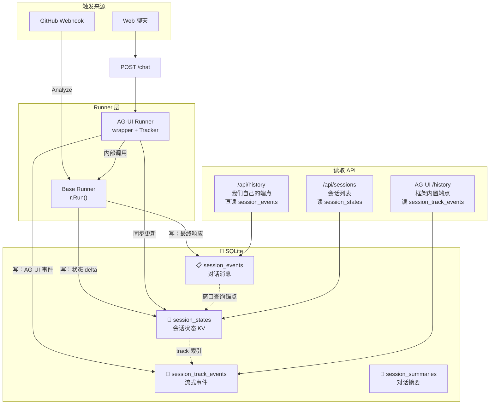
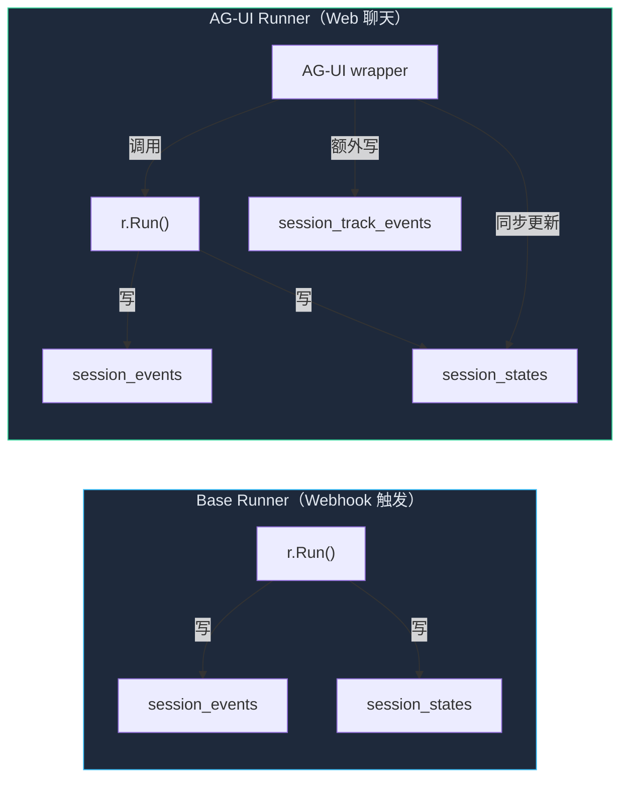
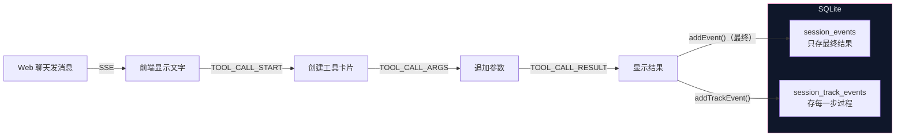

# EDITH 数据库心智模型

## 一句话理解

EDITH 的 SQLite 里有 **6 张表**，但本质上只有 **3 个职责**：

| 职责 | 表 | 类比 |
|------|-----|------|
| **对话内容** | session_events | 聊天记录本 |
| **追踪状态** | session_track_events + session_states | 实时进度条 |
| **全局配置** | app_states + user_states + session_summaries | 设置文件 |

## 数据流全景图



## 每张表的职责

### 1. session_events — 聊天记录本 📋

**存什么**：LLM 的完整响应（对话消息）

**写入条件**（重要！不是所有事件都存）：
```
必须同时满足：
  ✅ Response 不为 nil
  ✅ 不是部分响应（!IsPartial）
  ✅ 有有效内容（IsValidContent）
```

**谁写**：Base Runner（r.Run）→ `addEvent()`
**谁读**：`/api/history` → `getEventsList()`

**类比**：只存"最终版"草稿，不存涂改过程

---

### 2. session_track_events — 实时进度条 📡

**存什么**：AG-UI 的流式事件（TEXT_MESSAGE_CONTENT、TOOL_CALL_START 等）

**写入条件**：
```
无过滤，所有事件都存
但有自己的时间戳（不是 time.Now()）
```

**谁写**：AG-UI Runner → `addTrackEvent()`
**谁读**：messages_snapshot → `getTrackEvents()`

**类比**：视频录制的每一帧，用于回放

---

### 3. session_states — 会话状态 KV 🧩

**存什么**：会话级别的元数据（JSON 格式）

**关键字段**：
```json
{
  "tracks": ["agui"],           ← track 索引（指向 session_track_events）
  "state": { ... },             ← 应用自定义状态
  "expires_at": 1688640000      ← 过期时间
}
```

**写入时机**：每次写 events 或 track_events 时同步更新
**读取时机**：listSessions、getSession、messages_snapshot

**类比**：账本的目录页，记录每笔账在哪

---

### 4. session_summaries — 对话摘要 📝

**存什么**：LLM 生成的对话摘要（压缩历史）

**用途**：当对话太长时，用摘要代替完整历史，节省 token

**写入**：需要配置 summarizer（EDITH 没用这个功能）
**读取**：`GetSessionSummaryText()`

**类比**：书的目录摘要，不用翻完每一页

---

### 5. app_states + user_states — 全局配置 📁

**app_states**：整个应用共享的配置（所有用户、所有会话）
**user_states**：单个用户共享的配置（该用户的所有会话）

**读取时机**：getSession / listSessions 时自动合并到 session 的 state 里（带 `app:` / `user:` 前缀）

**类比**：
- app_states = 公司制度（所有人遵守）
- user_states = 个人偏好（你自己的设置）

## Base Runner vs AG-UI Runner 写表对比



| 表 | Base Runner | AG-UI Runner |
|---|---|---|
| session_events | ✅ 写 | ✅ 写（通过内部 runner） |
| session_states | ✅ 写 | ✅ 写 |
| session_track_events | ❌ 不写 | ✅ 写 |
| session_summaries | ❌ | ❌（EDITH 未启用） |

## 为什么 session_track_events 是 "黑盒"



**关键理解**：
- `session_events` = 只存"成品"（对话结束后的消息）
- `session_track_events` = 存"过程"（每一步操作记录）

**为什么 `/api/history` 能工作**：我们自己写的 `/api/history` 直接读 `session_events`，不依赖 `session_track_events`，所以不管是 Webhook 还是 Web 聊天触发，都能读到对话历史。

而 AG-UI 内置的 `/history`（messages_snapshot）读的是 `session_track_events`，所以只有通过 AG-UI 触发的会话才有数据。
