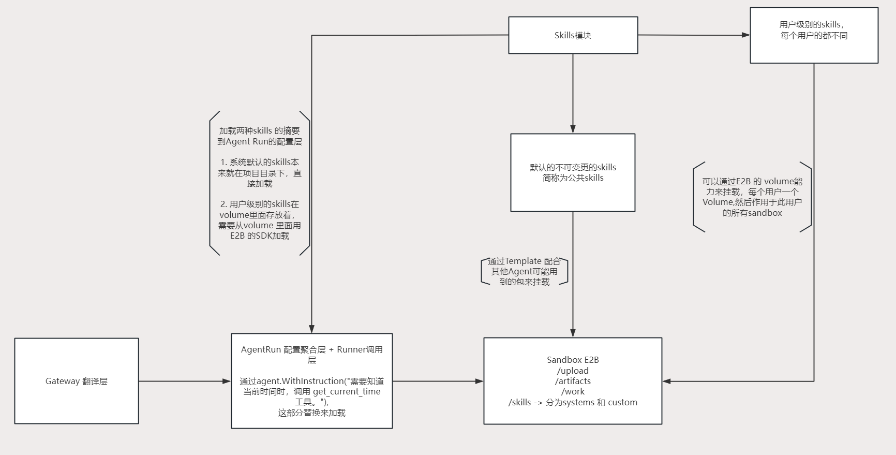

# Skills 系统设计



## 一句话

Skills 是 Agent 的“工作方法和领域知识”；Tool 是 Agent 的“可执行能力”。

```text
Tool   = Agent 能做什么
Skill  = Agent 应该如何完成一类任务
```

## Skill 文件格式

公共 Skills 和用户 Skills 统一使用 `SKILL.md`：

```markdown
---
name: daily-summary
description: >-
  帮助用户创建每日总结任务。
  当用户提到日报、每日总结或定时提醒时使用。
---

# 每日总结

这里是完整的执行规则、流程和示例。
```

文件分为两部分：

```text
SKILL.md
  ├─ YAML frontmatter
  │    ├─ name
  │    └─ description   ← Skill 摘要和触发说明
  └─ Markdown body      ← 完整执行规则
```

EDITH 的摘要只读取 `name + description`，完整正文按需读取：

```text
先加载摘要
  ↓
AgentRun 注入 Instruction
  ↓
Agent 判断是否使用
  ↓
需要时读取完整 Markdown body
```

Skill 目录可以包含 EDITH 专属的界面元数据：

```text
skill-name/
  ├─ SKILL.md      ← Agent 摘要和完整执行规则
  └─ edith.yaml    ← EDITH 页面展示信息
```

`edith.yaml` 中的界面字段只用于 EDITH 页面展示，不是 Agent 运行时的 Skill 摘要。Skill 的稳定 ID 由 Skill 目录名确定，不能每次扫描时重新生成。

## 总体结构

EDITH 的 Skills 分为两类，来源和生命周期完全不同：

```text
公共 Skills
  ├─ 平台内置
  ├─ 所有用户共享
  ├─ 代码维护
  └─ 不允许用户修改

用户 Skills
  ├─ 用户自己的资产
  ├─ 每个用户独立
  ├─ 存放在该用户的 E2B Volume
  └─ 用户可以新增和修改
```

它们最终都由 AgentRun 聚合：

```text
公共 Skill 文件 ─────┐
                     ├─► Skills ──► AgentRun ──► ManagedRunner.Run
用户 Volume Skill ───┘                    │
                                           └─► Sandbox / Tools
```

## Web 端入口：扩展

前端导航中新增一个与“新对话”和“定时任务”并列的“扩展”入口：

```text
侧边栏
  ├─ 新对话
  ├─ 定时任务
  └─ 扩展
       ├─ Skills
       └─ MCP 配置
```

“扩展”只是前端的统一入口，不代表后端要合并模块：

```text
扩展页面
  ├─ Skills 页面 ──► Skills 模块
  └─ MCP 页面 ─────► MCP 模块
```

MCP 配置从原来的“设置”页面移出，和 Skills 一起归入“扩展”；两者仍然各自管理自己的数据、HTTP 接口和业务能力。

## 各部分职责

### 公共 Skills

公共 Skills 是 EDITH 自带的系统能力，例如当前时间查询和 Skill 创建规范。

```text
项目目录中的 Skill 文件
          │
          ├─ AgentRun 读取摘要，注入本次 Agent 配置
          └─ Template 构建时复制到 Sandbox 的 /home/user/skills/system
```

项目目录中的文件是唯一源文件。Template 中的内容只是构建产物，不能再单独维护一份。

公共 Skills 对所有用户强制拥有：

```text
可以展示
不可关闭
不可编辑
不可复制
```

### 用户 Skills

用户 Skills 按用户隔离，每个用户拥有自己的 Volume：

```text
Clerk 用户 A ──► Volume A ──► 用户 A 的所有 Sandbox
Clerk 用户 B ──► Volume B ──► 用户 B 的所有 Sandbox
```

用户 Skill 存放在：

```text
/home/user/skills/custom
```

它不会进入公共 Template，也不会被其他用户看到。

用户 Skills 在“扩展 → Skills”页面中可以：

```text
展示 ── 开关 ── 编辑
```

开关状态按用户保存；编辑只允许修改用户自己的 Skill 文件。

### AgentRun

AgentRun 是 Skills 进入 Agent 执行链路的地方，也是配置聚合层。

```text
Gateway 翻译请求
      ↓
AgentRun
  ├─ 加载模型配置
  ├─ 加载 MCP 配置
  ├─ 加载图片配置
  ├─ 加载公共 Skill 摘要
  ├─ 加载用户 Skill 摘要
  ├─ 组装 Agent 配置
  └─ 调用 ManagedRunner.Run
```

Skills 不应该由 Gateway 加载。Gateway 只负责把不同渠道翻译成统一请求。

## Skills 如何进入 RunOptions

Skills 模块不直接依赖框架，也不返回 `agent.RunOption`；它只返回当前运行需要的 Skill 摘要。框架适配由 AgentRun 完成：

```text
Skills 模块
  ├─ 公共 Skills 摘要
  └─ 已启用的用户 Skills 摘要
             ↓
AgentRun
  ├─ 拼接 L3 系统 Skills + L4 用户 Skills
  └─ agent.WithInstruction(skillInstruction)
             ↓
ManagedRunner.Run(..., options...)
```

一次 Run 的 Prompt 层级对应关系：

```text
GlobalInstruction  = L1 身份 + L2 性格
Instruction        = L3 系统 Skills + L4 用户 Skills
message            = L5 当前用户消息
SessionService     = L6 历史消息
```

`WithInstruction` 是覆盖，不是追加。因此必须先拼成完整字符串，再调用一次：

```go
skillInstruction := systemSkills + userSkills

options := frameworkRunOptions(runOptionInput{
    globalInstruction: basePrompt + personality,
    instruction:       skillInstruction,
})
```

不能连续调用两次 `WithInstruction`，否则后一次会覆盖前一次。这样可以保持边界清晰：Skills 负责提供数据，AgentRun 负责翻译为框架 Options，ManagedRunner 负责执行。

## Web 页面如何读取用户 Skills

浏览器不直接访问 E2B，也不暴露 Volume ID。页面请求由 Skills 模块在服务端完成聚合：

```text
扩展 → Skills 页面
      │ GET /api/skills
      ▼
Skills HTTP
      ▼
Skills.Catalog.ListForUser(clerkUserID)
  ├─ 读取公共 Skills
  ├─ 通过 E2B Volume API 读取用户 /home/user/skills/custom
  └─ 读取 SQLite 中该用户的启用状态
      ▼
返回 Skill 摘要列表
```

查看 Skill 详情时再读取完整内容：

```text
GET /api/skills/{id}          → 读取内容
PUT /api/skills/{id}          → 写回用户 Volume
PUT /api/skills/{id}/enabled  → 修改用户启用状态
```

这里只读取 Volume，不为了展示页面而创建 Sandbox。公共 Skill 的状态固定为 `enabled=true`、`editable=false`；用户 Skill 的状态和编辑权限按用户隔离。

## Skill 加载时机

用户 Skill 必须在 Agent 开始运行前准备好：

```text
收到请求
  ↓
准备用户 Skill 来源
  ↓
读取公共 / 用户 Skill 摘要
  ↓
组装 AgentRun 配置
  ↓
ManagedRunner.Run
  ↓
Agent 执行并按需使用 Sandbox / Tool
```

不能等 Agent 第一次调用 Sandbox 工具时才加载 Skill，否则 Skill 无法影响本次运行的初始指令。

## Template、Sandbox、Volume 的边界

```text
Template
  = 可重复创建的环境定义
  = 基础镜像、依赖、环境变量、公共文件、启动命令

Sandbox
  = 一次实际运行中的隔离环境
  = 进程、临时文件、运行时状态

Volume
  = 独立于 Sandbox 的持久化用户文件
  = Sandbox 销毁后仍然保留
```

三者的关系是：

```text
Template ─────► 创建 Sandbox
                    ▲
                    │ 创建时挂载
                    │
用户 Volume ────────┘
```

Template 负责“环境长什么样”，Volume 负责“用户文件放在哪里”。Template 本身不负责挂载用户 Volume；Volume 需要在创建 Sandbox 时显式挂载。

## Sandbox 内部目录

```text
/upload       用户上传的文件
/artifacts    Agent 生成的产物
/work         当前工作目录
/home/user/skills
  ├─ system   Template 预置的公共 Skills
  └─ custom   用户 Volume 中的用户 Skills
```

AgentRun 读取 Skill 摘要用于组装初始配置；Agent 运行过程中，Tools 可以访问 Sandbox 中的完整 Skill 文件。

## 当前阶段与后续阶段

### 第一期：只实现公共 Skills

```text
公共 Skill 文件
      ↓
Skills 模块读取
      ↓
AgentRun 注入配置
      ↓
ManagedRunner.Run
```

当前内置 Skill：

```text
current-time   指导 Agent 在需要当前时间时调用 get_current_time
skill-creator  指导 Agent 创建和维护用户 Skill
```

第一期不实现用户 Skill 的 CRUD，但接口和目录边界按“公共 + 用户”设计，避免后续重写 AgentRun 主链路。

### 第二期：接入用户 Skills

```text
用户创建 / 修改 Skill
      ↓
写入用户 Volume
      ↓
AgentRun 按 userID 读取摘要
      ↓
本次 Agent 使用该用户自己的 Skills
```

用户 Skill 必须始终带有用户身份边界，不能由 Agent 自己填写或切换 userID。

## 设计约束

1. Gateway 只做渠道翻译，不加载 Skills。
2. AgentRun 负责聚合 Skills，并在 Runner 启动前完成加载。
3. 公共 Skill 的项目文件是唯一真相源，Template 只是构建产物。
4. 用户 Skill 只能从对应用户的 Volume 加载。
5. 公共 Skill 与用户 Skill 必须分目录、分权限、分生命周期。
6. Skill 只描述工作方法；真正执行动作仍然通过 Tool。
7. 用户 Volume 的并发写入规则需要在接入时明确，避免多个 Sandbox 同时修改同一个 Skill 文件。
8. “扩展”是前端导航分组；Skills 和 MCP 在后端仍是两个独立模块。

## 心智模型

```text
Gateway
  只负责“请求是谁、要说什么”
        ↓
AgentRun
  负责“这次 Agent 需要哪些配置和 Skills”
        ↓
ManagedRunner
  负责“真正执行 Agent”
        ↓
Sandbox + Tools
  负责“Agent 在隔离环境中实际做事”
```

最终边界可以压缩为：

```text
公共能力 → Template
用户资产 → Volume
运行配置 → AgentRun
真正执行 → ManagedRunner
```
