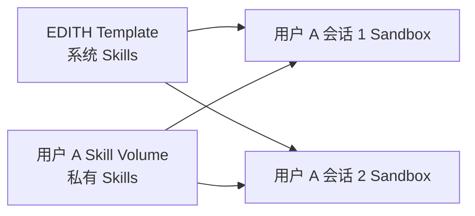
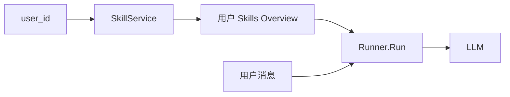
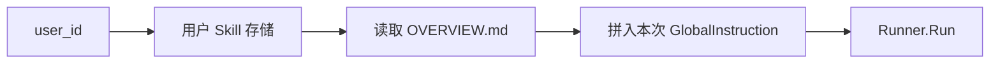
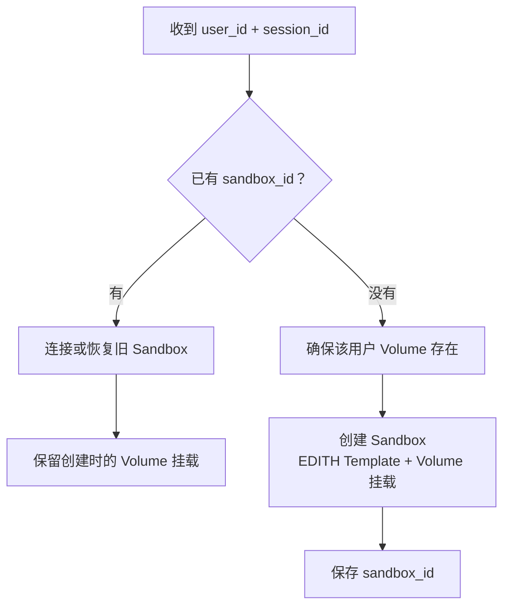

# EDITH Skills 系统设计

## 目标

让 EDITH 像人一样：平时只知道“有哪些专业能力”，需要时才打开对应 Skill 的完整说明。

```text
系统 Skills：EDITH 自带，所有用户可用，不可修改
用户 Skills：用户私有，由 EDITH 直接生成并永久保存
```

## 核心心智模型

```text
Template = EDITH 的系统盘：环境 + 系统 Skills
Volume   = 一个用户的永久技能盘：用户私有 Skills
Sandbox  = 一个会话的工作电脑：user_id + session_id
```



比例关系：

```text
一个 user_id → 一个 Skill Volume → 多个 session Sandbox
```

## Sandbox 内目录

默认工作目录固定为 `/home/user`。

```text
/home/user/
├── uploads/                 当前会话上传文件
├── output/                  当前会话产物
└── skills/                  Agent 唯一需要记住的 Skill 入口
    ├── system/              Template 内置，只读
    └── user/                用户 Volume 挂载，可读写
```

注意：Volume 挂载到 `/home/user/skills/user`，不能覆盖整个 `skills/`，否则看不见 Template 中的 `system/`。

Agent 不需要、也不应记住 `/home/user` 这个 E2B 内部绝对路径；它只使用工作目录相对路径：

```text
skills/system/<skill-name>/SKILL.md
skills/user/<skill-name>/SKILL.md
```

后端的 Local / E2B Sandbox 实现各自把相对路径映射到正确位置。

## 系统 Skills

系统 Skill 只维护一份源码：

```text
backend/skills/system/       ← Git 管理，唯一真相
        ↓ 构建 Template 时自动复制
/home/user/skills/system/    ← E2B 内的只读执行副本
```

```text
修改系统 Skill
→ 提交 EDITH 代码
→ 重建 EDITH Template
→ 新建 Sandbox 使用新版
```

暂停或已创建的旧 Sandbox 不会自动获得新 Template；需要重建才会升级。

## 用户 Skills

用户 Volume 根目录下，一个文件夹就是一个 Skill：

```text
skills/user/
├── OVERVIEW.md               用户 Skill 的短摘要索引
├── thesis-helper/
│   ├── SKILL.md
│   └── scripts/
└── data-cleaner/
    ├── SKILL.md
    └── references/
```

每个 Skill 的 `SKILL.md` 顶部保存最小元信息：

```md
---
name: thesis-helper
description: 按用户指定的论文规范进行润色与检查
---
```

完整正文、脚本、参考资料只在 Agent 真正需要该 Skill 时读取。

`OVERVIEW.md` 只保存供系统提示词注入的短摘要和完整读取路径：

```md
- thesis-helper：按用户指定的论文规范进行润色与检查
  读取：skills/user/thesis-helper/SKILL.md
```

## 自动触发：摘要与完整内容分离

每轮 Agent 对话只注入短摘要，而不注入全部 Skill 正文：

```text
固定 EDITH 规则 + 系统 Skills 摘要 + 当前用户 Skills 摘要
↓
LLM 判断是否匹配
↓
匹配时读取对应 SKILL.md
```



摘要示例：

```text
可用 Skills：
- system/pdf：处理、提取、生成 PDF
- user/thesis-helper：按用户论文格式润色
```

Prompt 分工：

```text
GlobalInstruction = EDITH 核心规则 + 系统 Skills + 当前用户 Skills Overview
用户消息          = 用户这次真正说的话
```

`Runner.Run` 仍只负责运行。调用它的外层在每次运行前，根据 `user_id` 读取 Overview，并以 `agent.WithGlobalInstruction(...)` 传入本次 Run；它不是把摘要伪装成用户消息，也不修改全局 Agent 实例。

## 摘要加载与缓存

```text
系统摘要
→ 启动时直接扫描 backend/skills/system/
→ 缓存一次

用户摘要
→ 每次 Run 前读取 skills/user/OVERVIEW.md
```



第一版不缓存用户 Overview：它很小，却能保证 Agent 刚创建或修改 Skill 后，下一次 Run 自动发现变化。后续若需要缓存，可在确认失效机制后再加；缓存不是正确性的前提。

## Sandbox 生命周期



规则：

```text
新建 Sandbox：挂载用户 Volume
Pause / Resume：沿用原挂载，不能中途新增挂载
旧 Sandbox 未挂 Volume：销毁后按新版配置重建
```

MVP 可通过稳定名称避免新增用户-Volume 映射表：

```text
volumeName = "edith-skills-" + hash(user_id)
```

## EDITH 创建用户 Skills

用户要求新能力时，EDITH 可以直接写入：

```text
skills/user/<skill-name>/SKILL.md
```

并同步更新 `skills/user/OVERVIEW.md`。该目录在 E2B 中挂载用户 Volume，因此写入即永久保存；在 Local 模式中则映射到该用户的本地持久目录。Agent 不需要用户再次确认“发布”。

## 职责边界

```text
Runner / Agent 核心：运行推理，不认识 Template、Volume、安装流程
SkillService：读取系统 Skill 与用户 Skill Overview
Runner 调用外层：按 user_id 获取 Overview，并调用 Runner.Run
E2B Provider：创建/恢复 Sandbox，负责 Template 与 Volume 挂载
Sandbox：执行 Skill 脚本和读写当前工作目录
```

## 暂不处理

```text
- Skill 安装、上传与技能市场
- Skill 版本、更新、依赖管理
- 多会话同时修改同一个用户 Skill 的冲突策略
- 用户 Overview 缓存与失效机制
```

## 已验证的 E2B 行为

后端通过 Volume SDK 写入文件后，已挂载该 Volume 的运行中 Sandbox 可以立即读取到新文件。

```text
实测结果：约 397ms 可见
```

因此，无论 Agent 在挂载目录内创建 Skill，还是后端 SDK 直接写入用户 Volume，当前会话 Sandbox 都无需重建，即可读取新文件。

可复现实验：`backend/test/e2b_volume_visibility`。
