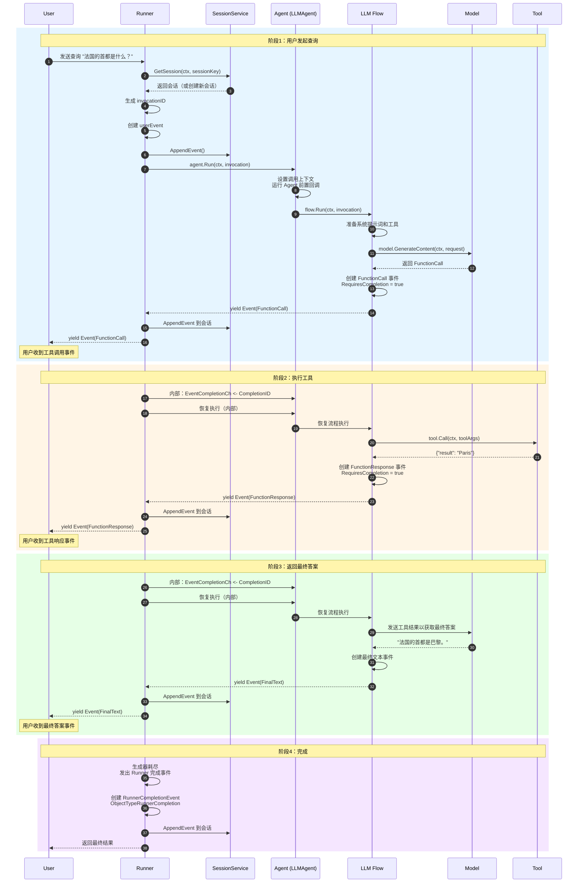

# trpc-agent-go 执行流程时序图

## 流程说明

| 阶段 | 动作 | 关键点 |
|------|------|--------|
| **阶段1** | 用户发起查询 | 加载会话 → 调用 LLM → 返回工具调用 |
| **阶段2** | 执行工具 | 执行工具 → 返回工具结果 |
| **阶段3** | 返回最终答案 | 发送工具结果 → LLM 生成最终答案 |
| **阶段4** | 完成 | 保存完成事件 → 返回最终结果 |

## 关键概念

| 概念 | 说明 |
|------|------|
| **invocationID** | 唯一标识本次调用 |
| **EventCompletionCh** | 用于恢复执行的通道 |
| **RequiresCompletion** | 标记需要继续执行 |
| **yield** | 产出事件给用户 |
| **AppendEvent** | 保存事件到会话 |
