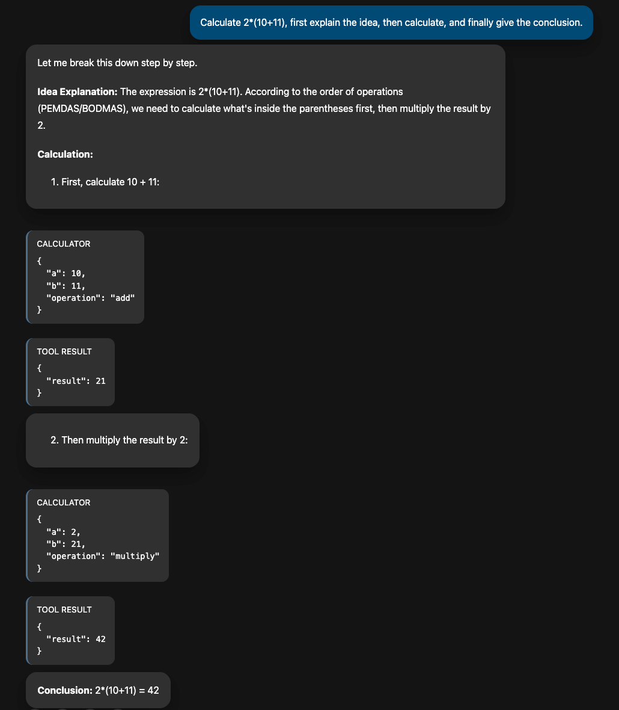

# 适用于 AG-UI Server 的 CopilotKit 前端

本示例展示了如何将基于 Go 的 AG-UI server 与基于 [CopilotKit](https://docs.copilotkit.ai/) 构建的 React 前端进行配对。该 UI 使用 `@ag-ui/client` 的 HTTP agent，从 AG-UI endpoint 流式传输 Server-Sent Events，并渲染由 CopilotKit 提供的助手侧边栏。

## Start the CopilotKit client

```bash
pnpm install   # 或 npm install
pnpm dev       # 或 npm run dev
```

在运行 `pnpm dev` 之前可用的环境变量：

- `AG_UI_ENDPOINT`: 覆盖 AG-UI endpoint 的 URL（默认值为 `http://127.0.0.1:8080/agui`）。

打开 `http://localhost:3000` 开始与全屏的助手 UI 聊天。输入框中会显示占位符 `Calculate 2*(10+11), first explain the idea, then calculate, and finally give the conclusion.`。按回车键运行该场景或输入你自己的请求。Tool calls 及其结果将内联呈现在聊天 transcript 中。

