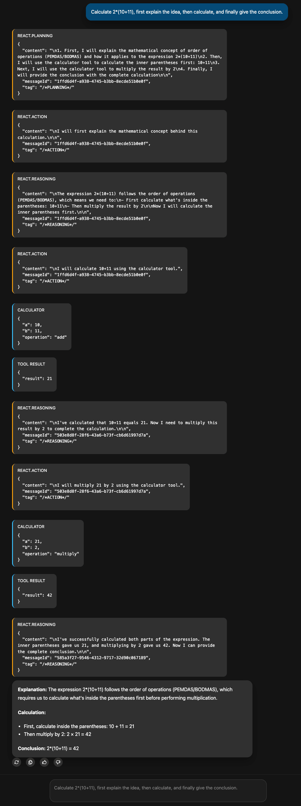

# React AG-UI 服务端

此示例展示了如何暴露一个由 `tRPC-Agent-Go` 运行器（runner）和 React 规划器（planner）支持的 AG-UI SSE 端点。

该服务端展示了 React 规划器的标签（tags）是如何作为自定义 AG-UI 事件进行流式传输的。这些结构化的标签描述了各种推理步骤、工具调用和最终输出。常见的标签包括 `/*THOUGHT*/`、`/*ACTION*/`、`/*ACTION_INPUT*/` 和 `/*FINAL_ANSWER*/`。有关详细信息，请参阅 [React 规划器文档](../../../../docs/mkdocs/en/planner.md)。

在此示例中，一个自定义转换器（translator）将 React 标签转换为前端可以处理的事件。`/*FINAL_ANSWER*/` 标签被翻译为普通文本消息事件，而 `/*THOUGHT*/`、`/*ACTION*/` 和 `/*ACTION_INPUT*/` 标签则被映射到自定义事件（如 `react.thought`、`react.action` 和 `react.action_input`）。这使得前端能够完整地重构 React 的交互流程。

## 如何运行

进入 `examples/agui` 模块并运行以下命令：

```bash
# 在 http://localhost:8080/agui 启动服务端
go run .
```

服务端会显示启动日志，指示绑定的地址：

```
2025-10-10T17:01:47+08:00       INFO    react/main.go:75        AG-UI: serving agent "agui-agent" on http://127.0.0.1:8080/agui
```

如果你使用的是原生客户端（raw client），输出结果将如下所示：

```log
Simple AG-UI client. Endpoint: http://127.0.0.1:8080/agui
Type your prompt and press Enter (Ctrl+D to exit).
You> calculate 1.2+3.5
Agent> [RUN_STARTED]
Agent> [CUSTOM] 'react.planning': {"content":"\n1. Use the calculator tool to add 1.2 and 3.5\n2. Return the result to the user\n\n","messageId":"12edf7d8-60a4-40a5-94b7-da0accfd29f9","tag":"/*PLANNING*/"}
Agent> [CUSTOM] 'react.action': {"content":"\nI will use the calculator tool to add 1.2 and 3.5.","messageId":"12edf7d8-60a4-40a5-94b7-da0accfd29f9","tag":"/*ACTION*/"}
Agent> [TOOL_CALL_START] tool call 'calculator' started, id: call_00_mXpifc8VGd6XFEHd6Rr09SI3
Agent> [TOOL_CALL_ARGS] tool args: {"a": 1.2, "b": 3.5, "operation": "add"}
Agent> [TOOL_CALL_END] tool call completed, id: call_00_mXpifc8VGd6XFEHd6Rr09SI3
Agent> [TOOL_CALL_RESULT] tool result: {"result":4.7}
Agent> [CUSTOM] 'react.reasoning': {"content":"\nThe calculator tool successfully performed the addition operation and returned the result of 4.7. This completes the calculation requested by the user.\n\n","messageId":"a38439ae-3122-4979-9eb6-5921b19231e6","tag":"/*REASONING*/"}
Agent> [TEXT_MESSAGE_START]
Agent> [TEXT_MESSAGE_CONTENT] 
1.2 + 3.5 = 4.7
Agent> [TEXT_MESSAGE_END]
Agent> [RUN_FINISHED]
```

如果你使用的是 copilotkit 客户端，输出将如下所示：


