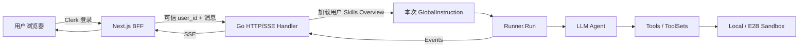
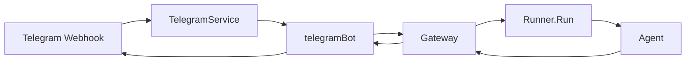

# EDITH 1.0 重构交接文档

> 本文用于把 EDITH 从已经跑通的 MVP，平稳交接到 `refactor/v1` 工作树继续设计与重构。
>
> 它记录的是：**已经验证的产品能力、当前代码事实、架构共识、已知债务和接手规则**。  
> 它不是最终架构设计。1.0 的模块划分必须由项目作者先提出心智模型，再经过审核后确定。

## 1. 当前工作区

```text
稳定 MVP
路径：C:\Users\Administrator\Desktop\Learn\GithubAgent
分支：main

1.0 重构工作树
路径：C:\Users\Administrator\Desktop\Learn\EDITH-v1
分支：refactor/v1
```

两个目录来自同一个 Git 仓库，但检出不同分支：

```text
main
└── 已跑通、可随时启动的 MVP

refactor/v1
└── 保持产品行为不变，重新整理职责与代码结构
```

重构失败时，`main` 仍然是可运行的参考实现。不要为了整理 1.0 而修改或破坏原工作树。

---

## 2. 产品定位

EDITH 是一个：

> **面向多用户的服务端 Agent 平台。**

它不是只能在开发者电脑上运行的本地 Agent。用户通过 Web 或自己的 Telegram Bot 与 EDITH 对话，EDITH 在隔离的 Local / E2B 工作区内调用工具、处理文件并保存用户能力。

核心隔离锚点：

```text
user_id
├── 拥有自己的会话
├── 拥有自己的长期记忆
├── 拥有自己的私有 Skills
├── 拥有自己的 Telegram Bot
└── 未来拥有自己的模型与 MCP 配置
```

一次运行的完整身份：

```text
app_name + user_id + session_id
```

其中：

- `app_name`：EDITH 应用身份，进程级固定。
- `user_id`：用户身份，是最大的多租户隔离单位。
- `session_id`：该用户的一段独立对话。

---

## 3. 已经跑通的功能

以下能力均已在 MVP 中实际实现，不是未来设想。

### 3.1 登录与身份

- 使用 Clerk 完成登录、注册和页面保护。
- 浏览器不能决定真正的 `user_id`。
- Next.js BFF 从 Clerk 登录态取得用户身份，并覆盖请求中的 `user_id`。
- Go 后端只接收可信的 `user_id` 字符串，不感知 Clerk、Cookie 或 JWT。

```text
浏览器
  │ Clerk 登录
  ▼
Next.js BFF
  │ 注入可信 user_id
  ▼
Go Backend
```

认证边界：

```text
Next.js BFF
└── 负责：登录态、认证、user_id 映射

Go Backend
└── 负责：Agent、Session、Sandbox、Skills、业务逻辑
```

### 3.2 Web 对话

- 支持 SSE 流式回复。
- 支持模型选择。
- 支持分别展示：
  - `reasoning`
  - `text`
  - `tool_call`
  - `tool_result`
  - `error`
  - `done`
- 使用 `request_id` 标识一次完整 Run。
- 使用 `response_id` 区分一次 Run 内的多次模型响应。
- 使用工具调用 ID 对齐工具调用和工具结果。
- 实时事件与历史记录最终映射为前端统一的 `ChatMessage`。

当前前后端契约的唯一真理来源：

```text
web/types/api.ts
```

铁律：

> 修改前后端接口时，先修改 `web/types/api.ts`，再同步 Go struct；JSON 字段使用 `snake_case` 并严格对齐。

### 3.3 多模态图片

- 前端把图片编码为 Base64。
- Next.js BFF 转发给 Go 后端。
- Go 后端构造多模态 `model.Message`。
- 支持视觉的模型直接收到图片。
- 不支持视觉的模型不会被强行当作视觉模型使用。

当前图片进入 Session Event 后可能以 Base64 保存。长对话的上下文体积与图片存储优化尚未作为 1.0 重构目标确定。

### 3.4 文件上传与工作区

- 用户可以上传普通文件到当前会话工作区。
- 每批上传使用 `attachmentID` 建立独立目录，避免重名和不同批次互相覆盖。
- Agent 可以通过 Sandbox 文件工具读取和修改文件。
- 前端有类似编辑器的工作区文件树。
- 用户可以浏览目录并下载 Agent 生成的文件。
- 隐藏以 `.` 开头的内部文件。
- Agent 命令默认在工作目录执行。

统一的 Agent 工作目录概念：

```text
.
├── uploads/
├── output/
└── skills/
```

底层真实路径不应该暴露给 Agent。Agent 只使用工作目录相对路径。

### 3.5 Local / E2B Sandbox

项目支持两种后端：

```text
Sandbox Backend
├── Local
└── E2B
```

两者对 Agent 暴露相同语义：

- 执行命令。
- 读写文件。
- 列出目录。
- 上传文件。
- 下载文件。
- 根据 `user_id + session_id` 隔离工作区。
- 读取该用户的私有 Skills 概览。

Local 的隔离主要依赖目录映射，不等价于强安全沙箱；E2B 才是生产方向的远程隔离环境。

### 3.6 系统 Skills

系统 Skills：

- 所有用户可用。
- 源码位于 `backend/skills/system/`。
- 由 Git 管理。
- 构建 E2B Template 时复制进模板。
- Agent 平时只看到短 Overview，需要时直接读取指定 `SKILL.md`。

当前 E2B Template：

```text
edith-v0-1-2
```

模板通过 E2B CLI 在代码外构建；运行时代码只通过环境变量选择模板，不负责创建模板。

### 3.7 用户级 Skills

用户可以要求 EDITH 创建自己的 Skill。

统一虚拟路径：

```text
skills/system/    系统公共 Skills
skills/user/      当前用户私有 Skills
```

用户 Skill 结构：

```text
skills/user/
├── OVERVIEW.md
└── <skill-name>/
    ├── SKILL.md
    ├── scripts/
    └── references/
```

运行流程：

```text
每次 Run 前
  ↓
按 user_id 读取 skills/user/OVERVIEW.md
  ↓
与 EDITH 基础 Prompt、系统 Skills Overview 拼接
  ↓
通过 agent.WithGlobalInstruction(...) 注入本次 Run
  ↓
LLM 判断是否需要某个 Skill
  ↓
需要时读取对应 SKILL.md
```

持久化方式：

```text
E2B
一个 user_id → 一个 Volume → 多个 Session Sandbox

Local
一个 user_id → backend/user-skills/<sha256(user_id)>/
```

E2B 已验证：

> 后端通过 Volume SDK 写入文件后，已经挂载该 Volume 的运行中 Sandbox 可以立即读取新文件，实测约 397ms，无需重建 Sandbox。

当前不实现：

- Skill 安装与市场。
- Skill 上传。
- Skill 版本管理。
- 多会话同时编辑同一 Skill 的冲突解决。
- 用户 Overview 缓存。

### 3.8 用户自带 Telegram Bot

当前产品模型是：

```text
一个 Web 用户 → 配置一个自己的 Telegram Bot
```

不是进程级共享 Bot，也不是 Telegram 用户注册为 EDITH 用户。

配置流程：

```text
用户登录 Web
  ↓
提交 Bot Token
  ↓
TelegramService 验证 Token
  ↓
生成 routeKey
  ↓
向 Telegram setWebhook
  ↓
保存 routeKey → telegramBot
```

消息流程：

```text
Telegram
  │ POST /webhook/telegram/{routeKey}
  ▼
TelegramService.byRoute[routeKey]
  ▼
telegramBot
  ├── ownerUserID → 决定进入谁的 Agent 空间
  └── client      → 决定用哪个 Bot 回复
  ▼
Gateway → Runner → Agent
  ▼
telegramBot.sendReply(...)
```

`routeKey` 不是 goroutine 隔离键。它只是一个随机的 Webhook 路由标识，用来在同一进程的多个 Bot 中找到正确的 `telegramBot`。

当前限制：

- Bot 配置只保存在进程内存，重启后需要重新配置。
- 当前不校验向 Bot 发消息的 Telegram 用户身份。
- Webhook 收到消息后应快速返回，Agent 在独立 Context 中异步执行，避免 Telegram 超时重试。

---

## 4. 当前运行架构

### 4.1 Web 主流程



极简读法：

```text
入口负责协议
  ↓
运行前准备用户配置
  ↓
Runner 运行 Agent
  ↓
Sandbox 提供可执行工作区
  ↓
事件返回前端
```

### 4.2 Telegram 主流程



Gateway 当前的实际价值：

- 给非 Web 入口提供简单的文本调用方式。
- 固定使用 `agent.WithStream(false)`。
- 收集 Runner Event，最终返回完整文本。
- 在运行前加载用户 Skills Overview。

它不是认证层，也不是 Sandbox 管理器。

---

## 5. 当前代码地图

```text
backend/
├── main.go                 进程组装、HTTP 路由、SSE Handler；当前过于臃肿
├── models.go               模型客户端与模型列表
├── tools.go                普通工具
├── toolsets.go             ToolSet 组装与生命周期
├── prompt.go               EDITH 基础 Prompt 加载
├── prompts/edith.md        EDITH 系统提示词正文
├── sessions.go             会话列表与读取
├── history.go              Session Events → 前端历史消息
├── uploads.go              文件上传接口
├── workspace_http.go       工作区浏览与下载接口
│
├── gateway/
│   └── gateway.go          非 Web 文本入口调用 Runner
│
├── channel/
│   └── telegram.go         多用户 Bot 配置、Webhook 路由与回复
│
├── sandbox/
│   ├── backend.go          Sandbox 能力契约
│   ├── local_*.go          Local 实现
│   ├── e2b_*.go            E2B 实现与用户 Volume
│   ├── *_tools.go          Agent 可调用的命令/文件工具
│   └── workspace.go        路径与工作区概念
│
└── skills/
    ├── system.go           系统 Skills Overview 加载
    └── system/             系统 Skill 源码

web/
├── types/api.ts            前后端交互契约
├── proxy.ts                Clerk 路由保护
├── app/chat/               对话页面、消息组合、SSE 事件处理
└── app/api/                BFF：认证后转发到 Go 后端
```

### 阅读现有代码的推荐顺序

不要从 `main.go` 第一行顺序啃完。按一条真实运行链阅读：

```text
1. web/types/api.ts
   先知道系统对外收什么、返回什么

2. backend/main.go 中的路由注册
   只看有哪些入口

3. sseHandler
   看 Web 请求如何进入 Runner

4. gateway/gateway.go
   看 Telegram 如何复用同一个 Runner

5. channel/telegram.go
   看 routeKey 与 telegramBot

6. sandbox/backend.go
   看 Agent 眼中的工作区能力

7. Local / E2B 实现
   最后看能力如何落地
```

---

## 6. 1.0 重构的核心架构心智模型

设计模块前，先问：

> 这个长期存在的对象，应该拥有什么能力、状态和身份？

```text
结构体字段
├── 长期能力：Runner、Sandbox Provider、DB、HTTP Client
├── 长期状态：缓存、Map、Mutex、配置
└── 稳定身份：App Name、基础 Prompt、目录

函数参数
└── 当前调用的临时输入：ctx、userID、sessionID、消息、模型选择
```

接口只在确实存在多种实现时使用：

```text
Sandbox Provider
├── Local
└── E2B
```

不要因为“解耦”两个字就增加接口。一个只负责转交调用、没有独立语义和替换价值的接口，会增加阅读负担。

设计顺序：

```text
先写一句职责
  ↓
列出长期能力与状态
  ↓
形成结构体字段
  ↓
列出本次调用输入
  ↓
形成方法参数
  ↓
最后决定 package、文件名和 New 函数
```

一句话共识：

> Go 架构的核心，是先决定每个长期存在的对象拥有什么能力和状态，再让它只承担这些能力自然推导出的职责。

---

## 7. 1.0 重构边界

### 目标

- 保持已经跑通的产品行为。
- 理清对象的长期能力、状态和生命周期。
- 减少 `main.go` 中业务逻辑。
- 让 `main` 最终主要负责组装和启动 HTTP Server。
- 让 Web 与 Telegram 共享清晰的“运行一次 Agent”能力。
- 保持 Local / E2B 的统一语义。
- 为未来的用户级模型、MCP、Skills 配置留出自然扩展点。
- 优先可读性和可理解性。

### 暂时不是目标

- 不顺手增加新功能。
- 不加入飞书、Slack 或 GitHub App。
- 不实现 Skill 市场或安装。
- 不引入微服务。
- 不为了“标准架构”增加 Manager / Service / Repository / Interface 套娃。
- 不一次性替换所有代码后再测试。
- 不修改已经稳定的前端 UI，除非后端契约确实需要变化。

### 重构方式

推荐使用“可验证迁移”，而不是无边界重写：

```text
确认现有行为
  ↓
设计一个清晰对象
  ↓
迁移一条完整运行链
  ↓
测试行为不变
  ↓
再迁移下一条
```

`main` 分支的 MVP 是行为参考，不是未来架构的模板。

---

## 8. 当前最明显的技术债

这些是需要重新判断的地方，不代表已经决定如何修改。

### 8.1 `main.go` 职责过多

当前同时包含：

- 进程组装。
- HTTP 路由。
- SSE 输入解析。
- 多模态消息构造。
- RunOption 组装。
- Runner Event → 前端事件转换。
- 一部分普通工具定义。

1.0 需要把“启动组装”和“运行协议”分清，但不要为了拆文件制造大量空壳对象。

### 8.2 Web 与 Telegram 的 Run 前准备存在重复

两条入口都需要：

```text
user_id
→ 读取用户 Skills Overview
→ 生成本次 GlobalInstruction
→ Runner.Run
```

这说明系统可能缺少一个清晰的“组织一次 Agent 运行”的长期能力对象。

但对象叫什么、字段是什么、是否需要接口，尚未决定。不要直接照搬 `AgentService`、`AgentCore` 或 `RuntimeManager` 之类名字。

### 8.3 Sandbox 接口可能承载了额外职责

当前 `BackendProvider` 同时负责：

- 获取会话 Sandbox Backend。
- 加载用户 Skills Overview。
- Close 生命周期。

这是 MVP 为 Local / E2B 对称而形成的实用设计。1.0 需要审核：

```text
读取用户 Skills Overview
究竟是“提供工作区”的自然职责，
还是一个独立的用户存储能力？
```

在没有完整替代方案前，不要先拆。

### 8.4 Skills Overview 注入位置侵入多个入口

当前系统 Skills 在启动时加入基础 Prompt，用户 Skills 在每次 Run 前加载。

行为本身合理：

```text
固定 Prompt + 固定系统 Skills + 当前用户 Skills
```

需要重构的是“由谁组织”，不是推翻 Prompt 机制。

### 8.5 Telegram 状态只在内存

`TelegramService` 通过：

```text
byUser
byRoute
botsMu
changeMu
```

管理多个 Bot。

当前锁的两种语义不同：

- `botsMu`：保护 Bot 路由 Map 的并发读写。
- `changeMu`：避免配置/替换 Bot 的长事务互相冲突。

不要简单用 `sync.Map` 替换；这里不仅是 Map 并发安全，还需要配置过程的事务边界。

未来持久化 Bot Token 需要单独做安全设计，不属于第一轮架构整理。

### 8.6 旧设计文档可能误导

`docs/IM接入设计.md` 记录的是早期方案，其中包含：

- 进程级 Bot。
- Telegram 长轮询。
- `telegram:<from.id>` 用户映射。

当前代码实际已经改为：

- 用户自带 Bot。
- Webhook。
- Bot 所属 Web 用户作为 `user_id`。

阅读代码时以当前实现和本文为准；旧文档只能作为演化背景。

---

## 9. 必须保持的行为约束

重构完成后至少必须继续满足：

```text
身份
├── 浏览器不能伪造 user_id
└── Telegram 消息进入 Bot 所有者的 Agent 空间

会话
├── user_id 隔离用户
└── session_id 隔离对话历史与工作区

流式协议
├── request_id 标识 Run
├── response_id 分隔模型响应
├── tool ID 对齐调用与结果
└── done 只在 Runner 整体完成时发送

Sandbox
├── Local / E2B 对 Agent 暴露相同相对路径
├── 路径不能逃出工作目录
├── HTTP 下载不是 Agent Tool
└── Agent 命令默认在工作目录执行

Skills
├── system 公共且不可被用户修改
├── user 私有且跨会话持久化
├── Overview 每次 Run 前可反映最新状态
└── 完整 Skill 按需读取

Telegram
├── 一个用户一个 Bot
├── 一个固定通配 Webhook Handler
├── routeKey 查表找到 Bot
└── Webhook 快速确认，后台独立 Context 运行 Agent
```

---

## 10. 验证命令

在 `EDITH-v1` 根目录执行：

```powershell
make check
make build
```

也可以分别运行：

```powershell
cd backend
go test ./...
go build .
```

```powershell
cd web
npm install
npm run build
```

开发启动：

```powershell
make backend-run
make web-dev
```

环境变量模板：

```text
backend/.env.example
web/.env.example
```

不要提交：

- `.env`
- API Key / Token
- 本地工作区文件
- Sandbox 运行状态
- 构建产物

---

## 11. 接手者工作方式

项目作者从 Python 转向 Go，重构的首要目标不是追求抽象数量，而是形成作者能够长期掌控的代码心智模型。

协作规则：

1. 项目作者先提出自己自然的模块与对象设计。
2. 接手者负责对抗性审核：
   - 职责是否闭合。
   - 字段是否真是长期能力或状态。
   - 参数是否只是当前调用输入。
   - 依赖方向是否反转。
   - 生命周期由谁创建、关闭。
   - 并发锁保护的到底是数据还是事务。
   - Local / E2B 是否行为对称。
3. 未经确认，不直接进行大规模拆包或重写。
4. 发现更好的方案要主动提出，不盲目顺从。
5. 讲解顺序：

```text
为什么需要
  ↓
它负责什么
  ↓
它长期拥有什么能力
  ↓
一次请求如何经过它
  ↓
最后再看代码
```

代码偏好：

- 中文关键注释，少而准确。
- 少套娃。
- 少无意义的 `New`。
- 少只转发调用的接口和结构体。
- 命名表达实际业务含义。
- 先看完整运行链，再看单个函数。
- 可读性与可理解性优先。

---

