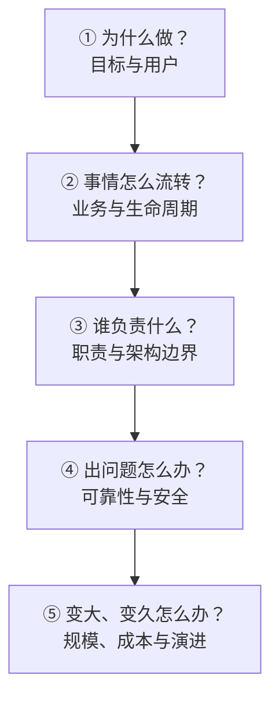

# 设计一个系统，只问五个问题

```text
1. 为什么做？
2. 事情怎么流转？
3. 谁负责什么？
4. 出问题怎么办？
5. 变大、变久以后怎么办？
```



对应关系是：

```text
为什么做
└── 用户是谁？解决什么问题？

事情怎么流转
└── 创建、使用、变化、结束

谁负责什么
└── 模块边界、数据归属、外部服务

出问题怎么办
└── 超时、重试、恢复、安全、监控

变大变久怎么办
└── 高并发、成本、扩展、技术债
```

放进 Sandbox：

```text
为什么做？       给 Agent 一个安全的远程执行环境
怎么流转？       Create → Running → Pause → Kill
谁负责？         Agent 使用，SandboxManager 管理
出问题怎么办？   Timeout 兜底、失败重试、定时清理
规模变大怎么办？ 限流、队列、成本控制、批量清理
```

之前那些概念只是这张地图里的局部：

- 领域建模、生命周期：事情怎么流转。
- 架构边界：谁负责什么。
- 可靠性：出问题怎么办。
- 高并发：规模变大怎么办。

最终只记住一句：

> 系统设计就是想清楚：为何做、怎么走、谁负责、如何兜底、未来怎么扛。
