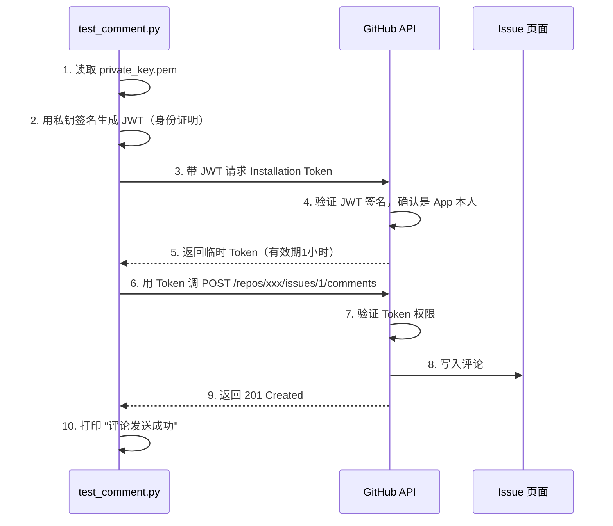

# 打通流程

```mermaid
sequenceDiagram
    participant Code as test_comment.py
    participant GH_API as GitHub API
    participant Issue as Issue 页面

    Code->>Code: 1. 读取 private_key.pem
    Code->>Code: 2. 用私钥签名生成 JWT（身份证明）
    Code->>GH_API: 3. 带 JWT 请求 Installation Token
    GH_API->>GH_API: 4. 验证 JWT 签名，确认是 App 本人
    GH_API-->>Code: 5. 返回临时 Token（有效期1小时）

    Code->>GH_API: 6. 用 Token 调 POST /repos/xxx/issues/1/comments
    GH_API->>GH_API: 7. 验证 Token 权限
    GH_API->>Issue: 8. 写入评论
    GH_API-->>Code: 9. 返回 201 Created
    Code->>Code: 10. 打印 "评论发送成功"
```
