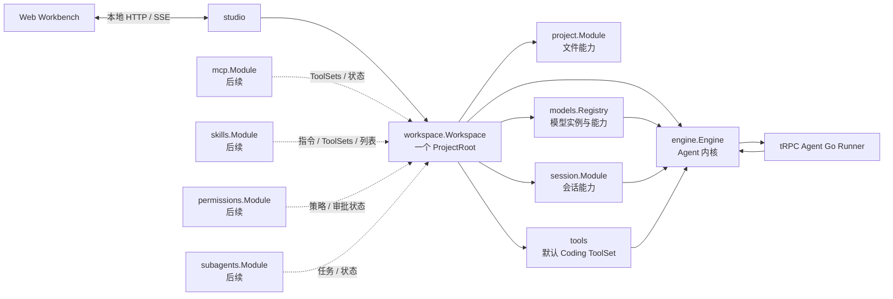
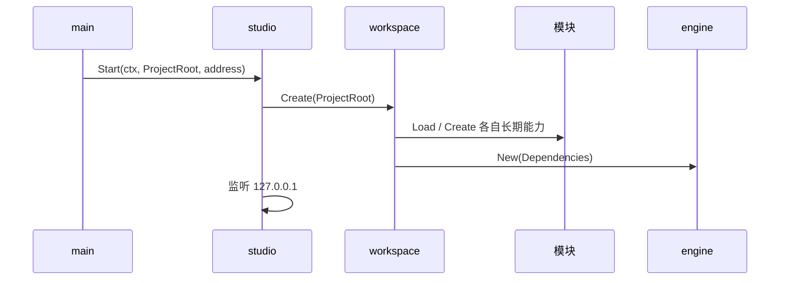

# EDITH Studio：架构设计

> 本文是 EDITH Studio 的唯一目标架构说明，面向开发者与 AI。
> 它描述产品最终应如何组织；尚未实现的能力只定义边界，不预建代码。

## 1. 目标

EDITH Studio 是一个本地单用户 Coding Agent：用户在项目目录执行 `edith`，浏览器打开本地工作台，在同一个界面中完成对话、查看代码、管理会话和控制 Agent。

```text
当前目录启动 edith
        ↓
一个本地 Studio 进程
        ↓
一个项目工作区
        ↓
会话、文件、Agent、模型、工具共同服务这个项目
```

设计优先级如下：

1. 读代码时能顺着一次真实操作走完，不靠猜测隐藏层。
2. 一个能力有一个明确所有者，资源创建与关闭在同一可读范围内。
3. 产品能力可以增加，但 Agent 内核不被文件树、侧栏或设置页面污染。
4. 不把本地单用户产品设计成多租户服务端系统。

## 2. 核心术语

### ProjectRoot

用户执行 `edith` 时所在的规范化绝对目录。

- 它是本次 Studio 进程服务的唯一项目根目录。
- 文件浏览、Coding Tool、项目级配置都以它为边界。
- 一个进程不切换多个 `ProjectRoot`；切换项目就启动另一个 EDITH 进程。

### Workspace

`workspace.Workspace` 是一个 `ProjectRoot` 对应的长期产品运行对象。

它不是 tRPC Agent Go 的 CodeExecutor Workspace，也不是浏览器工作区状态；它代表“当前项目里的完整 EDITH 世界”。

它持有项目身份和长期能力，并负责在退出时关闭它们。

### Module

`Module` 是有真实长期职责的具体能力对象，例如 `session.Module`、`project.Module`、未来的 `mcp.Module`。

它满足至少一项真实条件：

- 持有外部资源或需要 `Close`；
- 同时服务产品层和 Agent 内核；
- 需要保存稳定状态，例如项目根目录、连接状态、缓存或配置解析结果。

`Module` 只是包内具体结构体的名字，不是统一接口，也不要求每个包都有同名方法。

### Engine

`engine.Engine` 是 Agent 内核。

它负责一次 Agent Run 的启动、取消、框架事件读取和应用事件输出；它不负责会话侧栏、文件树、配置文件位置或 Web 页面。

### Studio

`studio` 是本地 HTTP/SSE 应用。

它接收浏览器请求，调用 `Workspace` 中真实能力，并把结果编码为 JSON 或 SSE。它不读取 tRPC Agent Go 的 Event 字段。

### Run

Run 是一次用户消息驱动的 Agent 执行。

它是短生命周期对象：包含 `ctx`、`requestID`、`sessionID`、消息和本次临时选项；不能被保存为 package 级状态，也不能成为下次 Run 的隐式依赖。

## 3. 不可突破的规则

### 项目与会话

- 一个 EDITH 进程只服务一个 `ProjectRoot`。
- 会话按照 `<appName, userID, sessionID>` 隔离。
- 本地单用户场景中，`userID` 是项目身份，不是人类账号。

```text
appName   = edith-studio
userID    = workspace:<规范化 ProjectRoot 的稳定哈希>
sessionID = 一条对话的 UUID
```

- 不同 `ProjectRoot` 的 Session 历史绝不互通。
- Session 读取、列表和删除只能通过框架 `SessionService`，不能绕过它直接查询 SQLite。

### 依赖与生命周期

- `main` 只确定启动环境并启动 Studio，不组装 Agent 内核零件。
- `Workspace` 是长期能力的汇合点：它创建、持有、关闭模块，并用模块导出的能力组装 `Engine`。
- `Engine` 只消费已准备好的模型、ToolSet、SessionService、指令等 Agent 能力。
- 模块之间不为了方便而互相导入；需要共同使用的能力由 `Workspace` 汇合后交给消费者。
- 谁创建资源，谁负责关闭；关闭顺序与创建依赖相反。
- 不使用 package 级可变状态保存当前项目、当前会话或当前请求。

### 配置

- 不存在总 `config` 包。
- 每个能力包拥有自己的配置格式、读取、校验和默认值；完整配置类型放在该能力包的 `types.go`。
- `Workspace` 只拿到模块已经解析好的能力，不读取 YAML、JSON 或 Markdown 配置。
- 模型配置是用户级全局配置；项目级 MCP、Skills 等配置由对应模块在真正实现时各自处理。

### 事件与并发

- `frameworkEventCh` 只存在于 `Engine.Run` 内部。
- 不为 Event 翻译额外创建 channel、goroutine、缓存或“事件桥”。
- 所有 channel 变量、字段和参数必须以 `Ch` 结尾。
- 唯一的完成判断是框架 Event 的 `IsRunnerCompletion()`。
- 浏览器断开后，Engine 继续消费当前框架事件流并完成会话收尾；浏览器只是失去接收 SSE 的能力。

### 代码组织

- 按业务能力分包，不按 `domain`、`infrastructure`、`common` 等技术层分包。
- 包内按运行路径拆文件；类型就近放在 `types.go`，只有真正跨能力的类型才提取。
- 禁止预建空包、空接口、`utils`、`common`、集中 `types` 包和大一统 `httpapi` 包。
- 没有真实复杂度，不增加抽象。

## 4. 整体结构



依赖方向只有两类：

```text
产品入口：Web → Studio → Workspace
Agent 执行：Workspace 导出能力 → Engine → Runner
```

`Workspace` 是允许多条能力线汇合的唯一位置；它不是巨型业务包，而是当前项目的长期所有者。

## 5. Workspace：产品运行层

### 身份与能力

`Workspace` 的字段只表达三类含义：身份、稳定配置、能力组装。

```text
Workspace
├─ ProjectRoot    身份：当前项目根目录
├─ WorkspaceID    身份：Session 隔离键
├─ Engine         能力：Agent Run 与取消
├─ Sessions       能力：会话列表、历史、删除
├─ Project        能力：文件树、文件读取、后续 Diff
├─ Models         能力：可用模型与模型能力说明
├─ MCP            能力：后续，连接与 ToolSets
├─ Skills         能力：后续，项目与用户 Skills
└─ Permissions    能力：后续，权限策略与审批状态
```

未实现的能力不创建字段、不创建包。上图描述的是最终归属，不是当前代码清单。

### 组装职责

`Workspace` 做三件事：

1. 接收 `ProjectRoot`，规范化路径并计算 `WorkspaceID`。
2. 创建真实长期模块：模型注册表、Session 模块、Project 模块、默认 ToolSet，以及未来按需出现的模块。
3. 取出模块的 Agent 能力，使用命名依赖创建 `Engine`。

`Workspace` 不做以下事情：

- 不解析模型 YAML、MCP JSON 或 Skill Markdown；
- 不读取框架 Event；
- 不把每个模块操作包一层无意义的 `Run`、`List`、`Read` 转发方法；
- 不保存一次 Run 的临时状态。

### 对 Studio 的暴露方式

Studio 直接使用 Workspace 的真实能力字段，调用路径应当一眼可见：

```text
workspace.Sessions.List(...)
workspace.Project.ListChildren(...)
workspace.Engine.Run(...)
workspace.Models.List(...)
```

只有跨能力的生命周期动作属于 Workspace，例如创建、关闭或未来整体重载。不要为了封装而把所有调用再包一遍。

## 6. 后端包与职责

```text
cmd/
└─ edith/
   └─ main.go                 启动环境、当前目录、进程退出

internal/
├─ studio/                    本地 HTTP、SSE、路由
├─ workspace/                 当前项目的长期产品运行层
├─ engine/                    Agent Run、取消、应用事件
├─ project/                   文件树、文件读取、后续 Diff
├─ session/                   SessionService 与会话产品能力
├─ models/                    用户模型配置与模型注册表
└─ tools/                     默认 Coding ToolSet 注册
```

未来只有在功能开始实现时，才增加下列包：

```text
internal/mcp/
internal/skills/
internal/permissions/
internal/subagents/
```

### main

`main` 只做应用启动：取得当前目录、创建根 Context、调用 `studio.Start`、处理进程退出。

它不认识 `Runner`、`LLMAgent`、`ToolSet`、模型配置或 SQLite。

### studio

`studio` 持有一个 Workspace，负责本地 Web API。

它负责：

- 路由、请求 JSON 解码、响应状态码；
- SSE Header、JSON 编码与 Flush；
- 仅允许本机 Web 页面访问；
- 将 HTTP 输入转为对应能力的输入。

它不负责：

- 框架 Event 字段解析；
- Agent 运行策略；
- 文件路径判断；
- 配置读取；
- 业务状态缓存。

### engine

`Engine` 由 Workspace 通过 `New(Dependencies)` 组装。

`Dependencies` 只放已准备好的长期 Agent 依赖，例如：

```text
Models / 默认模型
SessionService
ToolSets
全局指令与已启用的 Skill 指令
ProjectRoot
```

`Engine` 持有 Runner 和一次 Run 的内存状态。它提供：

```text
Run(ctx, RunInput, send)
Cancel(requestID)
Close()
```

其中 `send` 是当前 HTTP 请求提供的同步输出动作，不是 Engine 自造的 channel 或事件对象。

模型注册表、Session 模块、ToolSet、MCP 连接等资源仍归 Workspace 或对应 Module 所有；Engine 只在组装和 Run 时使用它们，不能越过所有者关闭它们。

### session

`session.Module` 同时服务两个方向：

```text
Engine                 产品界面
──────                 ────────
Service()              List()
Runner 持久化          Get()
                       Delete()
                       对话历史的应用数据
```

它内部持有框架 `SessionService`。历史读取时由 Session 模块直接整理成 Studio 的会话与消息数据；Web 不读取框架 Session Event。

### project

`project.Module` 是当前项目文件系统的唯一入口。

它负责：

- 只接受相对 `ProjectRoot` 的路径；
- 规范化路径并拒绝逃出项目根目录的访问；
- 按目录展开读取直接子项；
- 按文件点击读取内容；
- 后续提供保存、Diff、变更通知等能力。

它不负责：

- 递归扫描整个仓库后一次性返回；
- 把所有文件内容缓存到内存；
- 让浏览器和 Go 分别持有两份独立文件系统事实来源。

第一版不需要文件监听器。Agent 修改文件后，Web 重新读取当前文件或重新展开受影响目录即可。

### models

`models.Registry` 是启动期创建的可用模型索引，不必伪装成 `Module`。

它负责：

- 读取用户级 `~/.edith/models.yaml`；
- 校验 Provider 连接信息和每个模型能力；
- 创建模型实例，并保留模型 ID 到实例的映射；
- 向 Workspace/Web 提供可选模型和能力描述；
- 向 Engine 提供默认模型与全部已注册模型。

模型切换是一次 Run 的选项：只能选择已注册模型，不需要重启 Agent。修改 Provider、API Key、Base URL 或新增模型实例仍属于启动期配置变更，需要重新启动 Studio。

### tools

`tools` 当前只负责创建默认 Coding ToolSet。

默认工具如果只是按 `ProjectRoot` 构造且不需要给 Web 展示独立状态，就使用函数，不强行创建 `tools.Module`。当工具确实有长期状态、连接或产品界面时，再为它建立真实模块。

## 7. 关键运行路径

### 启动



启动失败时，已创建资源按相反顺序关闭；不会留下半初始化的 Workspace。

### 发送消息与流式输出

```text
Web POST /api/runs
  → studio 解码 RunInput
  → workspace.Engine.Run
  → Runner.Run
  → frameworkEventCh
  → Engine 在循环中读取框架字段
  → StreamEvent
  → studio 写 SSE JSON 并 Flush
  → Web 更新对话卡片
```

规则：

- `Engine` 是唯一读取框架 Event 字段的地方。
- `StreamEvent` 是 Web 看到的唯一实时事件类型。
- HTTP 只编码 `StreamEvent`，不按文本、工具、状态分别制造写入函数。
- 事件流结束但未看到 `IsRunnerCompletion()` 时，Run 以异常结束处理。

### 取消

```text
Web POST /api/runs/{requestID}/cancel
  → studio
  → workspace.Engine.Cancel(requestID)
  → Runner.Cancel(requestID)
```

Engine 记录用户主动取消，直到对应事件流完成。这样 Web 能区分普通完成、模型错误和用户停止。

### Session 侧栏与历史

```text
Web 请求 Session 列表
  → studio
  → workspace.Sessions.List(WorkspaceID)
  → SessionService.ListSessions
  → 返回 Session 摘要

Web 点击一条 Session
  → workspace.Sessions.Get(WorkspaceID, SessionID)
  → SessionService.GetSession
  → 返回应用消息与工具记录
```

侧栏只显示当前 WorkspaceID 对应的会话。删除也是同一条身份键下的删除操作。

### 文件浏览

```text
Web 展开目录
  → studio
  → workspace.Project.ListChildren(relativeDir)
  → 返回该目录的直接子项

Web 点击文件
  → studio
  → workspace.Project.ReadText(relativePath)
  → 返回该文件内容和基础元信息
```

浏览器不使用 File System Access API 作为正式产品文件来源。这样用户不需要重复选择目录，Agent 工具和代码页也不会出现两份不同的文件状态。

### 退出

```text
Context 取消
  → studio 停止接收新请求
  → Workspace.Close
  → Engine.Close
  → Workspace 按反向依赖关闭 ToolSet、Session Module、MCP Module 等资源
```

关闭阶段不再创建新的 Run；资源关闭错误应合并返回，不能因前一个错误跳过后续关闭。

## 8. 本地 HTTP 与 Web 边界

Web 直接调用本地 Go 服务，不使用 Next.js BFF。

```text
浏览器 Web
  ↕ HTTP / SSE
127.0.0.1 的 Go Studio
  ↕
当前 ProjectRoot、SQLite、模型 API、MCP 连接
```

HTTP 路由按产品资源组织，而不是按 Go 包或框架概念组织：

```text
Workspace   当前项目信息与可用能力
Sessions    列表、读取、删除
Runs        创建、SSE、取消
Files       目录子项、文件内容、后续保存与 Diff
Settings    后续的模型、权限、扩展配置
```

具体 JSON 字段在功能开始实现时与前端一起定义。架构层只固定以下边界：

- Web 不接触 Runner、SessionService、模型 SDK 或文件系统绝对路径。
- Studio 不把框架 Event、框架 Session 数据原样暴露给 Web。
- Engine 不知道 HTTP、SSE、React 或浏览器连接状态。
- `project.Module` 是文件事实来源，`session.Module` 是会话事实来源。

## 9. 前端组织

前端按产品界面组织，不照抄 Go 后端目录：

```text
web/src/
├─ app/                 页面入口与应用壳
├─ features/
│  ├─ sessions/         左侧会话列表
│  ├─ chat/             消息、思考、工具卡片、流式事件
│  ├─ composer/         输入、/ 指令、附件、模型、权限
│  ├─ files/            文件树、代码页、Diff
│  ├─ runtime/          分支、子 Agent、MCP 状态
│  └─ settings/         配置页面
├─ api/                 本地 HTTP / SSE 调用
└─ ui/                  真正可复用的基础 UI
```

规则：

- 类型放在所属 feature；只有多个 feature 真正共享时才提取。
- 页面级状态只保存跨面板事实，例如当前 Session、当前文件 Tab、当前 Run；组件内交互状态留在组件本地。
- 不为每个 feature 建一个 Store；本地单用户工作台保持线性可读。
- `chat` 消费 `StreamEvent`，不理解框架 Event。
- 文件页只保存当前浏览状态；真实内容随时可从 Project API 重新读取。

## 10. 配置与持久化

### 用户级目录

```text
~/.edith/
├─ models.yaml          模型 Provider、模型实例、能力声明
└─ sessions.db          SessionService 的 SQLite 数据
```

模型配置由 `models` 独立拥有。Web 设置页未来可以编辑该配置，但保存后是否重建模型实例由 `models` 的重载策略决定；不把配置编辑逻辑塞进 Workspace。

### 项目级目录

```text
<ProjectRoot>/.edith/
├─ mcp.json             后续，项目 MCP 配置
├─ skills/              后续，项目 Skills
└─ ...                  只放项目本身需要的 EDITH 配置
```

用户级与项目级都存在时，MCP、Skills 等模块按 VS Code 风格处理覆盖：更具体的项目配置覆盖同名用户配置。具体字段和冲突策略由模块自身定义。

### 事实来源

| 数据 | 唯一事实来源 | 所属能力 |
| --- | --- | --- |
| 当前项目目录 | 启动时的 `ProjectRoot` | Workspace |
| Session 历史 | `SessionService` | Session Module |
| 文件树与文件内容 | 本地项目文件系统 | Project Module |
| 模型实例与能力 | `models.yaml` 的启动期解析结果 | Models Registry |
| 当前 Run 状态 | Engine 内存 | Engine |
| 当前页面选中项 | 浏览器页面状态 | Web |

## 11. 未来能力的接入边界

### MCP

未来 `mcp.Module` 负责读取 MCP 配置、建立连接、报告状态和关闭连接。

```text
Workspace：持有 MCP Module，给 Web 提供状态
MCP Module：导出 ToolSets
Engine：注册 ToolSets，执行模型提出的工具调用
```

Engine 不读取 MCP JSON，也不自己管理连接。

### Skills

未来 `skills.Module` 负责发现用户级和项目级 Skills，并向两个方向导出能力：

```text
Web：/ 指令候选、Skill 列表与说明
Engine：全局指令、按 Run 选择的 Skill 指令、必要的 ToolSets
```

Skill 内容不由 Studio 或 Engine 直接扫描目录。

### 权限

未来 `permissions.Module` 是产品层策略能力：它维护权限等级、危险工具规则和审批状态。

```text
Workspace：持有权限策略与产品状态
Web：展示当前等级、提交用户决定
Engine：在真实暂停/恢复方案成熟后消费审批结果
```

当前不预建 Callback、审批 channel 或半成品接口。工具审批必须以“Run 暂停与恢复”为完整问题重新设计。

### 子 Agent 与分支

未来 `subagents.Module` 管理子任务身份、运行状态和分支信息。

它向 Web 提供状态，向 Engine 提供创建或协作能力；主 Engine 不直接承担子 Agent 列表的产品管理。

## 12. 命名与反模式

### 命名

函数名必须表达动作，不使用泛名 `Open()`。

| 动作 | 使用的名字 | 示例 |
| --- | --- | --- |
| 纯组装已准备依赖 | `New(Dependencies)` | `engine.New(dependencies)` |
| 读取配置或发现目录内容 | `Load...` | `models.LoadRegistry()` |
| 创建持久化或长期模块 | `Create...` | `workspace.Create(projectRoot)` |
| 启动监听或长期服务 | `Start...` | `studio.Start(ctx, ...)` |
| 释放资源 | `Close()` | `workspace.Close()` |

结构体注释只说明字段的身份、稳定配置或能力。函数注释只说明输入、输出和作用。

### 明确禁止

```text
Engine 自己读取所有产品配置
Studio 变成包含全部业务的巨型包
Workspace 为每个模块动作做无意义转发
全局可变的当前项目 / 当前 Run
第二条 Event channel 或后台翻译 goroutine
StreamTranslator、EventBridge 等包装对象
浏览器与 Go 各自读取一份项目文件系统
预建 mcp、skills、permissions 空包
utils、common、全局 types 包
```

只有并发安全、资源释放、安全边界或已经出现的真实重复要求时，才允许突破本文件；突破原因必须写在紧邻代码的注释中。

## 13. 读代码的顺序

理解一次真实用户操作时，按以下顺序阅读：

```text
main
  → studio 的路由
  → workspace 的对应能力
  → engine / session / project / models 的真实实现
  → tRPC Agent Go
```

遇到框架问题时：先读 `reference/trpc-agent-go/docs/mkdocs/zh` 文档；不够再用 CodeGraph 查框架源码；最后才直接翻源码。

遇到 Studio 实现问题时：优先用 CodeGraph 查看 `backend-v2` 的对应实现，但不复制服务端多用户复杂度。

## 14. 架构检查清单

新增功能前，用下面的问题检查归属：

1. 它属于一次 Agent Run，还是属于整个当前项目？
2. 它需要给 Web 展示状态吗？
3. 它是否需要跨 Run 持有资源或关闭责任？
4. 它给 Engine 的到底是配置、ToolSet、指令，还是运行结果？
5. 是否真的需要一个 Module，还是一个纯函数就够？
6. 是否让 HTTP、浏览器或框架细节穿透到了不该知道的层？

答案明确后再写代码；答案不明确时，先补一张小图或讨论边界，不用抽象猜测未来。
