# GitHub App 三种身份验证模式心智模型

这三种模式本质上是 GitHub App 的 **“三种变身（身份）”**。我们用一个生活中的**“外包物业公司”**类比来通俗解释：

假设你开了一家**物业服务公司（GitHub App）**，被**某个小区（GitHub 仓库/组织）**雇佣了。

---

## 1. 核心对比与类比

| 验证模式 | 通俗类比 | 鉴权媒介 | 它能干什么？ | 核心用途 |
| :--- | :--- | :--- | :--- | :--- |
| **1. 作为 App 自身**  *(As the App)* | **物业公司总部**  (证明自己是正规公司) | **JWT**  (用你的 App 私钥 `.pem` 签名生成) | 只能调用 App 自身管理的 API。比如： • 查询有哪些小区雇佣了我们。 • 产生进入某个小区的临时钥匙。 | **获取钥匙的准备阶段**。不能直接操作仓库代码。 |
| **2. 作为应用安装**  *(As an Installation)* | **派往某小区的保安**  (代表物业在小区干活) | **Installation Token**  (临时钥匙，1小时过期) | 代表**机器人自身**操作被授权的仓库。比如： • 自动在 PR 下留言。 • 自动合并代码、跑 CI。 • 自动给 Issue 打标签。 | **90% 自动化机器人**的核心模式。动作归属于 `@EDITH[bot]`。 |
| **3. 代表用户**  *(On behalf of a user)* | **业主委托的代理人**  (替某个业主去办业务) | **User Access Token**  (通过 OAuth 登录获取) | 代替**具体的用户（如 Bob）**去操作。比如： • 帮 Bob 提交一行代码。 • 读取 Bob 自己能看到但 App 没安装的私有库。 | **交互式网页应用**。动作归属于用户本人（如 `Bob` 经由 `App` 提交）。 |

---

## 2. 心智模型架构图

```mermaid
graph TD
    subgraph Mode1 ["1. 作为 App 自身验证"]
        JWT["JWT (私钥签名)"] -->|"证明: 我是物业总部"| GHApp["GitHub App 核心后台"]
        GHApp -->|"作用"| Info1["查询安装列表, 获取某个小区的临时钥匙"]
    end

    subgraph Mode2 ["2. 作为安装实例验证 (最常用)"]
        Token["Installation Token"] -->|"证明: 我是被授权的保安机器人"| GHRepo["具体安装的仓库 (如 Repo A)"]
        GHRepo -->|"作用"| Info2["自动回复 PR, 修改代码 (署名 Bot)"]
    end

    subgraph Mode3 ["3. 代表用户验证"]
        UserToken["User Access Token (OAuth)"] -->|"证明: 我代表业主 Bob"| GHPersonal["GitHub 个人用户资源"]
        GHPersonal -->|"作用"| Info3["帮 Bob 创建 Issue, 读写 Bob 的私有库 (署名 Bob)"]
    end
```

---

## 3. 开发时的典型调用流程

在写 Go 代码开发时，你的程序通常会经历 **模式 1 ➔ 模式 2** 的双阶跳：

1.  **第一步（模式 1）**：你的 Go 服务读取本地的 `private-key.pem`，生成一个 **JWT**。
2.  **第二步（中转）**：拿着这个 JWT，调用 GitHub 接口：“我是物业总部，请给我一张进入 `Installation ID: 123`（某个仓库）的门卡”。GitHub 验证 JWT 无误后，返回给你一个 **Installation Token**。
3.  **第三步（模式 2）**：你的 Go 服务用这个 **Installation Token** 初始化 `go-github` 客户端，开始欢快地修改代码和回复 PR。
