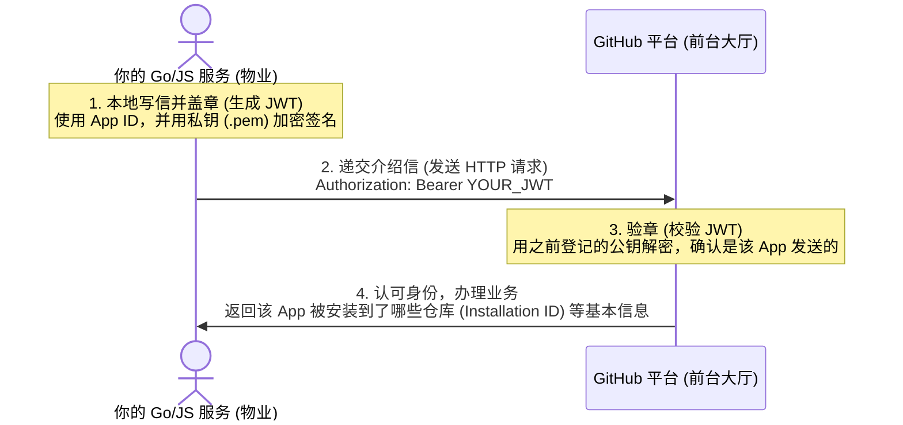

# 以 GitHub App 身份验证 (JWT) 的心智模型

这段烂文档其实只在解释一件事：**你的程序如何向 GitHub 证明“我是这个 App 本身”，从而开启后续的工作。**

---

## 1. 核心概念：生活中的“介绍信”类比

如果你要把你的代码接入 GitHub，必须经过第一步鉴权。这里的核心道具可以这样类比：

*   **App ID**：你的**“企业工商注册号”**（公开的，用来标识你是哪家物业公司）。
*   **私钥 (.pem 文件)**：你的**“企业公章”**（绝对机密，只能存在你的服务器上，用来盖章签名）。
*   **JSON Web 令牌 (JWT)**：一封**“盖了公章的临时介绍信”**。
    *   它由你的程序在本地用“公章（私钥）”对“注册号（App ID）+ 当前时间”进行数字签名生成。
    *   因为带有时间戳，这封信**只有 10 分钟有效期**，过期作废（防止介绍信被别人偷走长期使用）。

---

## 2. 身份验证流程图 (Sequence Diagram)

这里展示了文档中 `curl` 请求和 SDK 在底层到底在干什么：

---

## 3. SDK (如 Octokit.js / Go 库) 帮你省了什么？

文档的后半部分提到了 `Octokit.js` 的 `new App({ appId, privateKey })`。

*   **手写 curl 的痛苦**：你得自己写代码用 RSA 算法去签名生成 JWT，每次请求前还要检查这封“介绍信”有没有超过 10 分钟。如果过期了，还得重新写一封、重新盖章。
*   **使用 SDK 的快乐**：你只需要把“注册号（`appId`）”和“公章（`privateKey`）”交给他。SDK 在底层会**自动写信、自动盖章、发现过期自动重新盖章**，完全不需要你操心任何 JWT 的细节。

在 Go 语言中，我们用的 `ghinstallation` 库干的就是一模一样的事情。你只要把 `AppID` 和 `.pem` 文件路径传给它，它就会在后台自动帮你打理好所有的“盖章介绍信（JWT）”发送和刷新工作。
