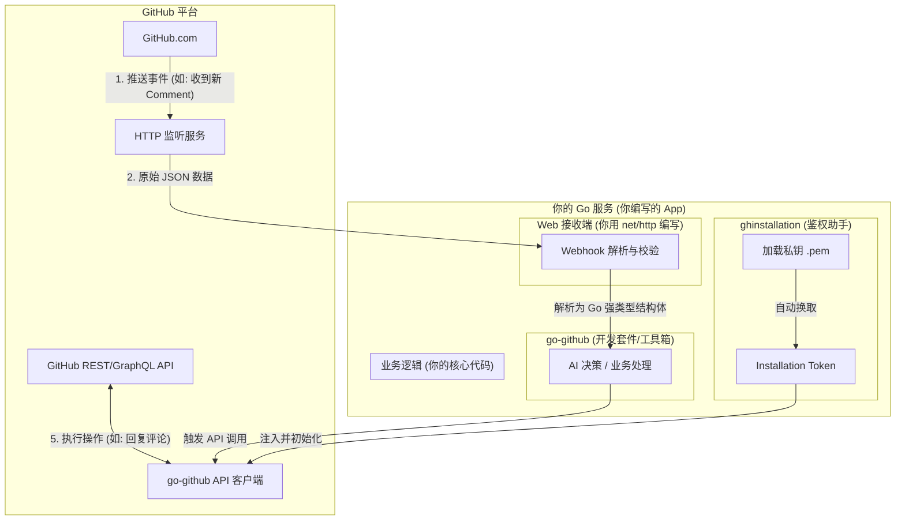

# GitHub App 开发流程与 go-github 的角色定位

为了帮你建立清晰的心智模型，我们用一张图和对比表格来说明：**开发一个 GitHub App 到底要做什么**，以及 **`go-github` 这个库在其中扮演了什么角色**。

---

## 1. 整体心智模型与架构图

在你的 GitHub App 项目中，各组件的分工如下：

---

## 2. “开发 GitHub App” 与 “使用 go-github” 的区别

| 开发步骤 / 关注点 | 谁来做？ | 它的具体工作是什么？ |
| :--- | :--- | :--- |
| **1. 部署与宿主 (Hosting)** | **你自己** | 编写 Go 代码启动一个 HTTP 服务器（如监听 `:2026` 端口），并将其部署到公网服务器，让 GitHub 能够访问到。 |
| **2. 路由与接收事件** | **你自己** | 处理 `/webhook/github` 路由，接收 GitHub 推送过来的 POST 请求。 |
| **3. Webhook 签名校验** | **`go-github` 辅助** | 校验请求头中的 `X-Hub-Signature-256`。防止别人伪造 GitHub 发送恶意请求。`go-github` 提供了一个简单的 `github.ValidatePayload` 函数来完成这个工作。 |
| **4. JSON 字段解析** | **`go-github` 提供** | GitHub 发来的 JSON 有上千行，包含无数嵌套字段。`go-github` 预定义了所有事件的 Go 结构体（如 `github.IssueCommentEvent`），你只需一句话就能把 JSON 解析成强类型的 Go 对象。 |
| **5. 安全鉴权 (Auth)** | **`ghinstallation` 辅助** | 使用你下载的 `.pem` 私钥进行复杂的加密签名，向 GitHub 换取一个临时的访问令牌。这一步由 `ghinstallation` 库帮你自动完成。 |
| **6. 调用 API 执行操作** | **`go-github` 封装** | 如果你想在 Issue 下发表评论，正常需要手写 HTTP 请求发送给 `POST /repos/{owner}/{repo}/issues/{number}/comments`。而 `go-github` 将其封装为了一个 Go 方法：`client.Issues.CreateComment(ctx, owner, repo, number, comment)`，你只需要传参即可。 |

---

## 3. 核心总结：`go-github` 到底帮你省了什么事？

如果没有 `go-github`，你必须：
1. **手写数百个 Go Struct** 来匹配 GitHub 的 API 请求和响应格式（非常容易写错字段类型）。
2. **手写 HTTP 客户端** 去拼接复杂的 URL、设置 Header、解析 JSON 响应。

有了 `go-github`：
它就是一个**翻译官**和**工具箱**。它把 GitHub 复杂的 HTTP/JSON 接口翻译成了**标准的 Go 函数和强类型结构体**，让你像调用本地函数一样去操作 GitHub。
