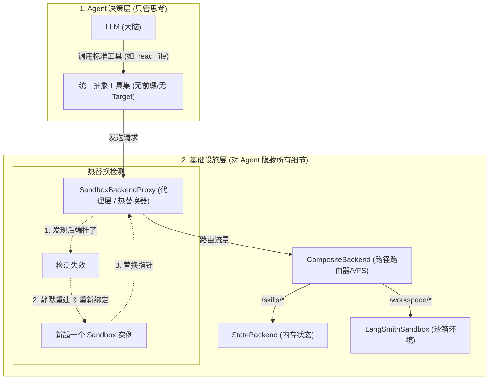

# Open SWE 的 Agent 架构分析：方案 C (VFS + 代理热替换)

本文件详细剖析了 Open SWE 采用的 **“单一抽象工具 + 代理层热替换 + 虚拟路径路由”** 的优秀 Agent 架构。

---

## 1. 架构示意图



---

## 2. 核心步骤与数据流

假设 LLM 决定读取文件 `read_file(path="/workspace/main.go")`：

1.  **大模型调用**：LLM 以为自己面对的是一个普通的本地文件系统，直接发起 `read_file` 调用。
2.  **代理层拦截 (Proxy)**：请求到达 `SandboxBackendProxy`。它充当了一道安全防火墙。
    *   *如果此时后台的沙箱容器挂了*：Proxy 会在后台默默创建一个新的沙箱，把连接换过去，然后再发送请求。**Agent 脑子里不需要有任何“重试”或“报错处理”的逻辑。**
3.  **路径路由 (VFS)**：请求到达 `CompositeBackend`。它检查文件路径：
    *   因为路径以 `/workspace/` 开头，它知道这属于沙箱磁盘，于是把请求路由给 `LangSmithSandbox` 驱动。
    *   如果路径是 `/skills/` 开头，它则会直接从内存状态（`StateBackend`）中读取，速度极快。
4.  **返回结果**：最终内容原路返回给 LLM。

---

## 3. Go 语言框架无关实现方案

这一设计思想完全不依赖于 Python 框架，在 Go 语言中可以通过接口 (Interface) 和依赖注入完美复现。

### ① 定义统一的 Backend 接口
```go
package agent

// Backend 定义了所有底层环境所需具备的统一文件操作能力
type Backend interface {
    ReadFile(path string) (string, error)
    WriteFile(path, content string) error
    Execute(command string) (string, error)
}
```

### ② 定义工具集 (只依赖 Backend 接口)
```go
// FileTools 暴露给 LLM 使用，LLM 只能看到标准工具，而感知不到底层后端
type FileTools struct {
    backend Backend // 注入的后端（可以是 Proxy，也可以是 Composite）
}

func (ft *FileTools) ReadFile(args struct{ Path string }) (string, error) {
    return ft.backend.ReadFile(args.Path)
}

func (ft *FileTools) WriteFile(args struct{ Path, Content string }) error {
    return ft.backend.WriteFile(args.Path, args.Content)
}
```

### ③ 实现虚拟挂载路由器 (CompositeBackend)
```go
import "strings"

type CompositeBackend struct {
    defaultBackend Backend
    routes         map[string]Backend // 例如: {"/skills/": stateBackend, "/workspace/": dockerBackend}
}

func (cb *CompositeBackend) ReadFile(path string) (string, error) {
    // 匹配前缀进行路径级分发 (类似 VFS 挂载)
    for prefix, backend := range cb.routes {
        if strings.HasPrefix(path, prefix) {
            return backend.ReadFile(path)
        }
    }
    return cb.defaultBackend.ReadFile(path)
}
```

### ④ 实现热替换代理 (SandboxBackendProxy)
```go
import "sync"

type SandboxBackendProxy struct {
    mu      sync.RWMutex
    current Backend // 真正起作用的后端（如 Docker 实例）
}

func (p *SandboxBackendProxy) ReadFile(path string) (string, error) {
    p.mu.RLock()
    defer p.mu.RUnlock()

    // 可以在这里静默做健康检查与热重载
    if p.isBroken() {
        p.mu.RUnlock()
        p.mu.Lock()
        p.reconnectNewSandbox() // 重建沙箱，Agent 无需中断
        p.mu.Unlock()
        p.mu.RLock()
    }

    return p.current.ReadFile(path)
}
```

通过这一层抽象，你未来的 Go Agent 可以无缝对接任何文件系统或沙箱，实现与 Open SWE 同样优秀且稳固的架构。
