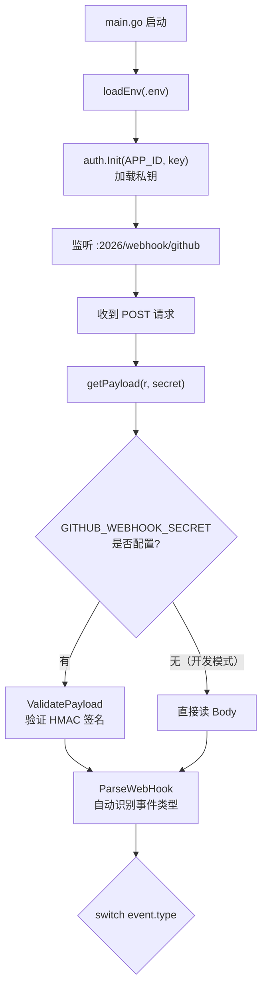
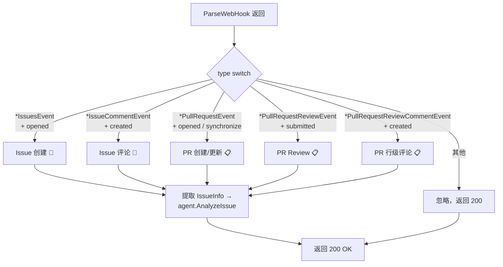
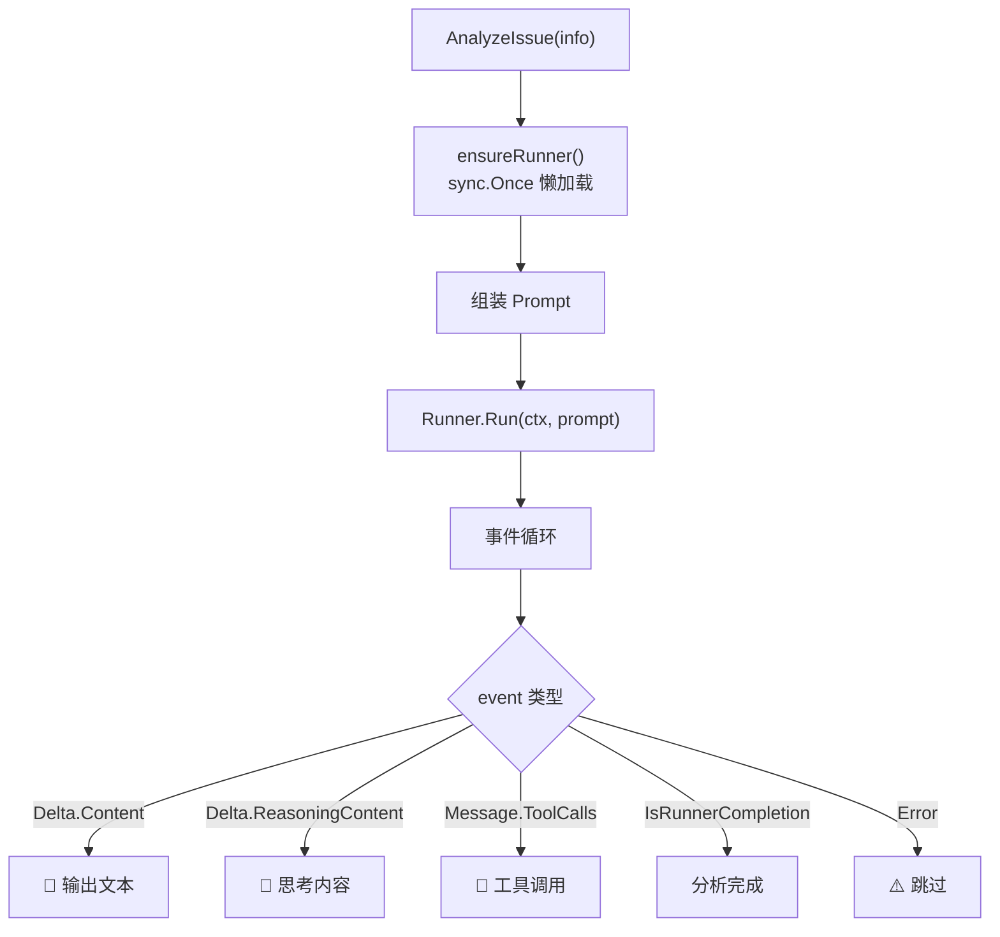
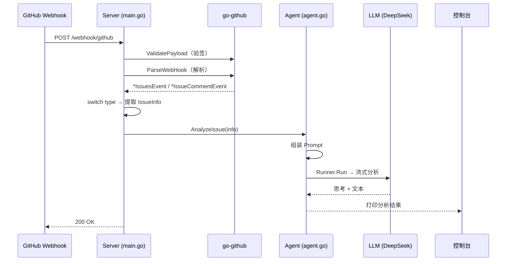
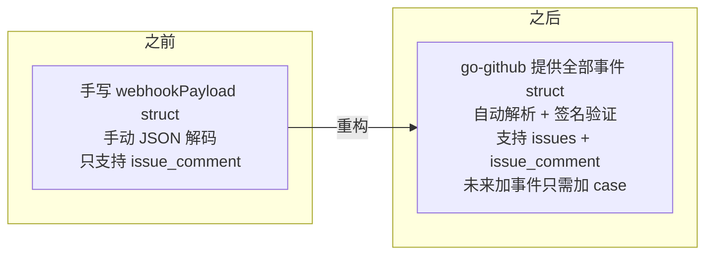

# 代码逻辑流程（go-github 版）

## main.go — 入口

```mermaid
flowchart TD
    A["main.go 启动"] --> B["loadEnv(.env)"]
    B --> B1["auth.Init(APP_ID, key)\n加载私钥"]
    B1 --> C["监听 :2026/webhook/github"]
    
    C --> D["收到 POST 请求"]
    D --> E["getPayload(r, secret)"]
    E --> F{"GITHUB_WEBHOOK_SECRET\n是否配置?"}
    F -->|"有"| G["ValidatePayload\n验证 HMAC 签名"]
    F -->|"无（开发模式）"| H["直接读 Body"]
    G --> I["ParseWebHook\n自动识别事件类型"]
    H --> I
    
    I --> J{"switch event.type"}
```

## 事件路由

```mermaid
flowchart TD
    A["ParseWebHook 返回"] --> B{"type switch"}
    
    B -->|"*IssuesEvent\n+ opened"| C["Issue 创建 📌"]
    B -->|"*IssueCommentEvent\n+ created"| D["Issue 评论 💬"]
    B -->|"*PullRequestEvent\n+ opened / synchronize"| E["PR 创建/更新 📋"]
    B -->|"*PullRequestReviewEvent\n+ submitted"| F["PR Review 📋"]
    B -->|"*PullRequestReviewCommentEvent\n+ created"| G["PR 行级评论 📋"]
    B -->|"其他"| H["忽略，返回 200"]
    
    C --> I["提取 IssueInfo →\nagent.AnalyzeIssue"]
    D --> I
    E --> I
    F --> I
    G --> I
    
    I --> J["返回 200 OK"]
    H --> J
```

## agent/agent.go — 分析（未变动）

```mermaid
flowchart TD
    A["AnalyzeIssue(info)"] --> B["ensureRunner()\nsync.Once 懒加载"]
    B --> C["组装 Prompt"]
    C --> D["Runner.Run(ctx, prompt)"]
    
    D --> E["事件循环"]
    E --> F{"event 类型"}
    F -->|"Delta.Content"| G["🤖 输出文本"]
    F -->|"Delta.ReasoningContent"| H["💭 思考内容"]
    F -->|"Message.ToolCalls"| I["🔧 工具调用"]
    F -->|"IsRunnerCompletion"| J["分析完成"]
    F -->|"Error"| K["⚠️ 跳过"]
```

## 完整链路

```mermaid
sequenceDiagram
    participant GH as GitHub Webhook
    participant S as Server (main.go)
    participant GG as go-github
    participant A as Agent (agent.go)
    participant LLM as LLM (DeepSeek)

    GH->>S: POST /webhook/github
    S->>GG: ValidatePayload（验签）
    S->>GG: ParseWebHook（解析）
    GG-->>S: *IssuesEvent / *IssueCommentEvent
    S->>S: switch type → 提取 IssueInfo
    S->>A: AnalyzeIssue(info)
    A->>A: 组装 Prompt
    A->>LLM: Runner.Run → 流式分析
    LLM-->>A: 思考 + 文本
    A-->>控制台: 打印分析结果
    S-->>GH: 200 OK
```

## 对比：之前 vs 之后

```mermaid
flowchart LR
    subgraph 之前
        A1["手写 webhookPayload struct\n手动 JSON 解码\n只支持 issue_comment"]
    end
    subgraph 之后
        B1["go-github 提供全部事件 struct\n自动解析 + 签名验证\n支持 issues + issue_comment\n未来加事件只需加 case"]
    end
    
    A1 -->|"重构"| B1
```
